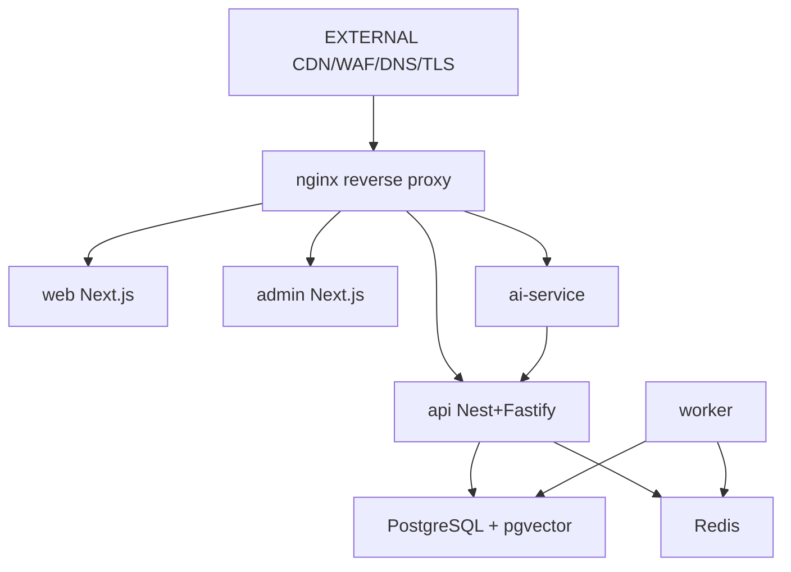

# Production architecture (Compose-first)

**Authority:** ADR-0019 — Compose / single-node first; **no Kubernetes** in v1.

## Topology

```text
                    [ EXTERNAL: CDN / WAF / DNS / TLS ]
                                    |
                              +-----+-----+
                              |   nginx   |  (TLS terminate when certs EXTERNAL)
                              +--+--+--+--+
                     /           |     |      \
                    v            v     v       v
                 web          admin   api    ai-service
               (Next)        (Next)  (Nest)  (Fastify)
                                    |
                     +--------------+--------------+
                     |                             |
                 postgres(+pgvector)             redis
                     ^
                  worker (outbox, reservations, notifications)
```



## Routing (staging nginx)

| Path                                   | Upstream        |
| -------------------------------------- | --------------- |
| `/`                                    | web:3001        |
| `/admin/`                              | admin:3004      |
| `/v1/`, `/api/`, `/health`, `/metrics` | api:3000        |
| `/ai/`                                 | ai-service:3003 |

## Deployables

Images: `buying-bot-api`, `buying-bot-worker`, `buying-bot-ai-service`,
`buying-bot-web`, `buying-bot-admin` (GHCR via staging workflow).

Compose files:

- Local deps/apps: `infrastructure/docker/compose/docker-compose.yml`
- Staging: `infrastructure/docker/compose/docker-compose.staging.yml`

## Explicitly out of scope (v1)

- Kubernetes manifests as runtime (folders may exist as placeholders only)
- Multi-region active-active
- Invented cloud account / DNS / SSL details
