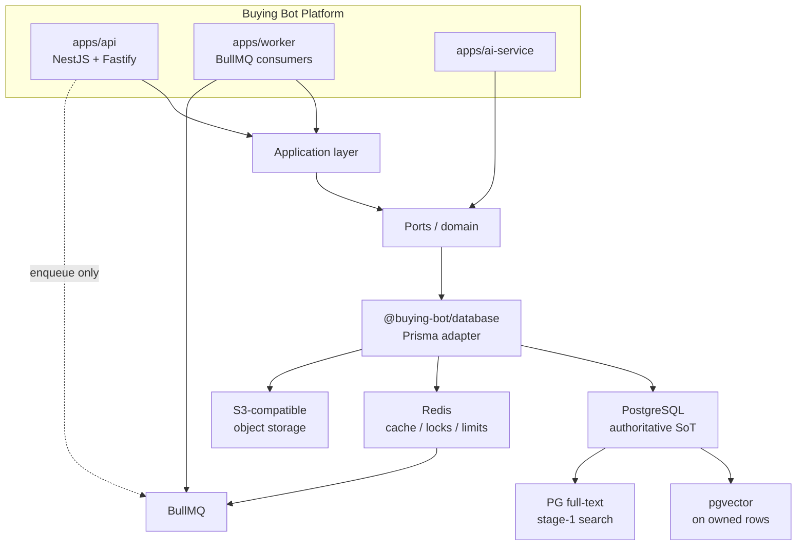

# ADR-0006: Database, data storage, and persistence architecture

- Status: **Accepted**
- Date: 2026-08-12
- Deciders: Platform Architecture (recommendation); product owner / technical
  lead (acceptance)
- Aligns with: [docs/ARCHITECTURE.md](../ARCHITECTURE.md),
  [ADR-0001](./0001-pnpm-turborepo-monorepo.md),
  [ADR-0002](./0002-typescript-strict-shared-config.md),
  [ADR-0004](./0004-node-http-ops-bootstrap.md),
  [ADR-0005](./ADR-0005-backend-framework.md),
  [docs/Deployment/disaster-recovery.md](../Deployment/disaster-recovery.md)
- Scope: Production data architecture for the modular monolith (stores, access
  layer, queues, objects, vectors, search/analytics evolution)
- Out of scope: Installing Prisma/PostgreSQL/Redis/BullMQ/pgvector packages;
  creating schemas, migrations, or tables; starting containers; implementing
  repositories, AuthN/Z, RAG, or business features

## 1. Context

The Buying Bot Platform is an AI-powered omnichannel commerce system. The
Enterprise Architecture Document locks a **modular monolith first**. ADR-0005
accepted NestJS + Fastify for `apps/api` only. `apps/worker` and
`apps/ai-service` remain independently deployable. `@buying-bot/database`
already defines ports (`DatabaseClient`, `UnitOfWork`, `Repository`) and
states that Redis is never the system of record.

There is **no** production datastore, Prisma schema, Redis, or object bucket
in the repository today. This ADR decides the data plane before any of those
are introduced.

Commerce and AI workloads that must eventually share a coherent data design:

- transactional e-commerce (customers, catalog, inventory, cart, orders,
  payments, refunds, promotions)
- omnichannel conversations and notifications
- AI interactions, embeddings, RAG, recommendations
- audit, analytics, background jobs, integrations
- future multi-tenant and horizontal scale, without starting as microservices

## 2. Problem

Without an explicit data architecture, the first Nest/Prisma/Redis change
will silently become the platform’s permanence model: Prisma in controllers,
orders in Redis, embeddings in a SaaS vector DB, images in PostgreSQL, and
no rebuild path for derived indexes.

This ADR answers:

1. What is the authoritative source of truth for transactional commerce data?
2. How do API/domain layers reach the database without Prisma leaking into
   packages?
3. Where do vectors, cache, jobs, and binaries live?
4. What is deferred (search engine, warehouse) vs required at first
   implementation?

## 3. Architectural requirements

The data plane must support:

| Need | Implication |
| --- | --- |
| ACID orders, inventory, payments | Relational SoT with real transactions |
| Relationships + reporting | Foreign keys, constraints, SQL |
| AI/RAG without a second ops plane on day one | Vectors next to metadata if viable |
| Modular monolith | One primary DB; domain schemas, not new databases per domain |
| ADR-0005 worker split | API enqueues; `apps/worker` consumes |
| Clean Architecture | Domain/application code talks to ports, not Prisma |
| Rebuildability | Cache, search, vectors, analytics are reconstructable |
| DR honesty | Existing RPO/RTO stay until explicitly revised |
| Extraction later | Schema/module boundaries, not distributed transactions now |

## 4. Primary database (system of record)

### 4.1 Question

**What is the authoritative source of truth for transactional commerce data?**

**Answer: PostgreSQL.** Orders, inventory, payments, customers, carts, and
related commerce entities are authoritative only in PostgreSQL. No other
store may be the sole copy of that state.

### 4.2 Comparison

| Criterion | PostgreSQL | MySQL / MariaDB | MongoDB |
| --- | --- | --- | --- |
| ACID for checkout / payments | Strong, mature | Strong for InnoDB; weaker JSON/extension story | Multi-doc transactions exist; poor default for relational commerce |
| Inventory consistency + FKs | Native | Native | Application-enforced |
| Payments / refunds auditability | Constraints + JSONB + triggers | Constraints; JSON weaker | Flexible docs; easy to lose invariants |
| Relationships (catalog, orders, customers) | First-class | First-class | Embed or manual refs |
| Reporting / analytics stage 1 | SQL in-place | SQL in-place | Aggregation pipeline; awkward joins |
| Indexing | B-tree, GIN, GiST, partial, expression | Strong B-tree; fewer extension indexes | Flexible; different ops model |
| Full-text search (stage 1) | `tsvector` / GIN | FULLTEXT | Text indexes |
| JSON | JSONB + GIN | JSON (less indexing maturity) | Document-native |
| Extensions | `pgvector`, `pgcrypto`, `pg_trgm` | Limited equivalent to pgvector | N/A (separate vector product) |
| Scale path | Vertical → replicas → Citus/partition later | Vertical → replicas | Shard-oriented; ops different |
| Reliability / PITR | WAL + PITR (cloud and self-host) | Binlog PITR | Oplog; different restore model |
| Ecosystem with Nest/Prisma/Node 22 | Best fit in this repo’s direction | Fine ORM support; weaker AI extension | Prisma support exists; wrong data model |
| DX for this TypeScript monorepo | Prisma + SQL + one backup plane | Similar ORM; two-system AI later | Schema-less fights ADR-0002 contracts |

MongoDB is rejected for **orders, inventory, and payments**: those domains
need invariants, unique constraints, and multi-row transactions as the
default, not an opt-in. Document flexibility helps catalogs and AI payloads
— PostgreSQL JSONB already covers that without abandoning relational
integrity.

MySQL is a credible RDBMS but loses on **pgvector**, JSONB indexing, and
extension maturity. Choosing MySQL would force an earlier dedicated vector
database — extra cost and backup plane this stage does not need.

### 4.3 Decision

Adopt **PostgreSQL 16+** (exact minor pinned at implementation time) as the
**only** system of record for transactional commerce and identity data.

## 5. ORM / database access

### 5.1 Required dependency direction

```text
apps/api (Nest modules)
    → application / domain layers
    → repositories / ports
    → @buying-bot/database
    → Prisma (adapter, this package only)
    → PostgreSQL
```

`apps/worker` and (if needed) `apps/ai-service` may use the same
`@buying-bot/database` adapter. They must not open a second ORM.

**Forbidden:** `import { PrismaClient } from '@prisma/client'` in domain
modules, application services, or any package other than the database
adapter. Nest providers bind ports to Prisma implementations.

### 5.2 Comparison

| Criterion | Prisma | Drizzle | TypeORM | `node-postgres` only |
| --- | --- | --- | --- | --- |
| Type safety with ADR-0002 | Generated client; good | SQL-schema TS; excellent | Decorators; weaker exactOptional fit | Manual |
| Migrations | Prisma Migrate; reviewable SQL | Drizzle Kit; SQL-first | Mixed quality historically | Hand-rolled |
| Schema as contract | `schema.prisma` | TS schema | Entities | None |
| Transactions | `$transaction`; must wrap behind `UnitOfWork` | Explicit SQL tx | QueryRunner | Explicit |
| Query flexibility | Improving; raw SQL escape hatch | Closest to SQL | Query builder + raw | Full |
| Performance | Good; watch N+1 and `$queryRaw` | Typically leaner | Variable | Best if expert |
| DX / Nest | Largest Nest + TS mindshare | Growing | Nest historically used it | Slowest delivery |
| Testing | Test DB + transaction rollback | Same | Same | Same |
| PostgreSQL | First-class | First-class | First-class | First-class |
| Long-term | Vendor (Prisma) risk; SQL dump/migrate out is possible | Lower lock-in | Stale patterns in many codebases | Highest staff cost |

### 5.3 Decision

Adopt **Prisma** as the **only** PostgreSQL access library, living behind
`@buying-bot/database`.

Use Prisma’s **raw SQL** (`$queryRaw` / `$executeRaw`) for inventory
locking, advisory locks, and pgvector operators when the client is awkward.
Those calls still belong in the adapter, not in domain services.

**Rejected:** TypeORM (decorator model vs strict TS; historical migration
pain). Direct driver only (too much invention for this team stage). Drizzle
is the strongest alternative (SQL-shaped, low overhead) but Prisma’s
migration workflow and Nest-era hiring/docs fit the current single-owner
monorepo better. Revisit Drizzle only if Prisma’s query model blocks
inventory/pgvector work in practice.

## 6. pgvector / vector storage

### 6.1 Question

**Should vector data initially live inside PostgreSQL using pgvector, or
should we introduce a dedicated vector database?**

**Answer: PostgreSQL + pgvector initially.** Do not introduce Pinecone,
Qdrant, Weaviate, or OpenSearch **because the product is AI-first**.

### 6.2 Comparison

| Criterion | PG + pgvector | Pinecone | Qdrant / Weaviate | OpenSearch k-NN |
| --- | --- | --- | --- | --- |
| Ops complexity now | One database we already run | New SaaS + network + keys | New cluster | New search cluster |
| Cost at low QPS | Marginal (same PG) | Always-on SaaS | Cluster cost | Cluster cost |
| Transactional metadata + vector | Same row / same tx | App-level sync | App-level sync | App-level sync |
| Filtering (tenant, product, locale) | SQL + vector in one query | Metadata filters | Strong | Strong |
| ANN performance at huge scale | Good until proven otherwise | Purpose-built | Purpose-built | Purpose-built |
| Backup | Same PITR as commerce | Separate | Separate | Separate |
| Consistency with catalog deletes | FK / same tx | Drift risk | Drift risk | Drift risk |
| Migration later | Export embeddings + ids | Standard | Standard | Standard |

Dedicated vector DBs win at **very large** ANN QPS and isolation. This
platform does not have that load. Product/knowledge embeddings start in the
same Postgres instance so RAG chunks stay consistent with catalog and
document rows. If recall/latency SLOs fail under measurement, extract
vectors (stage 3) without rewriting transactional AI tables.

## 7. Redis

Redis is **coordination and cache**, never the commerce ledger.

### 7.1 Belongs in PostgreSQL

Customers, users, roles/permissions records, catalog, inventory
reservations and on-hand quantities, carts, orders, payment/refund records,
promotions, notification **history**, conversations/messages,
prompt/version rows, embedding **rows** (vector column), audit events,
idempotency records for checkout/payments/webhooks, job **business
outcome** (e.g. “refund posted”).

### 7.2 Belongs in Redis

- HTTP/API rate limiting
- cache of hot read models (product cards) with TTL
- distributed locks (short-lived; lock does not replace the reservation row)
- BullMQ queue lists / job payloads in flight
- optional session/token denylist with TTL **in addition to** server-side
  session rows if sessions are used (AuthN ADR later)
- AI response cache by hash of (model, prompt version, inputs) — TTL only
- idempotency **fast path** (TTL) duplicating a Postgres unique key

### 7.3 Must NEVER exist only in Redis

Orders, payments, refunds, inventory quantities, customer PII, carts that
must survive restart, webhook processing results, audit logs, embeddings
that cannot be rebuilt, “paid” flags.

If Redis is flushed, the platform must remain **correct** (possibly slower
or briefly unable to enqueue). It must not forget that an order was paid.

## 8. BullMQ / background processing

### 8.1 Decision

Adopt **BullMQ on Redis** as the queue for `apps/worker`.

ADR-0005 already forbids processors inside `apps/api`. The API (and later
ai-service) may only **add** jobs through a queue port in
`@buying-bot/database` or a small `@buying-bot` jobs port — not by
importing BullMQ in domain code.

### 8.2 Alternatives

| Option | Why not as default |
| --- | --- |
| PostgreSQL-backed queues (pg-boss) | Simpler ops; weaker delayed/repeatable job ecosystem; couples OLTP to queue load |
| Amazon SQS / Google Pub/Sub | Cloud lock-in before IaC exists |
| Kafka | Event streaming, not a job runner; premature |
| Nest `@Processor` in `apps/api` | Violates deployable split |

### 8.3 Queue architecture (when implemented)

- Queues named by workload: `notifications`, `webhooks`, `embeddings`,
  `payments.reconcile`, `indexing`, `reports`
- Default: retries with exponential backoff + jitter; cap retries
- Failed after cap → dead-letter queue + Postgres failure row for
  business-critical jobs (payments, webhooks)
- Jobs carry an **idempotency key**; workers check Postgres before side
  effects
- Job status in BullMQ is operational; **business status** lives in
  PostgreSQL
- `apps/worker` graceful shutdown: stop taking jobs, finish in-flight
  within timeout (same SIGTERM story as ADR-0004)
- Observability: queue depth, failed count, processing latency (later)

## 9. Object storage

**Principle:** Binary and large objects are **not** stored in PostgreSQL
except a justified thumbnail/exception (none identified today).

Database rows store: content type, byte size, checksum, bucket, object key,
optional encryption flag, and access policy. Bytes live in **S3-compatible
object storage**.

Provider is **not** locked to AWS. Implementation should use an S3 API
(`PutObject`, `GetObject`, presigned URLs) so local MinIO, Cloudflare R2,
or AWS S3 can be swapped via config.

| Candidate | Role |
| --- | --- |
| S3-compatible (recommended interface) | Portable |
| Cloudflare R2 | Strong later cost/egress option |
| AWS S3 | Fine production choice when cloud ADR exists |
| Postgres BYTEA | Rejected for images/video/docs/exports |

Objects: product images/video, customer uploads, knowledge documents,
generated reports/exports, AI source files.

Access: private buckets; **signed URLs** for reads; no public-write;
server-side MIME/size checks when uploads exist (future).

## 10. Data ownership

| Class | Owner store | Rebuildable? |
| --- | --- | --- |
| **Authoritative** | PostgreSQL | N/A (backed up) |
| **Cache** | Redis | Yes, from PostgreSQL |
| **Ephemeral** | Redis TTLs, in-memory | Yes, discard |
| **Search index** | PostgreSQL FTS now; dedicated engine later | Yes, from PostgreSQL |
| **Vector data** | PostgreSQL pgvector (column on owned rows) | Yes, re-embed from source objects/text |
| **Object storage** | S3-compatible | Backup bucket; DB holds keys |
| **Event / job in-flight** | Redis/BullMQ | Replay from Postgres outbox if we add one |
| **Analytics** | PostgreSQL aggregates now; warehouse later | Yes, from facts in PostgreSQL |
| **Audit** | PostgreSQL (append-oriented) | Backup only; not rebuilt from cache |

Optional later: **transactional outbox** table in PostgreSQL so jobs/events
are not lost if Redis is down at enqueue time. Recommended when payment and
webhook reliability is implemented — not in this ADR’s install scope.

## 11. Source of truth hierarchy

```text
PostgreSQL          → authoritative transactional + AI metadata + audit
        ↓ rebuild
pgvector columns    → semantic retrieval (same cluster, derived from sources)
        ↓ rebuild
Redis               → cache, limits, locks, BullMQ
        ↓ rebuild
Object storage      → blobs (authoritative for bytes; DB is catalog of keys)
        ↓ rebuild
Search index        → derived (PG FTS now)
        ↓ rebuild
Analytics           → derived
```

**If lost:**

| Lost | Recovery |
| --- | --- |
| PostgreSQL | Restore PITR/backup (only true disaster for commerce) |
| Redis | Cold cache; recreate queues; **do not** restore commerce from Redis |
| Object storage | Restore bucket; reconcile keys vs DB |
| pgvector | Re-run embedding jobs from documents/products |
| FTS / analytics | Reindex / reaggregate from PostgreSQL |

## 12. Transaction strategy

- Default isolation: PostgreSQL **READ COMMITTED**.
- Checkout, inventory reservation, payment capture/refund: short
  **Postgres transactions** covering only the rows required.
- Do **not** hold transactions open across Stripe/M-Pesa/WhatsApp HTTP.
  Pattern: persist intent → commit → call provider → persist result
  (idempotent).
- Optimistic concurrency (`version` / `xmin`-equivalent column) on
  inventory and order state machines.
- Pessimistic `SELECT … FOR UPDATE` (via Prisma raw SQL in the adapter)
  only for hot SKU reservation when measurement shows lost updates.
- No 2PC / distributed transactions across Redis, S3, or providers.
- Eventual consistency is allowed for: search index, embeddings, analytics,
  notification delivery, AI caches.

## 13. Concurrency and inventory (strategy only)

Not implemented. Architectural rules:

1. **On-hand and reserved quantities live in PostgreSQL**, not Redis.
2. Checkout creates a **reservation row** (SKU, qty, order/cart id, expiry)
   in the same transaction as decrementing available stock
   (`on_hand - reserved`).
3. Payment failure / timeout / cancel releases reservation in Postgres
   (job or API path); never “just expire in Redis.”
4. Redis lock may serialize hot SKUs for milliseconds; the lock is not
   stock.
5. Duplicate checkout uses **idempotency keys** in PostgreSQL (unique).
6. Oversell protection is a database constraint/check plus transactional
   updates — not a cache invariant.

## 14. Idempotency

| Operation | Store of record |
| --- | --- |
| Checkout / order create | PostgreSQL unique `(actor, idempotency_key)` |
| Payment charge/refund | PostgreSQL + provider idempotency |
| Webhooks | PostgreSQL unique provider event id + signature verify (future) |
| Inventory adjust | PostgreSQL unique command id |
| BullMQ jobs | Key in job id + Postgres check before side effects |
| Integrations | Postgres unique external id |

Redis may cache “already processed” for TTL to shed load. **Redis alone is
not** the permanent idempotency record for payments, orders, or webhooks.

## 15. Migrations

When Prisma is introduced (later milestone):

- All schema change via **Prisma Migrate**; generated SQL committed.
- Migrations are versioned, deterministic, reviewed in PR, applied in CI
  against an ephemeral Postgres for smoke, then staging, then production.
- **Forward-only** in production. No `migrate down` on prod. Expand/contract
  for compatibility (add column nullable → backfill → constrain).
- Dev: `migrate dev` locally. Test: apply from empty. Staging = production
  path. Production: gated, backup taken first.
- Zero/low downtime: avoid rewrite-heavy operations on large tables without
  a plan; no drop-column in the same release that still reads it.

## 16. Schema organization

Do not create tables now. When created, use **PostgreSQL schemas** aligned
to bounded contexts (not one flat `public` junk drawer):

| Schema (illustrative) | Ownership |
| --- | --- |
| `identity` | users, credentials refs, roles |
| `customers` | shopper profiles, addresses |
| `catalog` | products, categories, media refs |
| `inventory` | on-hand, reservations |
| `cart` | carts, lines |
| `orders` | orders, lines, state |
| `payments` | intents, captures, refunds (tokenized refs only) |
| `promotions` | campaigns, redemptions |
| `notifications` | delivery records |
| `conversations` | threads, messages |
| `ai` | prompts, runs, chunks, embedding columns |
| `integrations` | provider accounts, webhook receipts |
| `analytics` | derived rollups (stage 1) |
| `audit` | append-only security/business events |

Nest modules and future extraction map to these schemas. Cross-schema FKs
are allowed in the monolith; extraction later copies a schema to a new
database.

## 17. Multi-tenancy readiness

**Now:** operate **single-tenant** (one merchant / one deployment).

**Schema discipline:** when tables appear, include a **`tenant_id` column
(nullable or default sentinel)** on tenant-owned entities so a later
shared-schema multi-tenant move does not rewrite every table. Do not
implement tenant isolation, routing, or RLS yet.

| Model | Verdict |
| --- | --- |
| Shared DB + `tenant_id` | **Recommended evolution path** |
| Schema-per-tenant | Rejected for v1 (ops and migration cost) |
| Database-per-tenant | Rejected until a true isolation/compliance ADR |
| Ignore tenancy in all tables | Rejected (expensive retrofit) |

## 18. Audit data

**Audit in PostgreSQL (`audit` schema), append-oriented.** Application
updates do not mutate audit rows.

**Audit:** logins (success/fail counts, not passwords), permission/role
changes, product/inventory/order/payment/refund mutations, admin actions,
AI **tool executions** (especially `write` / `payment` / `admin` risk).

**Do not audit:** raw tokens, passwords, card numbers, full prompt dumps
that contain secrets, unnecessary PII replicas.

Retention: policy TBD with legal; architecture assumes **finite retention**
and export-before-delete. Immutability is “no app update,” not WORM
storage, until a compliance ADR.

Privacy: audit may contain actor ids and resource ids; access restricted
like production DB. **Compliance is not claimed.**

## 19. Personal data

Store in PostgreSQL: names, email, phone, addresses, order history,
conversation text, preferences, **payment method references / provider
customer ids** — not PAN, CVV, or raw card data.

Object storage: identity documents only if a future feature requires them,
with access control.

Retention/deletion: support a future “delete customer” that anonymizes or
removes PII while **preserving financial records required for accounting**
(orders/payments may remain with redacted PII). Exact legal basis is out of
scope; do not claim GDPR/PCI compliance until implemented and audited.

## 20. Backups

**PostgreSQL (when deployed):**

- Automated backups + **PITR**
- Encryption in transit and at rest (disk/volume + backup)
- Off-site / other-region copy
- Retention ≥ 30 days (already in DR baseline)
- Monitoring of backup freshness
- **Restore drill** before production customer data — untested backups are
  **NOT VERIFIED**

**Redis:** no commerce restore. Optional AOF/RDB for queue durability is
operational, not a ledger.

**Object storage:** versioning + replication per provider; periodic restore
test of a sample prefix.

**Vectors / FTS / analytics:** rebuild jobs from PostgreSQL + objects.

## 21. Disaster recovery (RPO / RTO)

Existing foundation targets ([disaster-recovery.md](../Deployment/disaster-recovery.md)):

| Metric | Current documented target |
| --- | --- |
| RPO | ≤ 24 hours |
| RTO | ≤ 4 hours |

**This ADR does not change those numbers.** They remain appropriate for the
**current stage** (no production datastore, no customer money in-system).

They are **not** appropriate for production payment/inventory data. Before
the first production commerce launch, a follow-up must tighten roughly to:

- RPO: minutes (PITR), not 24 hours
- RTO: ≤ 1 hour for API+Postgres, unless a new ADR accepts more loss

Until that follow-up, implementers must not pretend 24h RPO is a payment
SLA.

## 22. Scalability (introduce when measured)

| Technique | When |
| --- | --- |
| Vertical PG | First years; default |
| Connection pooling (Prisma `connection_limit`, then PgBouncer) | When `too many connections` or worker+api share PG |
| Indexes | With schema; verify via slow-query log |
| Read replicas | When read-heavy catalog/admin load dominates writes |
| Partitioning | Large time-series (audit, messages) at size pain |
| Redis scale | When rate-limit/queue/cache memory or CPU saturates |
| Worker replicas | Queue depth / lag SLO breach |
| Vector extract | When pgvector recall/latency SLO fails |
| Object CDN | When media bandwidth hurts origin |

Do not start with Citus, Kafka, or multi-region active-active.

## 23. Performance principles

- Index FKs and filter/sort columns used by APIs.
- Keyset/cursor pagination for large lists; avoid unbounded `findMany`.
- Prevent N+1 in the adapter (Prisma `include` / batched loaders).
- Short transactions; no remote I/O inside a tx.
- Cache read-mostly product data in Redis with TTL and invalidation on
  catalog writes.
- Batch embedding jobs; do not embed inline on checkout.
- Measure first (slow queries, p95 API). No premature denormalization.

## 24. Security

- TLS to PostgreSQL, Redis, and object storage.
- Encryption at rest for PG volumes, backups, buckets.
- Credentials only in env/secret manager; never in git (existing
  `.gitignore` / `.env.example` policy).
- Least-privilege DB roles: migrator vs runtime (runtime cannot drop DB).
- PG and Redis **not** on the public internet; private network / firewall.
- Redis AUTH (and ACL if available); not an open `6379`.
- Signed URLs; buckets private.
- Backup access restricted like production data.

## 25. Testing strategy (later)

| Layer | Intent |
| --- | --- |
| Unit | Domain + ports; mock `DatabaseClient` |
| Repository | Adapter tests against test Postgres |
| Integration | Nest API + test DB |
| Migration | Apply from empty in CI |
| Transaction / concurrency | Reservation race tests |
| Rollback | Expand/contract rehearsals on staging |
| Backup/restore | Periodic drill — NOT VERIFIED until run |
| Failure | PG down → API readiness 503; Redis down → degrade cache, fail enqueue or outbox |

Do not implement these tests in this ADR.

## 26. Development environment (later)

Docker Compose (already sketched for Node apps) should later add:

- PostgreSQL 16+
- Redis
- MinIO (S3 API)
- optional: same compose profiles for worker

No compose services are added by this ADR.

## 27. Observability (later)

- PG: query latency, slow queries, errors, pool wait, tx rollbacks
- Redis: latency, memory, evictions
- BullMQ: depth, failures, processing time
- S3: 4xx/5xx, latency
- pgvector: kNN latency
- Readiness: PostgreSQL required for `apps/api` ready; Redis required for
  enqueue/ready of worker; API may stay ready for read-only if that is
  explicitly designed — default: **API not ready without PostgreSQL**

OpenTelemetry is not implemented here.

## 28. Failure behavior

| Dependency down | Default behavior |
| --- | --- |
| PostgreSQL | **Fail closed** for commerce writes/reads that need SoT. Liveness up; readiness down. |
| Redis | **Degrade:** skip cache; **fail** new job enqueue unless outbox exists; rate-limit may fail closed (safer) for auth/AI. Commerce reads from PG still work. |
| Object storage | **Fail** uploads; product pages degrade (broken media); metadata in PG remains. |
| Workers | API accepts; jobs queue (if Redis up) or outbox; **degrade** notifications/embeddings. Checkout still commits in PG. |
| pgvector / FTS | **Degrade** semantic/keyword search; exact catalog ID lookup still works. |
| External providers | Timeout + retry + persist intent; never lose order because Stripe was slow. |

## 29. Future service extraction

Search, AI, payments, notifications, analytics, inventory **may** become
apps later by taking a Nest module + PostgreSQL schema + package ports.
Until then they share one Postgres. **No microservices now.** No
per-domain database now.

## 30. Architecture diagram



Caption: Modular monolith data plane. PostgreSQL is the commerce ledger;
Redis/BullMQ are coordination; objects are blobs; vectors live in Postgres
until scale says otherwise.

## 31. Decision matrix

| Component | Decision | Purpose | Source of truth? |
| --- | --- | --- | --- |
| PostgreSQL | **Adopt** (16+) | Transactional commerce, identity, audit, AI metadata | **Yes** — authoritative |
| Prisma | **Adopt** behind `@buying-bot/database` | Typed access + migrations | No (client only) |
| pgvector | **Adopt in-cluster** | Embeddings / RAG / semantic search | Derived; rebuildable; stored in PG |
| Redis | **Adopt** | Cache, rate limit, locks, queue broker | **No** |
| BullMQ | **Adopt** on Redis | Async jobs in `apps/worker` | In-flight only; business result in PG |
| Object storage | **S3-compatible** | Images, docs, exports | Authoritative for **bytes**; keys in PG |
| Search engine | **Deferred** | Dedicated ES/Meilisearch/etc. | Derived when introduced |
| Analytics store | **Deferred** | Warehouse / OLAP | Derived when introduced |

## 32. Search engine

PostgreSQL `tsvector` + `pg_trgm` + pgvector cover stage 1 catalog and RAG.

| Stage | When | What |
| --- | --- | --- |
| **1** | First product search | PostgreSQL FTS + filters + pgvector |
| **2** | Ranking/typo/facet limits proven | Evaluate Meilisearch/Typesense (lighter) or OpenSearch |
| **3** | Cross-channel relevance at scale | Dedicated search cluster; PG remains SoT |

Do **not** add Elasticsearch now.

## 33. Analytics

| Stage | Approach |
| --- | --- |
| **1** | Facts in PostgreSQL; `analytics` schema rollups; admin SQL/API |
| **2** | Nightly extracts if OLTP suffers |
| **3** | Warehouse (BigQuery/Snowflake/ClickHouse) only with a new ADR |

No Kafka/ClickHouse/Snowflake now.

## 34. AI data placement

| Data | Store |
| --- | --- |
| Prompts, prompt versions, model metadata | PostgreSQL `ai` |
| Conversations, messages | PostgreSQL `conversations` / `ai` |
| Documents, chunk text, retrieval metadata | PostgreSQL + object key for original file |
| Embeddings | pgvector column on chunk/product rows |
| Tool execution records | PostgreSQL `audit` + `ai` (high-risk tools) |
| Evaluation sets/scores | PostgreSQL `ai` |
| Knowledge files | Object storage + PG metadata |

Transactional AI records ≠ the ANN index. Deleting a product deletes or
tombstones its embedding row in the same database.

## 35. Data lifecycle

| Category | Create | Update | Archive / delete | Restore |
| --- | --- | --- | --- | --- |
| Customer PII | PG | PG | Anonymize/delete per future policy; keep financial skeleton | From PG backup |
| Orders / payments | PG | State machine only | Retain for accounting; no silent delete | PITR |
| Logs | App logs (not PG blobs) | — | Retention on log store | Not a ledger |
| Conversations | PG | PG | Retention/delete with PII policy | PG backup |
| Embeddings | Worker job | Re-embed on source change | Delete with source | Rebuild |
| Documents | S3 + PG | New version object | Delete object + row | Bucket + DB |
| Audit | Append PG | No update | Retention then purge | Backup only |

## 36. Final recommendation

Recommended data architecture for Buying Bot Platform:

**PostgreSQL** (authoritative commerce + identity + audit + AI metadata)  
**+ Prisma** (adapter only, behind `@buying-bot/database`)  
**+ pgvector** (in PostgreSQL, not a separate vector SaaS)  
**+ Redis** (cache, limits, locks, BullMQ broker — never ledger)  
**+ BullMQ** (`apps/worker` consumers)  
**+ S3-compatible object storage** (binaries)

Search engine and analytics warehouse are **stage-2/3**, not initial.

This is chosen because the platform is **transactional commerce first**,
**AI-augmented**, **modular monolith**, and **operationally small**. Extra
datastores would multiply backup, IAM, and failure modes before the first
order exists.

## 37. Consequences

**Positive**

- One SoT for money and stock.
- AI retrieval can join catalog/ACL in SQL.
- Matches existing ports and ADR-0005 process split.
- Extraction remains schema/module-shaped.

**Negative**

- Prisma vendor coupling (mitigated by ports + SQL).
- pgvector may need extraction under heavy ANN load.
- Single Postgres is a critical dependency (correct for this stage).

**Operational**

- Must run Postgres + Redis + bucket before production features.
- PITR and restore drills become mandatory before real PII/payments.
- Compose local stack will grow (later).

**Developer**

- Repositories in the adapter; no Prisma in domain.
- Migrations reviewed like code.

**Security**

- Smaller blast radius than Redis-as-ledger or cards-in-DB.
- Still requires network isolation and secret hygiene at implement time.

**Cost**

- Low at stage 1 (one RDBMS, one Redis, cheap object storage).
- Avoids Pinecone/ES/warehouse bills until evidence.

**Migration**

- Acceptance does not migrate anything; there is no production data yet.
- Later vector/search extract is copy-by-id, not a rewrite of orders.

## 38. Implementation boundary

**Acceptance of ADR-0006 does NOT authorize:**

- installing Prisma, `pg`, Redis, BullMQ, or pgvector clients
- creating databases, migrations, or `schema.prisma`
- deploying Redis, BullMQ, or object buckets
- implementing repositories, RAG, or AuthN/Z
- changing `package.json` or application business logic

Those require separate implementation milestones after this ADR is
**Accepted**.

## 39. Rejected alternatives (summary)

| Alternative | Why not now |
| --- | --- |
| MongoDB as SoT | Weak invariants for orders/inventory/payments |
| MySQL as SoT | Weaker extension/pgvector path |
| Drizzle as default ORM | Viable; Prisma preferred for migrate/DX unless Prisma blocks |
| TypeORM | Poor fit to strict TS and migration discipline |
| Pinecone/Qdrant/Weaviate at v1 | Extra ops/cost; consistency split |
| Elasticsearch at v1 | PG FTS + vectors suffice |
| Redis as order/cart/payment store | Violates SoT and existing package comments |
| Kafka / warehouse at v1 | Premature |
| Schema- or DB-per-tenant at v1 | Ops cost; `tenant_id` readiness instead |
| BYTEA for product media | Use object storage |

## 40. Decision status

**Accepted.**

Indexed in [DECISIONS.md](../DECISIONS.md). Acceptance does **not** authorize
implementation of Prisma/PostgreSQL/Redis/BullMQ schemas or packages; see
out-of-scope and implementation boundary sections.
