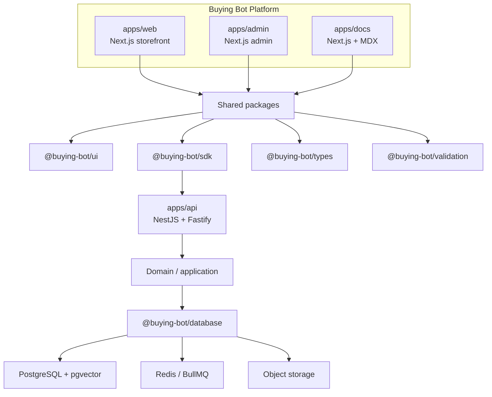

# ADR-0007: Frontend and application experience architecture

- Status: **Accepted**
- Date: 2026-08-13
- Deciders: Platform Architecture; accepted by technical lead on 2026-08-13
- Aligns with: [docs/ARCHITECTURE.md](../ARCHITECTURE.md),
  [ADR-0001](./0001-pnpm-turborepo-monorepo.md),
  [ADR-0002](./0002-typescript-strict-shared-config.md),
  [ADR-0005](./ADR-0005-backend-framework.md),
  [ADR-0006](./ADR-0006-database-and-data-architecture.md) (**Proposed** —
  treat as dependency, not accepted fact),
  [docs/SDS/application-shells.md](../SDS/application-shells.md)
- Scope: Frontend architecture for `apps/web`, `apps/admin`, and `apps/docs`;
  shared UI/SDK/types boundaries; rendering, state, SEO, a11y, testing, and
  deployment direction
- Out of scope: Installing Next.js/React/Tailwind/state libraries; scaffolding
  pages or components; AuthN/Z UI; API client implementation; deployment
  provisioning; mobile apps

## 1. Context

The Buying Bot Platform is an AI-powered omnichannel commerce system. The
Enterprise Architecture Document locks a **modular monolith**, independently
deployable apps, and shared packages. ADR-0005 accepted **NestJS + Fastify**
for `apps/api`. ADR-0006 (**Proposed**) recommends PostgreSQL + Prisma +
Redis + BullMQ + S3-compatible storage.

Current frontend reality (verified in-repo):

| Asset                                      | Current state                                                           |
| ------------------------------------------ | ----------------------------------------------------------------------- |
| `apps/web`                                 | TypeScript shell (`tsc` → `dist/`). Empty `bootstrap()`. No React/Next. |
| `apps/admin`                               | Same shell pattern. Separate deployable.                                |
| `apps/docs`                                | Shell only. Normative engineering docs live in `/docs`.                 |
| `packages/ui`                              | Design tokens only. Explicitly forbids React/Vue until this ADR.        |
| `packages/sdk`                             | Minimal `PlatformSdk` (health + errors). Product endpoints deferred.    |
| `packages/types` / `validation` / `config` | Shared contracts and Zod.                                               |
| Frontend tsconfigs                         | Extend `bundler.json` (ADR-0002).                                       |

Existing shells are **not** the final frontend architecture. This ADR
selects the product frontend stack before scaffolding.

Required experiences:

- **Customer web:** discovery, search, PDP, cart, checkout, accounts, orders,
  support, AI shopping assistant, marketing/SEO pages
- **Admin:** catalog, inventory, orders, customers, payments, promotions, AI
  ops, integrations, analytics, audit, configuration — with **separate
  security boundary** from the storefront
- Shared packages without leaking Nest/Prisma/secrets into the browser

## 2. Problem

Without a frontend ADR, the first React/Next install will silently decide
SEO, server/client boundaries, admin security, AI streaming UX, and package
ownership. Wrong choices would:

- make the storefront SPA-only and destroy commerce SEO;
- merge admin and customer apps into one insecure surface;
- put Prisma/Nest types in the browser;
- invent a second API style that fights ADR-0005 OpenAPI/SDK direction;
- bury business rules in Client Components.

This ADR decides frontend architecture. It does **not** authorize
implementation.

## 3. Architectural requirements

1. Independently deployable `web`, `admin`, and `docs` (EAD / ADR-0001).
2. SEO and public product discoverability for `apps/web`.
3. Server-first rendering where content is public or personalization is light.
4. Client interactivity only where required (cart UX, AI chat, forms, admin
   tables).
5. Shared design system via `packages/ui` without business workflows.
6. Typed API access via `packages/sdk` to Nest REST/OpenAPI (`apps/api`).
7. Zod from `packages/validation` on the client **and** server — client never
   replaces server validation.
8. Frontend AuthZ UI is UX only; backend AuthZ is authoritative (ADR-0005).
9. No browser access to PostgreSQL, Redis, object-storage credentials, payment
   secrets, or AI provider keys (ADR-0006 dependency).
10. Accessibility as architecture (WCAG 2.2 AA target).
11. Kenya-first commerce; i18n without rewrite later.
12. Future mobile clients consume API/SDK — not the web UI tree.
13. Consistent with strict TypeScript (ADR-0002) and monorepo boundaries.

## 4. Framework decision

### 4.1 Options

| ID  | Option                                                      |
| --- | ----------------------------------------------------------- |
| A   | **Next.js (App Router) + React**                            |
| B   | **React + Vite (SPA)**                                      |
| C   | **Remix / other React meta-framework** (considered briefly) |

### 4.2 Comparison (Buying Bot specific)

| Requirement                | A Next.js + React                    | B Vite SPA                      | C Remix          |
| -------------------------- | ------------------------------------ | ------------------------------- | ---------------- |
| Product/category SEO       | Strong (SSR/SSG/ISR + metadata)      | Weak without separate SSR layer | Strong           |
| PDP / category rendering   | RSC + streaming                      | Client fetch waterfall risk     | Loaders          |
| AI chat streaming          | RSC + client stream / SSE fit        | Client-only stream              | Feasible         |
| Admin dashboard            | Excellent (same stack, separate app) | Excellent                       | Feasible         |
| Image / metadata           | Built-in                             | Manual                          | Manual/partial   |
| Monorepo / Turborepo       | Mature                               | Mature                          | Less common here |
| Nest OpenAPI + SDK         | Fits as BFF consumer                 | Fits                            | Fits             |
| Ops with Docker foundation | Container or Node host               | Static + CDN                    | Container        |
| Hiring / docs              | Highest React commerce mindshare     | High                            | Lower            |

**Reject B for `apps/web`:** a pure SPA forces SEO workarounds for catalog and
marketing pages that are core to this business. Vite remains fine for
isolated widgets, not the storefront shell.

**Reject C:** capable, but adds a second learning path and weaker alignment
with the existing Next-oriented `.next` cache reservation in Turbo and common
commerce patterns. No in-repo requirement justifies Remix over Next.

### 4.3 Decision

Adopt **Next.js (App Router) + React + TypeScript** for:

- `apps/web` (customer)
- `apps/admin` (operations)
- `apps/docs` (publishable docs site; see §7)

Use the **App Router**, React Server Components by default, and Client
Components only for interactivity.

Exact Next.js major is pinned at implementation time (Node 22 compatible).
**NOT VERIFIED** until scaffolded.

## 5. Customer web (`apps/web`)

### 5.1 Route domains (illustrative)

Public: home, categories, PLP, PDP, search, content, FAQ, policies, marketing.  
Authenticated: account, orders, tracking, support.  
Transactional interactive: cart, checkout.  
AI: shopping assistant surfaces (embedded and/or dedicated).

### 5.2 Server vs Client

| Concern                                    | Default                                              |
| ------------------------------------------ | ---------------------------------------------------- |
| Product listing / PDP / category / content | **Server Components** + server fetch via SDK         |
| Metadata, canonical, structured data       | Server (`generateMetadata`)                          |
| Search results (initial)                   | Server; refine filters may hydrate client            |
| Cart badge / mini-cart                     | Client island; cart **source of truth** on API       |
| Checkout steps / payment widgets           | Client + server actions/API calls                    |
| Account / orders                           | Server fetch with auth session; client for mutations |
| AI chat UI                                 | Client (streaming); history loaded via API           |
| Analytics beacons                          | Client (privacy-aware)                               |

Avoid making the entire app `"use client"`.

### 5.3 Data ownership reminder

Cart, prices, stock, and payment state come from `apps/api` (and eventually
PostgreSQL per ADR-0006). The browser may optimistic-update UI, then reconcile.

## 6. Admin (`apps/admin`)

### 6.1 Decision

Separate Next.js application, **same framework** as web, independently
deployed, **different origin/host and cookie/session scope**.

### 6.2 Shared vs isolated

| Share                                 | Do not share                   |
| ------------------------------------- | ------------------------------ |
| `packages/ui` primitives/tokens       | Customer checkout flows        |
| `packages/sdk` (admin-scoped clients) | Storefront pages               |
| `packages/types`, `validation`        | Auth cookies across apps       |
| Design language                       | “Hide admin links” as security |

### 6.3 Security boundary

- Admin uses admin auth realm (future Auth ADR).
- Route guards and permission-aware UI are **UX**.
- Every mutating admin call is authorized in Nest guards (ADR-0005).
- No reliance on obscurity of `/admin` paths on the storefront.

## 7. Documentation (`apps/docs`)

| Content                        | Home                                 |
| ------------------------------ | ------------------------------------ |
| ADRs, EAD, standards, runbooks | Repository `/docs` (source of truth) |
| Publishable docs website       | `apps/docs`                          |

**Recommendation:** implement `apps/docs` with **Next.js + MDX** (or Nextra on
Next) so the stack matches web/admin and can render API reference generated
from OpenAPI later.

Do **not** move normative ADRs out of `/docs`. The site publishes; git remains
canonical.

Alternative rejected for now: Docusaurus (extra React stack). Starlight/VitePress
are fine for docs-only orgs; here stack consolidation wins.

## 8. Shared UI (`packages/ui`)

### 8.1 Belongs in `packages/ui`

- Design tokens (already started)
- Primitives: Button, Input, Text, Stack, Dialog, Table shell, Toast
- Accessibility behaviors for those primitives
- Theme / density variants usable by web **and** admin

### 8.2 Belongs in apps

- Feature composites: `ProductCard` (web), `OrderFulfillmentPanel` (admin)
- Page layouts tied to IA
- Domain workflows and API orchestration

### 8.3 Rule

If removing the component would break **only one** app’s business flow, it
does not belong in `packages/ui`.

After this ADR is accepted and React is chosen, `packages/ui` may contain
React components. Until implementation, tokens remain framework-agnostic.

## 9. Design system / styling

### 9.1 Options

| Option                    | Fit                                                                            |
| ------------------------- | ------------------------------------------------------------------------------ |
| **Tailwind CSS** + tokens | Fast layout, consistent utilities, good a11y patterns with headless primitives |
| CSS Modules               | Fine isolation; slower cross-app design velocity                               |
| CSS-in-JS runtime         | Extra runtime cost; weaker default for RSC                                     |

### 9.2 Decision

Adopt **Tailwind CSS** as the utility layer for `apps/web` and `apps/admin`,
driven by **CSS variables / tokens** owned by `packages/ui`.

Tailwind is a **styling engine**, not a design system. Brand tokens, spacing,
and typography remain package-owned. Prefer accessible headless primitives
(e.g. Radix-style patterns) wrapped in `packages/ui` — exact library chosen
at implementation, not in this ADR’s install scope.

Dark mode: token-ready; enable when product requires it — not a v1 blocker.

## 10. Component hierarchy

```text
Design tokens / primitives     → packages/ui
UI components                  → packages/ui
Composite / pattern components → packages/ui (generic) or apps (domain)
Feature components             → apps/web or apps/admin
Page / route segments          → apps/*/app (Next App Router)
```

Prevent: giant pages, copy-pasted buttons, business rules in presentational
primitives, prop drilling through 6 layers (use composition + server fetch),
circular `ui` ↔ `sdk` imports (`ui` must not call the API).

## 11. State management

### 11.1 Distinctions

| Kind                | Examples                                | Approach                                                                  |
| ------------------- | --------------------------------------- | ------------------------------------------------------------------------- |
| **Server state**    | Products, orders, account               | Server Components + SDK; client cache via TanStack Query when interactive |
| **URL state**       | Search query, filters, pagination, sort | Next.js searchParams / nuqs-style patterns                                |
| **Client UI state** | Modal open, stepper index               | React `useState` / local context                                          |
| **Form state**      | Checkout, admin editors                 | React Hook Form                                                           |
| **Auth state**      | Session presence                        | Server session + minimal client mirror (future Auth ADR)                  |
| **Cart state**      | Line items                              | **API-backed**; optimistic UI optional                                    |
| **AI conversation** | Messages, stream buffer                 | Client for stream; persistence via API                                    |

### 11.2 Decision

- **No Redux Toolkit** by default.
- **TanStack Query** for client-side server-state (admin tables, live
  refinements, AI history pagination).
- **Zustand** only if a concrete cross-tree UI state problem appears —
  not installed by default in this ADR.
- Prefer URL + server state over global stores.

## 12. Data fetching

| Situation                                | Mechanism                                                           |
| ---------------------------------------- | ------------------------------------------------------------------- |
| Public PDP/PLP first paint               | Server Component → `packages/sdk` (server fetch)                    |
| Admin lists with filter/sort             | Server first load + TanStack Query mutations/refetch                |
| Mutations (cart, checkout, admin writes) | SDK / route handlers calling Nest API                               |
| Next.js Server Actions                   | Allowed as thin BFF to `apps/api`, **not** as a second domain layer |
| Browser → Postgres/Redis                 | **Forbidden**                                                       |

Do not scatter raw `fetch('/api/...')` strings; go through SDK methods and
shared error types (`PlatformApiError`).

## 13. API SDK (`packages/sdk`)

**Decision:** `@buying-bot/sdk` is the **official** frontend (and future
mobile) API client.

Eventually provides: typed operations, auth header/session hooks, error
normalization, idempotency key helpers, optional retries for safe GETs.

Generation path (later): Nest OpenAPI (ADR-0005) → types/SDK methods, or
hand-maintained methods aligned to `@buying-bot/types` until OpenAPI exists.

SDK must not import Nest, Prisma, or server env secrets.

## 14. Type sharing

| Source                         | Use                                   |
| ------------------------------ | ------------------------------------- |
| `@buying-bot/types`            | Cross-app DTOs / domain vocabulary    |
| `@buying-bot/validation` (Zod) | Runtime parse on edges; infer types   |
| OpenAPI (future)               | Contract sync for SDK                 |
| Nest DTO classes               | **Stay in API**; do not export to web |

Avoid hand-duplicating request/response shapes in apps. Prefer
schema-first Zod or OpenAPI-derived types.

## 15. API contract style

**Decision: versioned REST + OpenAPI** against Nest (`/v1/...`), matching
ADR-0005.

| Alternative | Why not now                                                                                        |
| ----------- | -------------------------------------------------------------------------------------------------- |
| GraphQL     | Extra gateway and cache complexity; catalog/cart/admin map cleanly to REST resources               |
| tRPC        | Couples frontend to Nest/TS RPC style; weaker for future mobile/non-TS clients and public API docs |

REST resources cover catalog, search, cart, orders, accounts, admin CRUD, AI
conversation endpoints, and analytics ingestion.

## 16. Authentication integration (mechanism deferred)

This ADR does **not** choose sessions vs JWT vs OAuth vs MFA.

Frontend must be ready to:

- host login/register/recovery routes (web) and admin login (admin);
- store session proof in **httpOnly Secure cookies** preferred over
  `localStorage` tokens;
- gate UI routes for UX;
- attach credentials via SDK;
- handle expiry, logout, and step-up MFA UX when Auth ADR lands.

**Authentication** = who you are. **Authorization** = what you may do —
always enforced in `apps/api`.

## 17. Admin security (frontend)

- Separate deployable and cookie name/domain.
- Role- and permission-aware menus (from `/me` permissions).
- No secrets in client bundles (`NEXT_PUBLIC_*` review mandatory).
- Audit UIs are displays; audit writes happen server-side (ADR-0006 audit
  schema when accepted).

## 18. SEO (`apps/web`)

- `generateMetadata` per PDP/category/content
- Canonical URLs, `sitemap.xml`, `robots.txt`
- Product/Offer structured data (JSON-LD)
- Open Graph / Twitter cards for shareable PDPs
- SSR or static/ISR for public catalog; dynamic for personalized shelves
- Do not block indexing of public product URLs behind client-only shells

**Rendering defaults:** static/ISR for stable content; dynamic SSR for
session-aware pages; stream where it helps LCP/TTFB.

## 19. Performance principles & budgets (targets only)

Principles: RSC-first, route-level code splitting, next/image, font
subsetting, avoid request waterfalls, CDN for static, no huge client
stores.

**Initial architectural targets (not claimed achieved):**

| Metric                         | Target                                                 |
| ------------------------------ | ------------------------------------------------------ |
| JS shipped to PDP (initial JS) | ≤ 200 KB gzipped app+vendor critical path aspirational |
| LCP (PLP/PDP, 4G mid)          | ≤ 2.5 s                                                |
| INP                            | ≤ 200 ms                                               |
| CLS                            | ≤ 0.1                                                  |
| AI first token (UI)            | ≤ 2 s after request accept (network/model dependent)   |

Measure after scaffold; revise with evidence.

## 20. Accessibility

**Target: WCAG 2.2 AA** for web and admin.

Principles: semantic HTML, keyboard paths, focus traps in dialogs, labeled
forms, live regions for AI stream and errors, contrast via tokens, do not
ship icon-only controls without names. AI chat must be operable without
pointer-only gestures.

## 21. Responsive design

Mobile-first storefront; touch-friendly checkout and AI assistant; responsive
grids; admin usable on tablet, optimized for desktop density.

## 22. Forms

**Decision:** React Hook Form + Zod (`packages/validation`) for complex
forms; native forms acceptable for simple cases.

Client validation improves UX only. Nest + Zod remain authoritative.

## 23. Error handling

- Route-level and root **error boundaries**
- Loading / empty / retry UI patterns
- Map `PlatformApiError` to safe user messages; never render stack traces
- Auth failures → login; 403 → forbidden page; payment failures → recoverable
  checkout state from API
- Network timeout → retry for idempotent GETs; no blind POST retry without
  idempotency keys

## 24. AI shopping assistant UI

- Client chat surface with streaming display
- Transport: **SSE** (preferred first) or fetch streams from API/AI edge
- Persist conversations via API; refresh from server on reload
- Render product cards/recommendations as structured message parts from API
  (not free-form HTML from the model)
- Show tool status (pending/success/needs approval) for high-risk tools
  (`@buying-bot/ai-core` risk levels)
- Human handoff control calls support APIs
- Frontend never holds model API keys

## 25. Real-time

| Need            | Approach                                  |
| --------------- | ----------------------------------------- |
| AI token stream | SSE / HTTP stream                         |
| Order status    | Polling or SSE later; not WebSocket-first |
| Admin inventory | Refetch / TanStack Query                  |
| Support chat    | Defer; may need WebSocket in a later ADR  |

Do not stand up a socket cluster until a product ADR requires it.

## 26. Internationalization

Kenya-first (KES, en-KE formats). Architecture: message catalogs and locale
routing capable (e.g. `next-intl` later). Currency/tax rules stay server-side.
Do not implement i18n in this ADR.

## 27. Payments (frontend principles)

- Use provider-hosted / tokenized widgets (M-Pesa STK push UX, Stripe
  Elements-class patterns, PayPal buttons)
- Never collect/store PAN/CVV in our DOM state beyond provider iframes
- Trust payment **status from API/webhooks**, not client success callbacks
  alone
- Idempotent checkout keys from server

## 28. Analytics (frontend)

Event examples: view_item, search, add_to_cart, begin_checkout, purchase,
ai_message_sent, recommendation_click.

Principles: prefer first-party events to API; minimize PII; honor consent
when required; no scraping passwords. Tooling (e.g. privacy-friendly
product analytics) chosen later — **not installed now**.

## 29. Security

- XSS: React escaping + strict CSP later; sanitize any Markdown/AI rich text
- CSRF: cookie sessions need SameSite + CSRF strategy in Auth ADR
- No tokens in `localStorage` by default
- Clickjacking: `frame-ancestors` CSP
- Review all `NEXT_PUBLIC_*`
- Third-party scripts: allowlist; prefer server-side tag proxies later
- Dependency scanning already in CI direction (ADR-0003; `pnpm audit`)

**Browser → Frontend → API → Domain → Infrastructure.** Browser never talks
to data stores directly.

## 30. Environment configuration

| Class       | Examples                                              |
| ----------- | ----------------------------------------------------- |
| Public      | `NEXT_PUBLIC_API_BASE_URL`, theme flags               |
| Server-only | session secrets, server API keys to internal services |

Fail closed if server secrets missing in production (align with
`@buying-bot/config` spirit).

## 31. Testing architecture

| Layer       | Tool (direction)               |
| ----------- | ------------------------------ |
| Unit        | Vitest (already in monorepo)   |
| Component   | Vitest + React Testing Library |
| Integration | RTL + MSW against SDK          |
| E2E         | Playwright                     |
| a11y        | axe-core / Playwright axe      |
| Visual      | optional later                 |
| Perf        | Lighthouse CI later            |

Do not install new runners in this ADR beyond what already exists.

### E2E critical paths (future)

Browse → search → PDP → cart → checkout; auth; order tracking; admin login →
catalog/order management; AI assistant smoke.

## 32. Frontend observability

Capture: JS errors, failed API calls (with `requestId`), Web Vitals, checkout
and AI latency. Candidates later: Sentry + OpenTelemetry browser SDK. Not
implemented now.

## 33. Deployment

**Recommendation:** **containerized Next.js** builds for `web`/`admin`/`docs`,
consistent with existing Docker direction for Node services; put static
assets behind a **CDN**.

| Option                           | Role                                                                     |
| -------------------------------- | ------------------------------------------------------------------------ |
| Containers + CDN + reverse proxy | Default; matches api/worker ops                                          |
| Vercel                           | Optional for `web` speed; do not hard-require; avoid split-brain secrets |
| Pure static export               | Insufficient for personalized/AI/checkout SSR needs                      |

Final cloud vendor remains an infrastructure ADR.

## 34. Caching

| Layer              | Use                                        |
| ------------------ | ------------------------------------------ |
| CDN / ISR          | Public catalog and content                 |
| Framework cache    | Revalidate tags on product updates (later) |
| TanStack Query     | Client session cache                       |
| Browser HTTP cache | Immutable hashed assets                    |
| API / Redis        | Server-side (ADR-0006)                     |

**Never** publicly cache personalized account/cart/checkout responses.

## 35. Monorepo dependency boundaries

```text
apps/web, apps/admin, apps/docs
        ↓
packages/ui, sdk, types, validation, config, auth (contracts only)
        ↓
HTTP → apps/api → domain → @buying-bot/database → infrastructure
```

**Forbidden from frontend apps/packages:** Prisma, DB clients, BullMQ
processors, worker internals, AI provider SDKs with secrets, Nest internals.

## 36. Future mobile

React Native / Flutter / native consume **REST + OpenAPI + `packages/sdk`
concepts** (possibly generated clients). Do not import `packages/ui` React
DOM into native. No mobile app now.

## 37. UI vs domain separation

Frontend: presentation, navigation, optimistic UX, accessibility.  
Backend: prices, stock, permissions, payment capture, AI tool authorization.

The frontend must not become a second backend.

## 38. Architecture diagram



Caption: Independently deployable frontends share UI/SDK/types and call the
API only. Data stores remain behind the API (ADR-0006 proposed).

## 39. Technology decision matrix

| Area              | Decision                            | Alternative                    | Recommendation reason                    |
| ----------------- | ----------------------------------- | ------------------------------ | ---------------------------------------- |
| Web framework     | Next.js App Router + React          | Vite SPA; Remix                | SEO + RSC + one stack for web/admin/docs |
| Rendering         | RSC default; client islands         | SPA everywhere                 | Commerce SEO and TTFB                    |
| Styling           | Tailwind + UI tokens                | CSS Modules; CSS-in-JS         | Velocity + token control                 |
| State             | React + URL; Zustand only if needed | Redux                          | Avoid global store tax                   |
| Server state      | Server fetch + TanStack Query       | Redux async                    | Cache/refetch without reinventing        |
| Forms             | RHF + Zod                           | Formik                         | Aligns with `packages/validation`        |
| API contract      | REST + OpenAPI                      | GraphQL; tRPC                  | Matches ADR-0005; mobile-friendly        |
| API SDK           | `@buying-bot/sdk`                   | Ad-hoc fetch                   | Single contract surface                  |
| Validation        | Zod shared                          | Yup; class-validator on client | One schema language                      |
| Testing           | Vitest + RTL                        | Jest-only                      | Already in monorepo                      |
| E2E               | Playwright                          | Cypress                        | Strong a11y/API tooling                  |
| Accessibility     | WCAG 2.2 AA                         | None                           | Non-negotiable UX/legal hygiene          |
| Documentation app | Next + MDX                          | Docusaurus                     | Stack consolidation                      |
| Deployment        | Containers + CDN                    | Vercel-only                    | Ops parity with API                      |
| Analytics         | First-party events later            | Heavy third-party by default   | Privacy + control                        |
| Error monitoring  | Sentry-class later                  | None                           | Need `requestId` correlation             |

## 40. Recommended technology direction

**Next.js + React + TypeScript + `@buying-bot/ui` + `@buying-bot/sdk` + Zod +
Vitest/RTL + Playwright**, with **Tailwind**, **TanStack Query**, and
**React Hook Form** as the default companion libraries at implementation
time.

This is justified by SEO-heavy commerce, Nest OpenAPI alignment, monorepo
boundaries, and AI streaming UX — not by popularity alone.

## 41. Implementation phases (planning only)

1. Frontend framework foundation (Next scaffold for web/admin)
2. Design system tokens → primitives in `packages/ui`
3. Expand `packages/sdk` against API contracts
4. Customer web shell (layout, home, PLP/PDP skeletons)
5. Admin shell (layout, auth gate UX)
6. Authentication integration (after Auth ADR)
7. Commerce features
8. AI assistant experience
9. Docs site publishing from `/docs` + OpenAPI

Do not execute these phases in this ADR.

## 42. Consequences

**Positive:** SEO-capable storefront; shared stack; clear server/client split;
SDK boundary; admin isolation; aligns with Nest/OpenAPI.

**Negative:** Next operational complexity vs static SPA; RSC discipline
required; Tailwind misuse can create inconsistent UI without tokens.

**Security:** Better cookie/session patterns possible; risk of accidental
`NEXT_PUBLIC_` leaks — process required.

**Performance:** RSC/streaming help LCP; client AI chat must stay isolated.

**DX:** One React mental model across apps; Turborepo fits.

**Operational:** More Node frontends to deploy/monitor; CDN required.

**Cost:** Moderate compute vs pure static; avoids GraphQL gateway cost.

**Scalability:** Horizontal frontends + CDN; API remains bottleneck owner.

## 43. Implementation boundary

**Acceptance of ADR-0007 does NOT authorize:**

- installing Next.js, React, Tailwind, TanStack Query, RHF, etc.
- modifying frontend `package.json` dependencies
- scaffolding pages/components
- implementing auth UI or API clients
- changing deployment infrastructure

Those require separate milestones after **Accepted**.

## 44. Consistency with prior ADRs

- ADR-0001: independently deployable apps — preserved.
- ADR-0002: bundler TS for frontends — preserved.
- ADR-0005: Nest REST/OpenAPI/SDK — consumed, not contradicted.
- ADR-0006: Proposed data plane — frontend never bypasses API to stores.
- ADR-0004: ops HTTP remains backend concern.

## 45. Rejected alternatives (summary)

| Alternative              | Why not                                |
| ------------------------ | -------------------------------------- |
| Vite SPA for storefront  | SEO and PDP discoverability            |
| GraphQL gateway now      | Premature vs REST resources            |
| tRPC end-to-end          | Weak multi-client story                |
| Redux default            | Unnecessary for server-driven commerce |
| CSS-in-JS runtime        | RSC/ perf friction                     |
| Single app for web+admin | Security boundary failure mode         |
| Browser → Postgres/Redis | Violates SoT and security              |

## 46. Decision status

**Accepted.**

Indexed in [DECISIONS.md](../DECISIONS.md).

Acceptance records the frontend architecture choice only. It does **not**
authorize installing Next.js/React/Tailwind or related libraries, scaffolding
`apps/web` / `apps/admin` / `apps/docs`, or implementing authentication, pages,
or components. Scaffolding is a separate, explicit follow-up.
