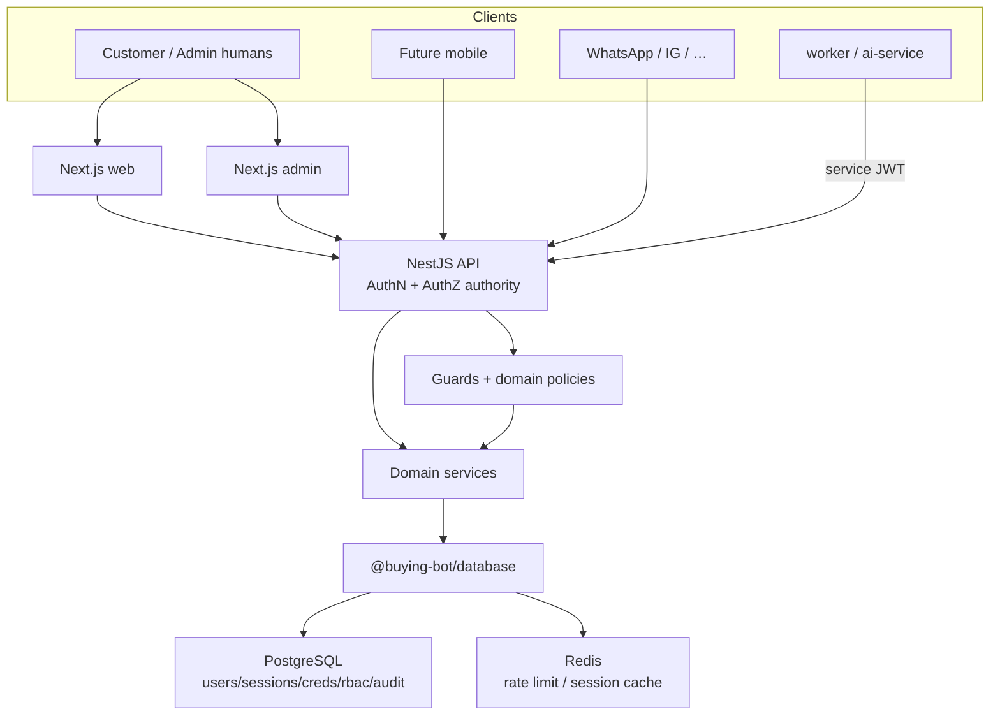

# ADR-0008: Authentication, identity, and authorization architecture

- Status: **Accepted**
- Date: 2026-08-13
- Deciders: Platform Architecture (recommendation); product owner / technical
  lead (acceptance)
- Aligns with: [docs/ARCHITECTURE.md](../ARCHITECTURE.md),
  [ADR-0005](./ADR-0005-backend-framework.md) (**Accepted**),
  [ADR-0006](./ADR-0006-database-and-data-architecture.md) (**Proposed** —
  treat as dependency, not accepted fact),
  [ADR-0007](./ADR-0007-frontend-architecture.md) (**Accepted**)
- Scope: Identity model, authentication, sessions/tokens, RBAC/permissions,
  MFA/OAuth readiness, service identities, webhooks/API keys, CSRF/CORS,
  audit, and frontend/backend auth boundaries
- Out of scope: Installing auth libraries; implementing login/register;
  creating user/session/RBAC tables or migrations; modifying apps or
  `package.json`

## 1. Context

Buying Bot Platform is an AI-powered omnichannel commerce system. Established
decisions:

| ADR | Status | Relevant constraint |
| --- | --- | --- |
| ADR-0005 | Accepted | NestJS + Fastify; Nest guards for AuthZ; OpenAPI/SDK |
| ADR-0006 | **Proposed** | PostgreSQL SoT; Redis cache/rate-limit/session denylist only; `identity` + `audit` schemas; `tenant_id` readiness |
| ADR-0007 | Accepted | Next.js web + admin, separate cookies/origins; httpOnly cookies preferred; backend is AuthZ authority |

Existing contracts (not final design):

- `@buying-bot/auth`: `AuthPrincipal`, `Authenticator`, `Authorizer`,
  `hasPermission`, `flattenRolePermissions`
- `@buying-bot/types`: `Permission`, `Role`, `PermissionAction`

No IdP, sessions, or credential stores are implemented.

This ADR selects identity/security architecture before any auth code ships.

## 2. Problem

Without an identity ADR, the first NextAuth/Clerk/Passport commit will decide
data ownership, admin isolation, mobile tokens, WhatsApp account linking, and
whether Nest remains the security boundary. Wrong choices would:

- make the browser or Next.js the authorization authority;
- share customer and admin cookies across apps;
- store sessions only in Redis (violates ADR-0006 SoT rules);
- lock Kenya customer PII into a foreign SaaS IdP without an exit plan;
- block omnichannel identity linking and service auth.

## 3. Architectural requirements

1. Nest API is the **authoritative** AuthN verification and AuthZ enforcement
   surface (ADR-0005 / ADR-0007).
2. Customers, staff, and admins share a coherent identity model without
   sharing browser security contexts.
3. Sessions/credentials live in **PostgreSQL** (when ADR-0006 is accepted);
   Redis may accelerate lookup or denylist only.
4. RBAC with fine-grained permissions; ownership/tenant checks where needed.
5. Admin security stricter than customer (MFA, shorter sessions, step-up).
6. Mobile and future channels authenticate to the **same API**, not a
   web-only IdP.
7. AI tools inherit user principal; the model is never the AuthZ authority.
8. No plaintext passwords; no secrets in logs; no PAN/CVV in identity store.
9. Rate-limit auth endpoints; audit security events.
10. `packages/auth` stays framework-agnostic contracts/ports.

## 4. Identity model

| Concept | Meaning |
| --- | --- |
| **Identity / User** | Stable subject (`subjectId`) representing a human or service principal |
| **Account** | Login-capable record for a user (status, primary contacts) |
| **Credential** | Password hash, OTP secret, WebAuthn credential, OAuth link |
| **Customer** | Commerce profile linked 1:1 (or 1:N later) to a user for shopping |
| **Staff / Administrator** | Same user table; elevated via **roles/membership**, not a second IdP |
| **Role** | Named bundle of permissions (e.g. `ORDER_MANAGER`) |
| **Permission** | `resource:action` (matches `@buying-bot/types`) |
| **Session** | Server-side authenticated period for a client |
| **Authentication factor** | Password, TOTP, WebAuthn, OTP, etc. |
| **Service identity** | Non-human principal for api/worker/ai-service/jobs |
| **Organization / Tenant** | Future merchant boundary; membership carries per-tenant roles |
| **Channel identity** | External id (WhatsApp MSISDN, Instagram PSID) linked to a user/customer |

**Rules:**

- One user may hold **multiple roles**.
- Customer shopping and staff access may share one **user** record when a
  person is both; **sessions and cookies remain realm-separated** (customer
  vs admin).
- Service identities are **separate** from human users.
- Future: one user may belong to **multiple organizations** with roles **per
  membership** (aligns with ADR-0006 `tenant_id` readiness).

## 5. Authentication approach evaluation

| Option | Fit for Buying Bot | Verdict |
| --- | --- | --- |
| **Custom Nest-owned auth** | Full data ownership; Nest guards; mobile/omnichannel; Kenya PII control; uses `@buying-bot/auth` ports | **Recommend** |
| NextAuth/Auth.js | Good for Next UI; weak as sole IdP for Nest + WhatsApp + workers | Reject as system of record |
| Better Auth | Modern TS; still needs Nest as authority; early ecosystem risk | Reject for v1 SoR |
| Auth0 / Clerk | Fast MFA/OAuth; cost, lock-in, Kenya data residency/ops, omnichannel linking friction | Reject as primary |
| Keycloak | Strong IdP; heavy ops for current stage | Defer |
| Supabase Auth | Couples to Supabase stack; conflicts with Nest+Postgres direction | Reject |

**Decision:** **First-party authentication owned by `apps/api` (Nest)**, with
shared contracts in `@buying-bot/auth`. Frontends are clients of the API auth
endpoints—not independent IdPs.

Managed IdPs remain a **future escape hatch** only if ops cost of first-party
auth exceeds benefit; would require a new ADR.

## 6. Authentication architecture (authority)

```text
Browser / Mobile / Channel adapter
        ↓
Next.js web | Next.js admin | future mobile | omnichannel ingress
        ↓  (credentials / session cookie / bearer)
NestJS API  ← authoritative AuthN + AuthZ
        ↓
Domain / application services (ownership checks)
        ↓
@buying-bot/database → PostgreSQL (sessions, users, credentials)
        ↕
Redis (rate limits, session cache/denylist — not sole SoT)
```

Verification of credentials and sessions happens in Nest. Next.js may read
session presence for UX routing only.

## 7. Session and token strategy

| Client | Mechanism |
| --- | --- |
| **Customer web** | Server-side **session** in PostgreSQL; opaque session id in **httpOnly** cookie |
| **Admin web** | Separate server-side session + **separate cookie name/domain**; shorter TTL |
| **Mobile** | Short-lived **JWT access token** + **rotating opaque refresh token** stored server-side |
| **Service-to-service** | Short-lived **signed service JWT** (or mTLS later); never human passwords |
| **External integrations** | Hashed **API keys** with scopes |

**Hybrid rationale:** Cookie sessions fit ADR-0007 SSR/RSC and CSRF controls
for browsers. Bearer access tokens fit mobile and service callers without
forcing JWT-as-session for browsers.

**JWT access tokens (where used):**

- Lifetime: minutes (e.g. 5–15)
- Claims: `sub`, `sid`/`jti`, `aud`, `iss`, `realm` (`customer`|`admin`|`service`), optional `tenant_id`
- **No** cart, PII dumps, or full permission catalogs in the token
- Refresh: opaque, rotating, stored in Postgres; reuse detection revokes family
- Revocation: session/refresh row status + optional Redis denylist for access `jti`

**Sessions (browser):**

- Create on login; rotate id on login and privilege elevation
- Expire idle + absolute max
- Logout / logout-all / admin terminate → revoke Postgres row (+ Redis denylist)

Redis may cache session payloads with TTL **mirroring** Postgres. Flushing
Redis must not “log everyone in forever” or invent sessions—miss → load from
Postgres or force re-auth.

## 8. Cookie strategy

| Attribute | Recommendation |
| --- | --- |
| HttpOnly | **Required** |
| Secure | **Required** in staging/production |
| SameSite | `Lax` default; `Strict` for admin if UX allows |
| Path | `/` within each app origin |
| Domain | Prefer **host-only** cookies; do **not** share one cookie across `web` and `admin` |
| Names | Distinct, e.g. `bb_cust_session` vs `bb_admin_session` |
| Expiration | Sliding session with absolute cap; admin shorter |

**Cross-origin:** `web`, `admin`, and `api` on separate origins. Browser
sessions use cookies scoped to each frontend origin; frontends call API with
`credentials` and CSRF protections (see § CSRF). Do not rely on a shared
parent-domain cookie for both apps.

## 9. Customer authentication (Kenya-first)

| Method | Launch posture |
| --- | --- |
| Email + password | **MUST** at launch |
| Email verification | **MUST** |
| Password reset | **MUST** |
| Phone/SMS OTP (login or step-up) | **SHOULD** soon after launch |
| Magic link | Optional later |
| OAuth (Google/Apple) | **SHOULD** later |
| Passkeys / WebAuthn | **OPTIONAL** future |
| MFA (customer) | Optional; encourage for high-value accounts later |

Phone OTP **complements** email/password; it does not replace password SoR
at launch unless product later decides OTP-primary.

## 10. Admin / staff authentication

| Control | Admin / privileged staff |
| --- | --- |
| MFA | **Mandatory** (TOTP first; WebAuthn preferred when ready) |
| Password policy | Stronger than customer |
| Session length | Shorter idle/absolute |
| Step-up auth | Refunds, role changes, secret rotation, payouts |
| Device/session list | Required |
| IP/risk signals | Optional later |

Staff roles are permission-scoped (support ≠ finance ≠ catalog).

## 11. RBAC and permissions

### 11.1 Roles (conceptual catalog — not created in code yet)

`CUSTOMER`, `SUPPORT`, `CATALOG_MANAGER`, `INVENTORY_MANAGER`,
`ORDER_MANAGER`, `FINANCE`, `MARKETING`, `ANALYST`, `ADMIN`, `SUPER_ADMIN`

### 11.2 Permissions

`resource:action` vocabulary already sketched in `@buying-bot/types`
(`create|read|update|delete|execute|manage`). Examples:

- `catalog:read|create|update|delete`
- `inventory:read|adjust`
- `orders:read|update|refund`
- `customers:read|update`
- `payments:read|refund`
- `ai:manage`, `integrations:manage`, `audit:read`, `system:manage`

Mapping: **User → Role(s)** [per tenant membership later] → **Permissions**.

Roles alone are insufficient for “own order only” — add **resource ownership
/ contextual checks** in application services.

### 11.3 RBAC vs ABAC

**Recommend: RBAC + contextual authorization** (ownership, tenant,
resource id). Full ABAC engine is premature. Nest **guards** check
permissions; **domain policies** check ownership/state.

## 12. Multi-tenancy (future)

Assume ADR-0006 `tenant_id` / membership:

- `Membership(user, organization)` holds roles for that org
- Permissions evaluated in **current tenant context**
- Platform `SUPER_ADMIN` is cross-tenant and heavily audited

Do not implement tenancy now.

## 13. Service identities

Human credentials **never** used by workers.

**Initial:** signed short-lived **service JWTs** issued/verified by platform
keys (`aud`/`sub` = service name), or mutual TLS between internal services
when mesh exists.

**External:** hashed API keys with scopes + rotation.

`apps/worker` / `apps/ai-service` authenticate as services when calling API
internals; jobs that act **for a user** carry the user’s `subjectId` as
delegated context and still pass AuthZ.

## 14. Nest placement

| Step | Nest home |
| --- | --- |
| Parse cookie/bearer | Middleware / guard |
| Authenticate session/token | Guard → `Authenticator` port |
| Attach `AuthPrincipal` | Request context / custom decorator |
| Permission check | Guard metadata (`@RequirePermissions`) |
| Validation | Pipes + Zod |
| Ownership / domain rules | Application services / domain policies |
| Audit | Interceptor or domain event → audit writer |

HTTP-layer AuthZ is necessary but **not sufficient** for IDOR-sensitive
operations.

## 15. Domain authorization examples

- Customer: read **own** orders; never another customer’s.
- Support: read customers/orders; **not** payment secrets or arbitrary refunds
  without `orders:refund` / `payments:refund`.
- Inventory manager: adjust stock; not change roles.
- Catalog manager: products; not capture payments.
- AI tool call: same permission checks as the invoking principal; high-risk
  tools need explicit allow + human approval flags (`@buying-bot/ai-core`).

## 16. Password security

If passwords used (recommended for launch):

- Hash with **Argon2id** (prefer) or bcrypt if Argon2 unavailable
- Calibrated work factor; unique salt per credential
- Policy: length + complexity guidance; check against breached sets when
  feasible
- Reset via single-use time-limited tokens (Postgres); invalidate sessions on
  reset
- Lockout / progressive delays after failures (coordinate with rate limits)

Never store plaintext. Never log password or reset tokens.

## 17. MFA

| Audience | Recommendation |
| --- | --- |
| Admin / SUPER_ADMIN | **Mandatory TOTP**; WebAuthn/passkeys as upgrade path |
| Staff with privileged perms | Mandatory when role includes refunds/system |
| Customer | Optional later; SMS OTP as step-up for risky actions |

SMS OTP is weaker (SIM swap)—acceptable for Kenya customer step-up with rate
limits; **not** sole admin MFA.

## 18. OAuth / social login

Future providers: Google, Apple (mobile), others as needed.

**Account linking:** if verified email matches, link OAuth to existing user
after explicit confirmation when risk warrants; prevent takeover via unverified
emails. Do not create duplicate customers for the same verified identity.

## 19. Phone / OTP

- Normalize MSISDN (E.164, Kenya `+254`)
- OTP: short TTL, single-use, attempt cap, per-phone and per-IP rate limits
- Prefer SMS provider abstraction; WhatsApp verification possible later
- Replay prevention: store hashed OTP codes server-side
- Acknowledge SIM-swap residual risk in product UX

## 20. Account recovery

Priority: security over convenience.

Flows: password reset; lost phone (email proof + cool-down); lost MFA
(admin-assisted or recovery codes); compromised (force logout-all, rotate
credentials, flag `COMPROMISED`); locked (time/unlock policy).

## 21. Account states

| State | Meaning |
| --- | --- |
| `PENDING_VERIFICATION` | Registered; limited until email/phone verified |
| `ACTIVE` | Normal |
| `SUSPENDED` | Admin block; no login |
| `LOCKED` | Automated lockout; temporary |
| `DEACTIVATED` | User-requested close; no login |
| `DELETED` | Soft-deleted/anonymized per policy; financial records retained per ADR-0006 |
| `COMPROMISED` | Forced recovery path |

## 22. Session management

Create → rotate on login/elevation → expire → revoke on logout/logout-all/
password change/admin terminate. Store device/user-agent/IP coarsely for
security UX—not invasive fingerprint warehouses. Suspicious reuse of refresh
tokens revokes the chain.

## 23. Audit logging

Events: `login_success|failure`, `logout`, `password_changed|reset`,
`mfa_enabled|disabled`, `role_changed`, `permission_changed`,
`session_revoked`, `account_suspended`, `admin_action`,
`service_authentication_failure`, `api_key_*`, webhook auth failures.

Store in PostgreSQL `audit` (ADR-0006). **Never** log passwords, tokens, MFA
secrets, OTP codes, or payment credentials.

## 24. Rate limiting

Redis-backed (ADR-0006) limits on: login, register, password reset, OTP send/
verify, MFA attempts, recovery. Fail **closed** on auth abuse paths when
Redis is down (safer than unlimited attempts)—or degrade to stricter
in-process limits. Exact numbers at implementation.

## 25. Threat mitigations (summary)

| Threat | Mitigation |
| --- | --- |
| Credential stuffing / brute force | Rate limits, lockout, breached password checks |
| Session/token theft | HttpOnly Secure cookies, short JWT TTL, rotation, revoke |
| CSRF | SameSite + CSRF token/origin check for cookie sessions |
| XSS → session | CSP, React escaping, no tokens in JS storage |
| Privilege escalation | Server AuthZ + domain ownership checks |
| IDOR | Resource-scoped queries by `subjectId`/tenant |
| OTP abuse / SIM swap | Rate limits, TTL, prefer TOTP/WebAuthn for admin |
| OAuth takeover | Verified email linking rules |
| Session fixation | Rotate session id on login |

## 26. CSRF

Cookie sessions **require** CSRF defense beyond SameSite alone:

- Prefer **double-submit or synchronizer CSRF tokens** for state-changing
  browser calls, and/or
- Strict `Origin`/`Referer` checks on mutating API routes from browsers

Bearer-token mobile/API clients are not CSRF-vulnerable in the cookie sense.

## 27. CORS

Explicit allowlist of `web` and `admin` origins for credentialed API calls.
**No wildcard** `*` with credentials in production (already aligned with
`@buying-bot/config` CORS guards). Mobile native apps are not browser CORS
subjects.

## 28. Security headers

Frontend/API edge should plan: CSP, HSTS, `X-Content-Type-Options`,
`frame-ancestors`/`X-Frame-Options`, `Referrer-Policy`, `Permissions-Policy`.
Implement later with Next/Nest middleware—not in this ADR.

## 29. Privacy

Minimize PII in sessions and tokens; retain login/IP/device data only as needed
for security; deletion/anonymization aligns with ADR-0006 lifecycle. **No
compliance claim** until verified.

## 30. Payment security

Identity ≠ card data. Store provider customer/payment-method **references**
only. Refunds/captures require AuthZ permissions and server-side provider
calls. AI cannot initiate payment tools without permission + approval gates.

## 31. AI identity

AI requests run with the **authenticated user’s principal** (or explicit
service principal for batch jobs). Tool execution calls the same AuthZ stack.
The LLM never grants access.

## 32. Omnichannel identity

```text
WhatsApp MSISDN / Instagram PSID / …  →  ChannelIdentity link  →  User/Customer
```

Verified channel binding required before merging accounts. Avoid uncontrolled
duplicate customers for the same person across web and WhatsApp.

## 33. API keys

For merchants/integrations: generate once, store **hash only**, scopes,
expiry, rotation, revocation. Display plaintext only at creation.

## 34. Webhook authentication

HMAC signature + timestamp window + replay cache/idempotency key in Postgres
(ADR-0006). Secrets rotated; never trust source IP alone.

## 35. Conceptual data model

Entities (not tables yet): `User`, `Credential`, `Session`, `Role`,
`Permission`, `UserRole`, `Organization`, `Membership`, `MfaFactor`,
`OAuthAccount`, `ChannelIdentity`, `VerificationToken`, `RecoveryToken`,
`ApiKey`, `AuditEvent`.

Relationships: User 1—N Credential/Session/MfaFactor/OAuthAccount;
User N—N Role via UserRole (or via Membership for tenants); Role N—N
Permission.

## 36. `packages/auth` role

**In:** ports (`Authenticator`, `Authorizer`), principal/permission types,
pure policy helpers, maybe shared permission constants.

**Out:** Nest guards implementation details, Next.js middleware, Prisma
models, secret material, passport strategies as package exports.

Adapters live in `apps/api` (and thin Next BFF only if unavoidable).

## 37. Frontend auth boundary

Web/admin may: show user chip, hide buttons, redirect to login, attach
cookies/credentials via SDK.

Web/admin may **not**: be the final allow/deny for refunds, data access, or
AI tools.

## 38. Admin / customer isolation

**Separate security realms:** distinct cookies, session tables/realm column,
and preferably distinct subdomains. Shared **user** directory is allowed;
shared **session cookie** is not.

## 39. Mobile

Use refresh + access token pair against the same Nest auth APIs. Do not
design cookie-only auth that blocks native clients.

## 40. Testing (future)

Unit: password hash, permission helpers, token/session rules.  
Integration: login/logout/refresh/CSRF/RBAC/IDOR.  
E2E: customer + admin auth journeys.  
Security: brute force, privilege escalation, webhook forgery.  
Never assert on raw secrets in logs.

## 41. Observability

Metrics/alerts: failed login rate, lockouts, MFA failures, authz denials,
refresh reuse. Correlate with `requestId`. No secret fields in log sinks.

## 42. Disaster recovery

Users, credentials (hashes), roles, MFA configs, OAuth links, API key hashes,
and audit events restore with PostgreSQL (ADR-0006). Sessions may be bulk-
revoked after restore if integrity uncertain. Redis session cache is
rebuildable.

## 43. Performance

Session read by hashed id (indexed); Redis cache optional; JWT verify is
local/CPU-bound; horizontal API scale remains stateless **except** shared
Postgres/Redis. No distributed auth mesh at v1.

## 44. Vendor lock-in

First-party auth accepts **our** ops/security burden: patches, MFA, abuse,
uptime. Avoids Auth0/Clerk lock-in and keeps omnichannel linking under our
schema. Revisit managed IdP only with export/migration ADR.

## 45. Decision matrix

| Area | Decision | Alternative | Recommendation |
| --- | --- | --- | --- |
| Identity model | Unified User + roles/memberships | Separate customer/staff IdPs | One directory; separate realms |
| Customer auth | Email/password + verify | OTP-only; magic-link-only | MUST password; SHOULD phone OTP |
| Admin auth | Password + mandatory MFA | Password-only | Stronger than customer |
| Session model | Server sessions (browser) | JWT-only browsers | Postgres session + cookie |
| Access tokens | Short JWT for mobile/services | Long-lived JWT | Minutes-lived |
| Refresh tokens | Opaque rotating in Postgres | Stateless refresh JWT | Reuse detection |
| Cookies | HttpOnly Secure; separate names | Shared parent domain cookie | Isolate web/admin |
| RBAC | Roles → permissions | Roles only | Fine-grained permissions |
| ABAC | Contextual ownership checks | Full ABAC engine | RBAC + context |
| MFA | TOTP mandatory admin | SMS for admin | TOTP/WebAuthn |
| OAuth | Later, link by verified email | Launch blocker | SHOULD later |
| Phone OTP | Complementary | Replace passwords | Kenya SHOULD |
| Service auth | Signed service JWT | Human creds in workers | Never human creds |
| API keys | Hashed scoped keys | Plaintext DB keys | Hash + rotate |
| Webhooks | HMAC + timestamp + idempotency | IP allowlist only | HMAC required |
| CSRF | Token/origin + SameSite | SameSite only | Defense in depth |
| CORS | Explicit origins | `*` | No wildcard+creds |
| Rate limiting | Redis-backed on auth routes | None | Fail closed on abuse |
| Audit | Postgres security events | Logs only | Durable audit |

## 46. Architecture diagram



Caption: Nest is the security boundary. Browsers use isolated cookie
sessions; mobile/services use bearer credentials; channels link to users.

## 47. Implementation phases (planning only)

1. Identity model + `packages/auth` contract expansion  
2. Customer register/login/logout/verify/reset  
3. Server sessions + cookies + CSRF  
4. Admin/staff auth + mandatory MFA  
5. RBAC permissions + Nest guards + domain ownership checks  
6. Refresh tokens for mobile  
7. OAuth linking  
8. Service JWTs + API keys  
9. Omnichannel identity linking  
10. Hardening (headers, advanced risk, WebAuthn)

Do not execute in this ADR.

## 48. Implementation boundary

**Acceptance does NOT authorize:** installing Passport/NextAuth/Auth.js/
Clerk/Auth0/Keycloak/JWT libraries; creating user/session/RBAC tables;
implementing login/register/MFA/OAuth; modifying `apps/*` or `package.json`.

## 49. Consistency notes

- ADR-0005: Nest guards/ports — reinforced.  
- ADR-0007: separate admin/web cookies; httpOnly; backend AuthZ — reinforced.  
- ADR-0006 (**Proposed**): sessions/users/audit in Postgres; Redis not SoT;
  rate limits on Redis — **assumed**. If ADR-0006 is rejected, revisit session
  storage before implementation.

## 50. Rejected alternatives (summary)

| Alternative | Why not |
| --- | --- |
| Auth0/Clerk as primary IdP | Lock-in, cost, omnichannel/data ownership |
| NextAuth as SoR | Nest/mobile/channels need API-owned identity |
| JWT-only browser auth | XSS token theft; weaker SSR session story |
| Shared web/admin cookie | Privilege confusion / session fixation risk |
| Redis-only sessions | Violates SoT; auth survives Redis flush poorly |
| Roles without permissions | Too coarse for refunds/AI/admin |
| SMS as admin MFA | SIM-swap unsuitable for privileged access |

## 51. Decision status

**Accepted.**

Indexed in [DECISIONS.md](../DECISIONS.md). Acceptance does **not** authorize
implementation; see §48 Implementation boundary.
