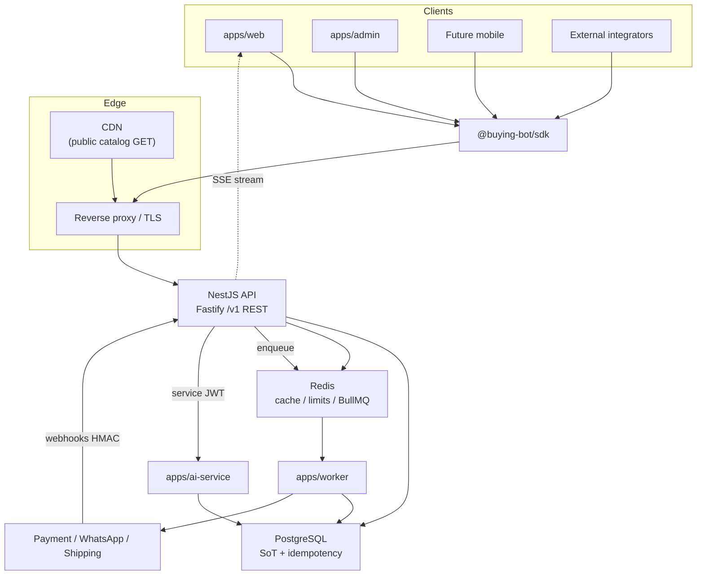

# ADR-0009: API contract and communication architecture

- Status: **Accepted**
- Date: 2026-08-13
- Deciders: Platform Architecture (recommendation); product owner / technical
  lead (acceptance)
- Aligns with: [docs/ARCHITECTURE.md](../ARCHITECTURE.md),
  [ADR-0005](./ADR-0005-backend-framework.md) (**Accepted**),
  [ADR-0006](./ADR-0006-database-and-data-architecture.md) (**Accepted**),
  [ADR-0007](./ADR-0007-frontend-architecture.md) (**Accepted**),
  [ADR-0008](./ADR-0008-authentication-and-identity-architecture.md)
  (**Accepted**)
- Scope: Public and internal communication contracts between web, admin, API,
  worker, AI service, future mobile, and external integrations
- Out of scope: Installing dependencies; implementing controllers, routes,
  DTOs, OpenAPI, endpoints, auth, queues, SSE, WebSockets, webhooks; modifying
  apps or packages; creating schemas or migrations

## 1. Context

Buying Bot Platform is an AI-powered omnichannel commerce system. Established
decisions:

| ADR      | Status   | Relevant constraint                                                                                                      |
| -------- | -------- | ------------------------------------------------------------------------------------------------------------------------ |
| ADR-0005 | Accepted | NestJS + Fastify for `apps/api`; Zod validation; `/v1` + OpenAPI → SDK; API enqueues, worker consumes; webhooks ack fast |
| ADR-0006 | Accepted | PostgreSQL SoT; Redis cache/limits/queues; BullMQ on worker; idempotency in Postgres; optional outbox                    |
| ADR-0007 | Accepted | Next.js web/admin consume REST + OpenAPI via `@buying-bot/sdk`; SSE for AI streaming                                     |
| ADR-0008 | Accepted | Nest is AuthN/AuthZ authority; cookie sessions (web) + bearer tokens (mobile/service); webhook HMAC; rate limits         |

Current communication reality (verified in-repo):

| Asset                             | Current state                                            |
| --------------------------------- | -------------------------------------------------------- |
| `apps/api`                        | Ops shell only. No product routes.                       |
| `apps/web` / `apps/admin`         | TypeScript shells. No Next.js yet.                       |
| `apps/worker` / `apps/ai-service` | Ops shells. No job/AI product routes.                    |
| `@buying-bot/sdk`                 | `PlatformSdk` + `PlatformApiError`; health only.         |
| `@buying-bot/types`               | `ApiErrorBody`, `Permission`, pagination types deferred. |
| `@buying-bot/validation`          | Zod + `paginationQuerySchema` + `parseOrThrow`.          |
| `@buying-bot/utils`               | `x-request-id` / `x-correlation-id` in ops server.       |
| `@buying-bot/auth`                | `Authenticator` / `Authorizer` ports.                    |
| `@buying-bot/ai-core`             | Model/tool ports; AI service is separate process.        |

No OpenAPI spec, product endpoints, queues, or webhook handlers exist. This ADR
defines the communication architecture before implementation.

## 2. Problem

Without a communication ADR, the first Nest controller or SDK method will
silently decide:

- REST vs GraphQL vs tRPC incompatibility across web, admin, and mobile;
- inconsistent errors, pagination, and idempotency;
- webhooks that block on business logic before acknowledging providers;
- workers that bypass domain rules;
- Prisma models leaking into JSON responses;
- duplicate validation in three places;
- WebSocket complexity where SSE and polling suffice.

Wrong patterns would be expensive to reverse once commerce, payments, and
omnichannel integrations ship.

## 3. Architectural requirements

1. **One primary external API style** consumable by web, admin, mobile, and
   integrators.
2. **Nest API is the orchestration boundary** — not the browser, not the AI
   model, not workers calling Postgres directly for domain mutations.
3. **OpenAPI-backed contracts** feeding `@buying-bot/sdk`.
4. **Zod at boundaries** — shared schemas in `@buying-bot/validation`.
5. **PostgreSQL is SoT** for business outcomes; Redis/BullMQ for async work
   (ADR-0006).
6. **AuthN/AuthZ per ADR-0008** — this ADR defines how requests carry identity,
   not how identity is stored.
7. **Fast webhook acknowledgement** — verify, persist/enqueue, respond, process
   async.
8. **Idempotency** for checkout, payments, refunds, webhooks, and jobs.
9. **Correlation IDs** across API, worker, AI service, and integrations.
10. **No secrets, stack traces, or DB errors** in client-visible responses.

## 4. Primary API style

### 4.1 Options evaluated

| Option                            | Fit                                                                                                 | Verdict                                 |
| --------------------------------- | --------------------------------------------------------------------------------------------------- | --------------------------------------- |
| **REST (JSON over HTTP)**         | Nest + Fastify native; OpenAPI; CDN/cache; mobile; external integrators; aligns with ADR-0005/0007  | **Recommend**                           |
| GraphQL                           | Flexible reads; adds schema/auth/complexity; weak fit for webhooks, file uploads, payment callbacks | Reject as primary                       |
| tRPC                              | Excellent TS DX; poor fit for mobile, external merchants, OpenAPI ecosystem                         | Reject                                  |
| gRPC                              | Strong service-to-service; poor browser/public API ergonomics                                       | Defer for internal only if needed later |
| RPC-style POST actions everywhere | Easy to abuse; hides resources                                                                      | Reject as default pattern               |

### 4.2 Decision

Adopt **versioned REST with JSON** as the **primary public and client API**
for `apps/api`.

Internal service calls (`api` → `ai-service`) use **HTTP + JSON** initially,
with optional gRPC only if latency/typing pressure justifies a future ADR.

## 5. REST architecture

### 5.1 Resource orientation

- Nouns represent resources: `/v1/products`, `/v1/orders/{orderId}`.
- Collections use **plural** kebab-case names.
- Prefer shallow paths; avoid deep nesting beyond two levels
  (e.g. `/v1/orders/{id}/items` is acceptable; avoid
  `/v1/shops/{id}/categories/{id}/products/{id}/reviews/{id}`).

### 5.2 Request structure

- `Content-Type: application/json` for bodies unless uploading binary (future
  multipart to object storage via signed URLs).
- Query parameters for read filters, pagination, sort — never for secrets.
- Headers for auth, idempotency, concurrency, correlation (see below).

### 5.3 Response structure

- Success: JSON body with explicit **response DTO** — never raw Prisma rows.
- Collections: `{ data: [...], meta: { ... } }` or equivalent stable envelope.
- Single resource: `{ data: { ... } }` or bare resource object (pick one
  convention at implementation; default **envelope with `data`** for consistency).
- `204 No Content` for successful deletes with no body.

### 5.4 Conceptual examples (not implemented)

```http
GET /v1/products?category=electronics&sort=price&order=asc&page=1&pageSize=20
Authorization: Bearer … | Cookie: (browser session via BFF/SDK credentials)

POST /v1/orders
Idempotency-Key: <client-generated-uuid>
Content-Type: application/json

{ "cartId": "…", "shippingAddressId": "…" }
```

## 6. API versioning

### 6.1 Strategy

**URI path versioning** as the primary contract:

```text
https://api.example.com/v1/...
https://api.example.com/v2/...   (future)
```

Reject version-in-header-only as the sole mechanism — mobile clients and
external integrators need visible, loggable version boundaries.

Optional `Accept-Version` or `Sunset` headers may supplement deprecation
communication but do not replace URI versions.

### 6.2 Change policy

| Change type                                     | Handling                                                                         |
| ----------------------------------------------- | -------------------------------------------------------------------------------- |
| Non-breaking (new optional field, new endpoint) | Same `/v1`                                                                       |
| Breaking (remove/rename field, semantic change) | New `/v2`                                                                        |
| Deprecation                                     | `Deprecation` / `Sunset` headers + docs + changelog                              |
| Migration period                                | Minimum **6 months** for external/mobile after `/v2` GA unless security-critical |
| Sunset                                          | Old version read-only or removed per announced date                              |

Mobile apps may lag; `/v1` must remain stable until sunset policy completes.

## 7. Resource naming

| Resource      | Path segment    | ID style                                                                        |
| ------------- | --------------- | ------------------------------------------------------------------------------- |
| Products      | `products`      | UUID in API (`id`); slug only in public SEO routes on web, resolved server-side |
| Categories    | `categories`    | UUID                                                                            |
| Orders        | `orders`        | UUID                                                                            |
| Customers     | `customers`     | UUID (admin); `me` alias for self-service                                       |
| Cart          | `cart`          | Session/customer scoped singleton                                               |
| Payments      | `payments`      | UUID                                                                            |
| Inventory     | `inventory`     | SKU or UUID per domain model                                                    |
| Promotions    | `promotions`    | UUID                                                                            |
| Conversations | `conversations` | UUID                                                                            |
| Messages      | `messages`      | Nested under conversation or flat with filter                                   |

**Rules:**

- Plural collection names.
- IDs in path: `{orderId}` camelCase param name, UUID value.
- Slugs appear in **web URLs**, not as authoritative API identifiers.
- Business logic stays in application services — controllers are thin.

## 8. HTTP methods

| Method     | Use                                                                                   |
| ---------- | ------------------------------------------------------------------------------------- |
| **GET**    | Safe, idempotent reads. No body side effects.                                         |
| **POST**   | Create resources **or** non-idempotent commands that do not map cleanly to PUT/PATCH. |
| **PUT**    | Full replace of a resource representation (rare).                                     |
| **PATCH**  | Partial update of allowed fields.                                                     |
| **DELETE** | Remove or soft-delete per domain rules.                                               |

### 8.1 Command-like operations

Prefer **state transitions on resources**:

- `POST /v1/orders/{orderId}/cancel`
- `POST /v1/payments/{paymentId}/refund`
- `POST /v1/catalog/products/{productId}/publish`

Use POST sub-resource actions when the operation is a **domain command** with
side effects, not a CRUD field edit. Avoid unbounded `/v1/doSomething` RPC
namespaces.

Commands require AuthZ, idempotency keys when money/state is involved, and
audit events.

## 9. Status codes

| Code    | When                                                          |
| ------- | ------------------------------------------------------------- |
| **200** | Successful GET/PATCH/POST returning body                      |
| **201** | Resource created; include `Location` when helpful             |
| **202** | Accepted for async processing (job enqueued)                  |
| **204** | Success with no body                                          |
| **400** | Malformed request, unknown query param, bad JSON              |
| **401** | Missing/invalid authentication                                |
| **403** | Authenticated but not authorized                              |
| **404** | Resource not found **or** hidden by AuthZ (avoid enumeration) |
| **409** | Conflict (duplicate, state mismatch, concurrency)             |
| **422** | Semantically invalid input (validation failed)                |
| **429** | Rate limited                                                  |
| **500** | Unexpected server error (generic message)                     |
| **502** | Bad gateway to upstream provider                              |
| **503** | Service unavailable / dependency down (readiness)             |

Never return **200** with `{ success: false }` for HTTP-level outcomes.

## 10. Error contract

Standardize on the existing `@buying-bot/types` shape:

```json
{
  "error": {
    "code": "ORDER_NOT_CANCELLABLE",
    "message": "This order cannot be cancelled in its current state.",
    "requestId": "01J…",
    "details": [
      { "field": "status", "message": "Must be pending or confirmed" }
    ]
  }
}
```

**Rules:**

- `code`: stable machine string (`SCREAMING_SNAKE` or dotted namespacing).
- `message`: safe for humans; no internal exception text.
- `requestId`: matches `x-request-id` response header.
- `details`: optional validation issues array.
- Never expose stack traces, SQL, internal hostnames, or secrets.

Nest maps domain/application errors to this envelope via a global exception
filter (implementation deferred).

## 11. Validation

### 11.1 Layering

| Layer                    | Responsibility                                                |
| ------------------------ | ------------------------------------------------------------- |
| **Frontend (web/admin)** | Zod from `@buying-bot/validation` for UX — immediate feedback |
| **SDK**                  | Optional client-side parse of responses; no business rules    |
| **API boundary (Nest)**  | Authoritative request validation via Zod schemas (ADR-0005)   |
| **Application/domain**   | Invariants, state machines, cross-field rules                 |

**Single source:** define request/query schemas in `@buying-bot/validation`
(or domain-specific files exported from it). Nest pipes call `parseOrThrow`.
Do not duplicate divergent schemas in controllers.

### 11.2 Relationship to Nest

- No `class-validator` / second schema stack.
- Controllers accept `unknown`, validate to typed input, pass to application
  services.
- Response mapping is explicit — validated output schemas where high-risk
  (payments, PII).

## 12. OpenAPI

### 12.1 Role

**OpenAPI 3.x is the authoritative external API description** for `apps/api`.

Flow:

```text
apps/api (Nest + Fastify)
        ↓ generate/publish
OpenAPI spec (committed or CI artifact)
        ↓
@buying-bot/sdk types/methods
        ↓
web / admin / mobile / docs
```

### 12.2 Contents

- All `/v1` public and admin-documented routes
- Request/response schemas aligned with Zod (generate from Zod or maintain
  OpenAPI with CI drift checks — choice at implementation)
- Standard error schema referencing `ApiErrorBody`
- Security schemes: cookie session (documented), bearer JWT, API key (future)
- Pagination/filter parameters documented per resource

### 12.3 Versioning

- One OpenAPI document per major API version (`openapi-v1.yaml`).
- Breaking changes bump URI version and spec file.

Internal-only routes (`/internal/...`) may be excluded from public OpenAPI or
marked with separate tags.

## 13. SDK architecture (`packages/sdk`)

### 13.1 Role

`@buying-bot/sdk` is the **preferred typed client** for all first-party apps.

### 13.2 Responsibilities

| In scope                                        | Out of scope            |
| ----------------------------------------------- | ----------------------- |
| HTTP request construction                       | Business workflows      |
| Auth header/cookie attachment hooks             | Prisma/database         |
| Typed responses/errors (`PlatformApiError`)     | Nest internals          |
| Retries (safe/idempotent only), timeouts, abort | Worker queue logic      |
| Serialization (JSON)                            | Authorization decisions |

Extend `PlatformSdk` with generated or hand-maintained methods per OpenAPI
resource. Map non-2xx to `PlatformApiError` using parsed `ApiErrorBody`.

### 13.3 Auth integration (ADR-0008)

- Browser apps: SDK uses `credentials: 'include'` for cookie sessions where
  applicable; CSRF token header when required.
- Mobile: `getAccessToken()` bearer hook (already in SDK foundation).
- Never embed refresh tokens in SDK storage logic on web — prefer httpOnly
  cookies.

## 14. Type ownership

| Layer            | Owns                                      | Must not leak             |
| ---------------- | ----------------------------------------- | ------------------------- |
| **Domain**       | Entities, invariants, ports               | HTTP, Prisma              |
| **Database**     | Prisma models, migrations                 | Browser, OpenAPI directly |
| **API contract** | Request/response DTOs in types/validation | ORM shapes                |
| **UI**           | View models, component props              | Database types            |

**Mapping:** domain entity → response DTO in application layer. Prisma records
never cross the HTTP boundary.

Public contracts in `@buying-bot/types` / `@buying-bot/validation` remain
stable across ORM refactors.

## 15. Pagination

### 15.1 Strategies

| Use case                         | Strategy                                                             |
| -------------------------------- | -------------------------------------------------------------------- |
| Admin tables (orders, customers) | **Offset** (`page`, `pageSize`) — already in `paginationQuerySchema` |
| Product catalog browsing         | **Cursor** preferred at scale (`cursor`, `limit`)                    |
| Audit logs, events               | **Cursor** required                                                  |
| Search results                   | **Cursor** + stable sort key                                         |

### 15.2 Response meta

Offset:

```json
{ "data": [], "meta": { "page": 1, "pageSize": 20, "totalItems": 450 } }
```

Cursor:

```json
{ "data": [], "meta": { "nextCursor": "…", "hasMore": true } }
```

Maximum `pageSize` / `limit` enforced server-side (e.g. 100).

## 16. Filtering

Whitelist filter parameters per resource — no arbitrary query DSL.

Examples:

- Products: `category`, `brand`, `minPrice`, `maxPrice`, `inStock`, `ratingMin`
- Orders: `status`, `createdAfter`, `createdBefore`, `customerId` (admin)
- Customers: `status`, `email`, `phone` (admin, AuthZ required)

Validate every filter with Zod; reject unknown params with **400**. Apply
AuthZ before returning filtered private data.

## 17. Sorting

- Allowed sort fields enumerated per resource (`sort=price`, `order=asc|desc`).
- Reject sorts on arbitrary/internal columns.
- Default sort documented (e.g. products: `relevance` or `createdAt desc`).
- Stable tie-breaker (e.g. always `id`) to prevent pagination drift.

## 18. Search (contract only)

Product search endpoint (conceptual):

```http
GET /v1/search/products?q=…&category=…&sort=relevance&cursor=…
```

Response includes `data`, `meta` (pagination), optional `facets` object.

Search **engine** choice belongs to data architecture (ADR-0006: PostgreSQL
FTS initially). This ADR only defines the HTTP contract.

Autocomplete:

```http
GET /v1/search/suggestions?q=…
```

Rate-limit search endpoints aggressively (see §24).

## 19. Idempotency

Required for:

- Checkout / order creation
- Payment initiation and capture
- Refunds
- Inbound webhooks (provider event id)
- Outbound integration retries
- Job submission with side effects

**Mechanism:**

- Client sends `Idempotency-Key` header (UUID v4 recommended).
- Server persists unique `(actor, route, idempotency_key)` in **PostgreSQL**
  (ADR-0006); Redis optional fast-path cache.
- Replay returns **same response** (201/200) without duplicate side effects.
- Conflicting payload with same key → **409**.

Workers check Postgres before executing side effects (ADR-0006).

## 20. Concurrency

| Domain                | Mechanism                                                   |
| --------------------- | ----------------------------------------------------------- |
| Inventory adjustments | Optimistic concurrency — `version` field or `If-Match` ETag |
| Cart updates          | Short-lived cart version or merge strategy                  |
| Order state changes   | State machine + version check → **409** on stale            |
| Refunds               | Idempotency + state guard                                   |

Support `If-Match` / `ETag` on mutable resources where lost updates are costly.

## 21. Caching

| Data class                                | Policy                                                   |
| ----------------------------------------- | -------------------------------------------------------- |
| **Public catalog** (products, categories) | `Cache-Control: public, max-age=…`; CDN friendly; `ETag` |
| **Personalized** (cart, account, orders)  | `private, no-store` or short private max-age             |
| **Sensitive** (payments, admin PII)       | `no-store`                                               |
| **Webhooks/auth**                         | Never cache                                              |

Application-level Redis cache (ADR-0006) for hot reads — invalidate on writes.
CDN must not cache authenticated responses.

## 22. Rate limiting

Coordinate with ADR-0006 (Redis) and ADR-0008 (auth endpoints).

| Surface                  | Limit philosophy                |
| ------------------------ | ------------------------------- |
| Public catalog reads     | Higher limits; IP-based         |
| Auth (login, OTP, reset) | Strict; fail closed             |
| Customer mutations       | Per user + IP                   |
| Admin                    | Per user; stricter on exports   |
| Search                   | Per IP/user; anti-scrape        |
| AI endpoints             | Per user; token budget separate |
| Checkout/payment         | Low burst; fraud-aware          |
| Webhooks                 | Per provider signature id       |
| Service-to-service       | Per service identity            |

Return **429** with `Retry-After` when appropriate. Do not implement in this ADR.

## 23. Authentication integration (ADR-0008)

This ADR does **not** redefine AuthN. Request flow:

```text
HTTP Request
    ↓
Extract cookie / bearer / API key
    ↓
Nest Guard → Authenticator (ADR-0008)
    ↓
AuthPrincipal on request context
    ↓
Authorization (roles, permissions, ownership, tenant)
    ↓
Controller → Application Service → Domain
```

Frontends attach credentials via SDK; backend always verifies.

## 24. Authorization

- **Guards:** permission metadata (`orders:read`, etc.).
- **Ownership:** customers access own resources (`/v1/me/orders`).
- **Staff/admin:** RBAC per ADR-0008; admin routes under `/v1/admin/...` or
  uniform resources with stricter AuthZ — pick one at implementation (recommend
  **resource-oriented with permission checks**, not duplicate resource trees).
- **Tenant context:** future `X-Tenant-Id` or membership from session (ADR-0008).

Never rely on frontend filtering. List endpoints must scope queries server-side.

## 25. Correlation IDs

Propagate across all communication:

| Header             | Purpose                                                              |
| ------------------ | -------------------------------------------------------------------- |
| `x-request-id`     | Single HTTP request identifier (generated at edge/API)               |
| `x-correlation-id` | Business operation spanning services (reuse from client or generate) |

Rules:

- API ops middleware already sets these (`@buying-bot/utils` pattern).
- SDK forwards correlation id on mutations.
- Worker jobs include correlation id in payload.
- AI service logs correlation id; returns in error responses.
- External provider calls attach correlation id in structured logs (not always
  in provider payload).

One checkout or webhook processing chain shares one correlation id.

## 26. Synchronous vs asynchronous

| Synchronous (hold HTTP)                        | Asynchronous (prefer)           |
| ---------------------------------------------- | ------------------------------- |
| CRUD reads/writes with immediate consistency   | Email/SMS/push notifications    |
| Login, cart read                               | AI embedding/indexing           |
| Payment **initiation** returning client action | Report generation               |
| Webhook **acknowledgement** only               | Order fulfillment orchestration |
|                                                | Image processing                |
|                                                | Integration sync                |
|                                                | Heavy search reindex            |

Long-running work: return **202** + `{ jobId }` or resource in `pending` state;
client polls or receives SSE/push later.

## 27. Job queues (API → worker)

Per ADR-0006: **BullMQ on Redis**, consumers in `apps/worker` only.

### 27.1 Submission

```text
API validates + persists intent (Postgres)
    ↓
Enqueue job { type, payload, idempotencyKey, correlationId }
    ↓
Return 202 or continue if fire-and-forget
```

### 27.2 Job contract

- `jobId`, `type`, `payload`, `idempotencyKey`, `correlationId`, `attempt`
- Retries: exponential backoff + jitter; max attempts per job type
- DLQ: failed jobs to dead-letter queue + alert; business status in Postgres
- Worker invokes **application services** via ports — no direct domain bypass

Optional **transactional outbox** (ADR-0006) when Redis unavailable at enqueue
time for payment-critical paths.

## 28. Events

Distinguish:

| Kind             | Example       | Transport                                 |
| ---------------- | ------------- | ----------------------------------------- |
| **Command**      | `CreateOrder` | HTTP POST → application service           |
| **Domain event** | `OrderPaid`   | In-process handler → enqueue side effects |
| **Query**        | `GetProduct`  | HTTP GET                                  |

**Not** full event sourcing. Domain events trigger notifications, analytics,
search index updates, and worker jobs.

Initial: in-process event dispatch in `apps/api` + BullMQ for cross-process.
Extract to Redis Streams or broker later if needed — not Kafka at v1.

## 29. Event bus evaluation

| Option              | Verdict                                          |
| ------------------- | ------------------------------------------------ |
| In-process + BullMQ | **Adopt** for v1                                 |
| Redis Streams       | Consider when cross-service fan-out grows        |
| Kafka / RabbitMQ    | Defer — ops cost unjustified now                 |
| SNS/SQS             | Cloud-specific; evaluate with infrastructure ADR |

## 30. Webhook architecture

### 30.1 Inbound (providers → API)

Dedicated routes, e.g. `/v1/webhooks/payments/{provider}`,
`/v1/webhooks/shipping/{provider}`, `/v1/webhooks/whatsapp`.

Flow:

```text
Receive raw body
    ↓
Verify signature + timestamp (ADR-0008)
    ↓
Persist idempotency record / event stub (Postgres)
    ↓
Enqueue processing job
    ↓
Return 2xx quickly (< 3s target)
    ↓
Worker executes domain logic
```

Fastify **raw body** required for HMAC (ADR-0005).

### 30.2 Outbound (platform → merchants)

Signed callbacks with HMAC, retry with backoff, idempotency keys, delivery
logs in Postgres.

## 31. Webhook response behavior

Acknowledge after **durability** (Postgres write or outbox), not after full
business processing. Processing failures retry from queue; do not ask providers
to replay if already acknowledged — use internal retry/DLQ.

## 32. Retries

| Layer              | Policy                                                        |
| ------------------ | ------------------------------------------------------------- |
| SDK/client         | Idempotent GET only; no blind POST retry                      |
| API → provider     | Bounded retries, jitter; circuit breaker on sustained failure |
| Worker             | BullMQ retry policy; idempotent handlers                      |
| Provider → webhook | They retry; we dedupe via idempotency                         |

**Never** blindly retry payment capture/refund without idempotency keys.

## 33. Timeouts (aspirational targets)

| Call                    | Target timeout                            |
| ----------------------- | ----------------------------------------- |
| Frontend → API          | 10–30s (mutations lower)                  |
| API → PostgreSQL        | Pool/query timeouts per statement class   |
| API → AI service        | 60–120s streaming; shorter for non-stream |
| API → payment provider  | Provider-specific; ≤ 30s for user-facing  |
| API → external shipping | 10–20s                                    |
| Worker → provider       | Higher; async context                     |

Every outbound HTTP client must set connect + response timeouts.

## 34. Circuit breakers

Apply selectively to **external dependencies** (payment, AI, messaging) when
error rate threshold exceeded — open circuit, fail fast, half-open probe.

Do not deploy circuit breakers on internal Postgres/Redis paths at v1; use
health/readiness instead.

## 35. SSE / streaming

Per ADR-0007: **SSE (Server-Sent Events)** is the preferred first mechanism for:

- AI assistant token streaming
- Long-running job progress (optional)

Route example (conceptual): `GET /v1/ai/conversations/{id}/stream`

Headers: `Content-Type: text/event-stream`, auth required, no caching.

## 36. WebSockets

**Not required at v1.**

| Potential use | Recommendation                           |
| ------------- | ---------------------------------------- |
| AI chat       | SSE first                                |
| Order status  | Polling or SSE; push notifications later |
| Live support  | SSE or third-party widget later          |
| Notifications | Mobile push / email; not WebSocket-first |

Revisit WebSockets only if bidirectional low-latency needs exceed SSE limits.

## 37. AI service communication

```text
Client → API (AuthN/AuthZ)
    ↓
API → apps/ai-service (service JWT + correlation id)
    ↓
ai-service → model provider (adapter)
    ↓
API ← structured result / stream
    ↓
API persists conversation state (Postgres) + executes tools via domain services
```

Rules:

- AI service is **not** system of record.
- Tool calls that mutate commerce state execute in API/domain with same AuthZ
  as user (`@buying-bot/ai-core` risk levels).
- Model never bypasses authorization.

## 38. Worker communication

```text
API → BullMQ → worker → application ports / providers
```

Workers do not expose public HTTP for domain mutations. Internal health ops
only (ADR-0004). Workers authenticate to API/internal services with **service
identity** (ADR-0008).

## 39. Service-to-service authentication

Per ADR-0008: **short-lived signed service JWT** (`aud`, `sub`, `iss`) between
`api`, `worker`, `ai-service`. mTLS optional future hardening.

No human credentials in workers. Rotate signing keys with overlap period.

## 40. External integrations

```text
apps/api
    ↓
Integration adapter (implements port)
    ↓
Provider SDK (infra layer only)
```

Ports examples: `PaymentProvider`, `MessagingProvider`, `ShippingProvider`,
`AiProvider`. Provider SDKs must not leak into domain modules.

## 41. Payment API safety

- Initiation returns client-safe references (client secret, redirect URL) — never
  full provider credentials.
- Payment **status** confirmed server-side via provider API + webhooks — frontend
  display is not SoT.
- Refund endpoints require elevated permissions + idempotency + audit.
- No card PAN/CVV through platform API (tokenization via provider).

## 42. API security

Protect against:

- Injection → parameterized queries, validated input
- Broken access control → ADR-0008 + domain ownership
- Mass assignment → explicit allow-lists (see §43)
- Excessive data exposure → response DTOs
- IDOR → query scoping by principal
- Replay → idempotency, webhook timestamps
- Abuse → rate limits, payload size caps (e.g. 1MB default JSON)
- Enumeration → uniform 404/403 messaging

## 43. Mass assignment

- HTTP payloads validated against **strict Zod objects** (`.strict()` where
  appropriate).
- Map input DTO → command object → domain — never bind request body to ORM
  `update()` directly.
- Reject unknown fields on admin writes.

## 44. Response design

Do not return: password hashes, session tokens, refresh tokens, internal ids
(provider raw payloads), stack traces, `deletedAt` unless admin, payment
secrets.

Use explicit response types; include only fields clients need.

## 45. API documentation

| Artifact     | Owner                                  |
| ------------ | -------------------------------------- |
| OpenAPI spec | `apps/api` CI artifact + repo copy     |
| Human guides | `docs/API/`                            |
| Auth docs    | Cross-link ADR-0008 implementation     |
| Examples     | SDK snippets                           |
| Changelog    | Per API version in `docs/API/`         |
| Deprecation  | OpenAPI + HTTP headers + release notes |

Docs must stay synchronized with OpenAPI — CI contract drift check recommended.

## 46. API testing (future)

| Level       | Focus                                       |
| ----------- | ------------------------------------------- |
| Unit        | Mappers, validators, idempotency logic      |
| Integration | Nest routes + Postgres test container       |
| Contract    | OpenAPI vs SDK types; consumer-driven tests |
| E2E         | Checkout, admin refund, webhook flow        |
| Security    | AuthZ bypass, IDOR, rate limit, CSRF        |
| Load        | Search, checkout, webhook burst             |

Breaking changes require explicit compatibility tests.

## 47. Contract testing

Provider: `apps/api` OpenAPI.  
Consumers: web, admin, mobile, AI service clients.

Verify:

- Response schemas match SDK types
- Error envelope consistent
- Required headers documented
- CI fails on breaking diff without version bump

## 48. Observability

Metrics/logs/traces (OpenTelemetry later):

- Request count, latency histogram, status codes
- Auth failures vs authz failures (distinct)
- Rate limit hits
- Queue enqueue failures
- External provider error rate
- AI time-to-first-token

Always include `requestId` / `correlationId`. Never log tokens, passwords,
payment credentials, or full webhook secrets.

## 49. Performance targets (aspirational)

| Operation                      | p95 target (initial) |
| ------------------------------ | -------------------- |
| Standard read API              | < 300 ms             |
| Product search                 | < 500 ms             |
| Auth login                     | < 500 ms             |
| Checkout submit (sync portion) | < 800 ms             |
| Webhook ack                    | < 1 s                |
| AI first token (stream start)  | < 2 s                |

Label as **ASPIRATIONAL** until measured in staging.

## 50. API gateway / reverse proxy

**Initial:** reverse proxy / load balancer (TLS termination, routing) — no full
API gateway product at v1.

Future migration path: WAF, rate limiting at edge, mTLS internal mesh — adopt
via infrastructure ADR when evidence supports.

CDN in front of public GET catalog endpoints only.

## 51. Public vs internal API surfaces

| Surface                  | Path pattern                                  | Audience              | Auth                        |
| ------------------------ | --------------------------------------------- | --------------------- | --------------------------- |
| **Public/customer API**  | `/v1/...`                                     | Web, mobile, partners | Customer session/bearer     |
| **Admin API**            | `/v1/admin/...` or permission-gated resources | Admin app             | Staff session + MFA         |
| **Webhook API**          | `/v1/webhooks/...`                            | External providers    | HMAC signatures             |
| **Internal service API** | `/internal/...` or private network            | worker, ai-service    | Service JWT / network       |
| **Health/ops**           | `/health`, `/ready`                           | Orchestrator          | Unauthenticated or internal |

Admin routes must not be exposed on customer CDN routes. Network policies
restrict `/internal` from public internet.

## 52. API boundary diagram



Caption: REST + OpenAPI at the API boundary; async via BullMQ; webhooks ack
fast; AI and workers stay behind service auth.

## 53. Decision matrix

| Area                  | Decision                           | Alternatives                       | Reason                                   |
| --------------------- | ---------------------------------- | ---------------------------------- | ---------------------------------------- |
| API style             | REST JSON                          | GraphQL, tRPC, gRPC public         | OpenAPI, mobile, webhooks, ADR-0005/0007 |
| API versioning        | URI `/v1`                          | Header-only                        | Visible, mobile-friendly                 |
| Contract              | OpenAPI 3.x authoritative          | Hand-written SDK only              | Drift control, docs                      |
| SDK                   | `@buying-bot/sdk` from OpenAPI     | Raw fetch                          | Typed clients, errors                    |
| Validation            | Shared Zod                         | class-validator, duplicate schemas | ADR-0005, DRY                            |
| Errors                | `ApiErrorBody` envelope            | Ad-hoc                             | Already in types                         |
| Pagination            | Offset admin; cursor catalog/audit | Offset only                        | Scale + UX                               |
| Filtering             | Whitelist query params             | Generic query language             | Security/simplicity                      |
| Search                | HTTP contract; FTS backend         | —                                  | ADR-0006 owns engine                     |
| Caching               | CDN public; no-store private       | Cache-all                          | Privacy                                  |
| Idempotency           | `Idempotency-Key` + Postgres       | Client-only dedupe                 | Payments/orders                          |
| Async jobs            | BullMQ via API enqueue             | Sync long HTTP                     | ADR-0006                                 |
| Events                | Domain events + queue              | Event sourcing                     | Simplicity                               |
| Queue                 | BullMQ on Redis                    | Kafka v1                           | Ops cost                                 |
| Webhooks              | Verify → persist → ack → async     | Sync process                       | Provider timeouts                        |
| Streaming             | SSE for AI/progress                | WebSocket-first                    | ADR-0007                                 |
| Service communication | HTTP + service JWT                 | gRPC now                           | Simplicity                               |
| API security          | Guards + DTOs + rate limits        | Frontend-only                      | ADR-0008                                 |
| Documentation         | OpenAPI + docs/API                 | Code comments                      | Consumer trust                           |
| Testing               | Contract + integration + security  | Manual only                        | Regression safety                        |

## 54. Architectural consequences

### Positive

- One REST/OpenAPI contract for web, admin, mobile, integrators.
- Clear async boundary reduces webhook timeouts and user-facing latency.
- Shared Zod reduces validation drift.
- Idempotency and Postgres SoT protect payments and orders.

### Negative

- OpenAPI/Zod sync requires CI discipline.
- Multiple pagination modes increase SDK surface area.
- First-party auth + REST means we own more integration code than SaaS IdP.

### Security

- Strong server-side AuthZ; no trust of frontend or AI model.
- Webhook and idempotency patterns reduce replay/double-charge risk.

### Performance / scale

- Stateless API scales horizontally; Redis/BullMQ coordination per ADR-0006.
- CDN only on safe public reads.

### Operational

- BullMQ monitoring, DLQ playbooks, OpenAPI changelog process required.
- Correlation ids mandatory for incident response.

### Developer experience

- SDK + OpenAPI improves frontend velocity; Nest guards standardize AuthZ.
- Strict schemas may feel verbose — offset by shared validation package.

### Cost / vendor lock-in

- Avoids GraphQL/tRPC/mobile lock-in; payment/messaging providers still vendor-
  specific behind adapters.

## 55. Implementation phases (planning only)

1. API contract foundation (envelope, errors, correlation ids)
2. OpenAPI generation/publish pipeline
3. SDK expansion from OpenAPI
4. URI versioning `/v1` scaffolding
5. Error/validation standards in Nest
6. Auth integration (ADR-0008) at guards
7. Core commerce REST resources
8. Async jobs + domain events + BullMQ
9. Inbound/outbound webhooks
10. AI SSE streaming endpoints
11. Observability + contract tests + rate limits

Do not execute in this ADR.

## 56. Implementation boundary

**Acceptance does NOT authorize:** installing Nest product modules, OpenAPI
libraries, BullMQ, generating SDK methods, implementing routes, webhooks,
queues, SSE, or modifying `apps/*` / `packages/*` / `package.json`.

## 57. Consistency notes

- **ADR-0005:** REST, OpenAPI, Zod, Fastify raw body, worker enqueue — reinforced.
- **ADR-0006:** Postgres idempotency, BullMQ, Redis roles, outbox option — reinforced.
- **ADR-0007:** SDK, REST, SSE for AI — reinforced.
- **ADR-0008:** AuthN/AuthZ, webhooks HMAC, service JWT, rate limits — referenced, not overridden.

## 58. Rejected alternatives (summary)

| Alternative                    | Why not                                 |
| ------------------------------ | --------------------------------------- |
| GraphQL primary                | Webhook/payment/mobile/OpenAPI mismatch |
| tRPC primary                   | No third-party/mobile contract path     |
| gRPC public API                | Poor browser/integrator ergonomics      |
| WebSocket-first realtime       | SSE covers AI; less ops complexity      |
| Kafka event bus v1             | Premature ops burden                    |
| Sync webhook processing        | Provider retries/timeouts risk          |
| JWT-only browser sessions      | ADR-0008 cookie session decision        |
| Prisma models as API responses | Leakage, unstable contracts             |

## 59. Decisions requiring human approval

1. URI versioning (`/v1`) as sole major version mechanism
2. OpenAPI as authoritative contract with CI drift checks
3. Response envelope shape (`{ data, meta }`)
4. Offset vs cursor pagination per resource class
5. POST sub-resource commands vs pure PATCH state transitions
6. Admin route namespace (`/v1/admin/...` vs unified resources)
7. SSE vs WebSocket for AI streaming (SSE recommended)
8. BullMQ-only async vs transactional outbox for payments at launch
9. Internal `/internal/...` routes vs private network service mesh
10. Aspirational latency SLOs

## 60. Decision status

**Accepted.**

Indexed in [DECISIONS.md](../DECISIONS.md). Acceptance does **not** authorize
implementation of routes, OpenAPI, SDK generation, queues, SSE, webhooks, or
application code; see §56 Implementation boundary.
