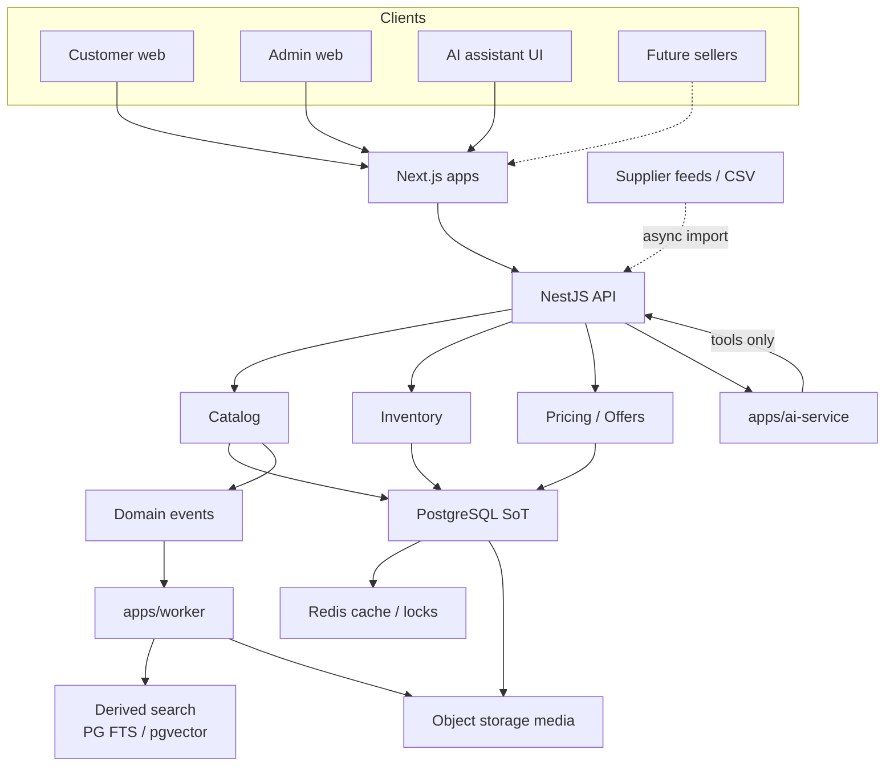

# ADR-0010: Catalog, product, inventory, and search architecture

- Status: **Accepted**
- Date: 2026-08-13
- Deciders: Platform Architecture (recommendation); product owner / technical
  lead (acceptance)
- Aligns with: [docs/ARCHITECTURE.md](../ARCHITECTURE.md),
  [ADR-0005](./ADR-0005-backend-framework.md) (**Accepted**),
  [ADR-0006](./ADR-0006-database-and-data-architecture.md) (**Accepted**),
  [ADR-0007](./ADR-0007-frontend-architecture.md) (**Accepted**),
  [ADR-0008](./ADR-0008-authentication-and-identity-architecture.md)
  (**Accepted**),
  [ADR-0009](./ADR-0009-api-contract-and-communication-architecture.md)
  (**Accepted**)
- Scope: Product catalog, variants, SKUs, offers, pricing, inventory,
  categories, attributes, media, discovery/search, indexing, imports, and
  AI-assisted catalog access
- Out of scope: Installing packages; creating Prisma models or migrations;
  implementing endpoints, search engines, queues, Redis, object storage, or
  frontend catalog pages

## 1. Context

Buying Bot Platform is a Kenya-first AI-powered omnichannel commerce system.
Established decisions this ADR must not override:

| ADR      | Status   | Relevant constraint                                                                                                                                                                                         |
| -------- | -------- | ----------------------------------------------------------------------------------------------------------------------------------------------------------------------------------------------------------- |
| ADR-0005 | Accepted | NestJS + Fastify; catalog as a bounded context module                                                                                                                                                       |
| ADR-0006 | Accepted | PostgreSQL SoT; `catalog` + `inventory` schemas; Redis cache only; object storage for blobs; PG FTS + pgvector for stage-1 search; dedicated search engine **deferred**; inventory reservations in Postgres |
| ADR-0007 | Accepted | Next.js SSR/RSC for PLP/PDP/SEO; catalog data via SDK; browser never owns price/stock                                                                                                                       |
| ADR-0008 | Accepted | `catalog:*` / `inventory:*` permissions; future org/membership; backend AuthZ                                                                                                                               |
| ADR-0009 | Accepted | REST `/v1/products`, `/v1/search/products`; whitelist filters; cursor pagination for catalog; events → worker → derived index                                                                               |

Current repository reality: no product tables, no search index, no media
pipeline. `@buying-bot/database` holds ports only. SRS/SDS/EAD folders are
placeholders; [ARCHITECTURE.md](../ARCHITECTURE.md) is the EAD overview.

## 2. Problem

Without a catalog ADR, the first product table will collapse Product, SKU,
price, and stock into one row. That would:

- block variants and multi-seller offers;
- make order history mutate when catalog prices change;
- put media blobs in PostgreSQL;
- make Elasticsearch the product database;
- let the AI invent prices and stock;
- hardcode KES and Kenyan categories in application logic.

This ADR defines the catalog domain **before** implementation.

## 3. Core principle

**PostgreSQL catalog + inventory are the authoritative source of product
truth.** Search indexes, Redis product cards, embeddings, and AI answers are
**derived**.

Concepts must stay distinct:

```text
Product          sellable concept (T-shirt, Phone)
  └── Variant    option combination (Size M / Color Black)
        └── SKU  stock-keeping identity (internal code, barcode)
              └── Offer     commercial terms from a seller (price, currency)
                    └── Inventory  physical/logical stock at a location
```

**Order item** is a **snapshot** of what was sold (name, SKU, unit price,
currency, tax treatment at purchase). It must **not** be a live FK that
rewrites history when the catalog changes.

Collapsing these into one entity fails variants, marketplace readiness,
auditable stock, and historical orders.

## 4. Product model (conceptual)

A **Product** is merchandising content, not a price or a warehouse quantity.

| Concern            | Lives on                                                        |
| ------------------ | --------------------------------------------------------------- |
| Identity           | UUID `productId` (API); human `slug` for SEO                    |
| Content            | name, short description, description, brand, primary category   |
| Attributes / specs | see §16                                                         |
| Media              | `MediaAsset` references (object keys)                           |
| Lifecycle          | status (see §13)                                                |
| SEO                | title, meta description, canonical slug, structured-data fields |
| Audit              | `createdAt`, `updatedAt`, created/updated by (subject id)       |

Operational data that changes independently:

- **Offer** price and seller conditions
- **Inventory** quantities and reservations
- **Search** derived documents
- **Analytics** popularity scores

Do not store “current selling price” only on the Product row if offers exist.

## 5. Variants

**Product** = parent concept customers browse.  
**Variant** = a specific option combination of that product.  
**SKU** = the inventory/fulfillment identity of a variant (usually 1:1).

Examples:

- T-shirt → size {S,M,L} × color {black,white} → up to 6 variants/SKUs
- Phone → storage {128GB,256GB} × color {black,blue}

Rules:

- Do **not** create duplicate Product records for simple option changes.
- Option axes (size, color) are defined attributes; variant values are
  constrained combinations.
- A product with no options has **one default variant** and one SKU.
- Invalid combinations (e.g. size S + color discontinued) are omitted, not
  sold as empty products.

## 6. SKU architecture

| Identifier         | Role                                                    |
| ------------------ | ------------------------------------------------------- |
| `skuId` (UUID)     | Immutable technical identity                            |
| `internalSku`      | Platform-unique business code (human-readable, unique)  |
| `sellerSku`        | Optional merchant-supplied code (unique **per seller**) |
| `barcode` / `gtin` | Optional; unique when present                           |

Rules:

- API resources use UUIDs; slugs are SEO, not stock identity.
- Internal SKU is immutable after first sale (or after first inventory
  movement) — deprecate and create a new SKU rather than recycle codes.
- One variant maps to one SKU at v1. Future: multiple SKUs per variant only
  if a new ADR justifies it (e.g. pack vs unit).

## 7. Sellers / merchants

### 7.1 Launch vs future

| Phase               | Model                                                           |
| ------------------- | --------------------------------------------------------------- |
| **v1 Kenya launch** | **Single merchant** (the platform operator)                     |
| **Readiness**       | **Offer** entity owned by an Organization (ADR-0008 membership) |

**Accepted for v1:** the **Offer** entity is the commercial boundary even
while the platform operates as a **single merchant**. Price, currency, and
seller conditions live on Offer, not on Product. Future multi-seller
functionality must add Offers (and organizations), not rewrite the catalog.

Do **not** build a full marketplace (seller onboarding, commissions, seller
P&L) at v1. Do **not** bind price and stock directly to Product.

### 7.2 Terms

| Term                      | Meaning                                    |
| ------------------------- | ------------------------------------------ |
| **Organization / Tenant** | ADR-0008 membership boundary               |
| **Merchant / Seller**     | Organization that can own Offers           |
| **Offer**                 | Seller-specific commercial terms for a SKU |

v1: one default Organization; all Offers belong to it. Adding Seller B later
adds Offers, not a catalog rewrite.

## 8. Offer model

**Catalog data** (name, specs, media, category) is shared.  
**Commercial offer** is sellable instance:

- seller / organization
- SKU
- selling price + currency
- list vs sale price + effective dates
- availability flag (merchant intent, distinct from stock)
- inventory location(s) or source
- fulfillment notes (ship from, lead time) — conceptual
- condition (new/used) if needed later

**Why separate:** marketplace, seller-specific pricing, and “same phone,
different merchant” cannot be expressed if price lives only on Product.
Order lines snapshot the **Offer** (and SKU/product names) at checkout.

v1: exactly one **active** Offer per SKU for the default seller. The Offer
model is **mandatory at v1**, not deferred until marketplace launch.

## 9. Pricing

### 9.1 Authority

**Server-side Offer price in PostgreSQL is authoritative.** The client, CDN
cache, search index, and AI must not be trusted for payable amounts.

Checkout recomputes payable amount from Offer + promotions + tax rules at
order time (future cart/order ADR). Catalog “display price” is a read model.

### 9.2 Model

| Field                   | Rule                                                                 |
| ----------------------- | -------------------------------------------------------------------- |
| Currency                | ISO 4217 code on every money amount — **KES first**, never hardcoded |
| Base / list price       | Merchant list price                                                  |
| Sale price              | Optional; effective `from`/`to`                                      |
| Display price           | Derived: sale if in window else list                                 |
| Promotions              | Separate `promotions` schema (ADR-0006); applied at cart/checkout    |
| Customer-specific price | Deferred; do not encode in Product                                   |
| Price history           | Append-only price-change events for audit                            |

Minor units stored as integer (e.g. cents/cents-equivalent for KES) plus
currency code. Do not use float.

A full pricing engine (B2B contracts, volume breaks) is **future**. v1 is
list + optional sale + later promotion application.

## 10. Tax

Do **not** assume catalog price includes VAT.

Conceptual stack (calculation in cart/checkout ADR, not here):

```text
catalog / offer price
    − discounts / promotions
    + tax (per jurisdiction / tax class)
    = payable amount
```

Catalog may store a **tax class** or “price includes tax?” flag on Offer or
Product for Kenya VAT readiness. Tax rates and invoices belong to a future
tax/order ADR. Catalog must not bake a single VAT percentage into Product.

## 11. Inventory

### 11.1 Distinguish availability vs stock

| Concept                          | Meaning                                                                                                 |
| -------------------------------- | ------------------------------------------------------------------------------------------------------- |
| **Catalog / offer availability** | Merchant will sell this SKU (ACTIVE offer, not discontinued)                                            |
| **Inventory**                    | Counted stock at a location                                                                             |
| **Available to sell**            | `on_hand - reserved - damaged` (policy-defined)                                                         |
| **Inventory availability**       | Derived from quantities: `AVAILABLE`, `LOW_STOCK`, `OUT_OF_STOCK` — **never** a product lifecycle state |

### 11.2 Quantities (PostgreSQL, not Redis)

Per ADR-0006:

- `on_hand`
- `reserved`
- `damaged` (optional v1)
- `incoming` (optional; purchase orders later)

**Available** is computed, not a separately writable field that can drift.

### 11.4 Inventory availability (derived)

Inventory availability is independent of product lifecycle. An `ACTIVE`
product may be `OUT_OF_STOCK`. An `ARCHIVED` product is not sold regardless
of remaining quantity.

| Availability   | Meaning                                                                        |
| -------------- | ------------------------------------------------------------------------------ |
| `AVAILABLE`    | Available-to-sell quantity is above the low-stock threshold                    |
| `LOW_STOCK`    | Available-to-sell is greater than zero and at or below the low-stock threshold |
| `OUT_OF_STOCK` | Available-to-sell is zero (or below sellable policy)                           |

Thresholds (including low-stock) are **configurable** per SKU, location, or
catalog policy — not hardcoded in the lifecycle state machine.

**Accepted:** append-only inventory **movements** plus **reservation-based**
management (ADR-0006). Do not manage stock as a single mutable `quantity`
column without a movement ledger.

### 11.3 Inventory movements

Do not only store `quantity = 10`. Require an **append-only movement**
(adjustment, receipt, reservation, sale, release, return, damage) with:

- SKU, location, delta, reason, actor, correlation id, unique command id
  (ADR-0006 inventory adjust idempotency)

Current balances are maintained transactionally from movements (or a
balance row updated **in the same transaction** as the movement insert).

## 12. Inventory consistency

Align with ADR-0006 §13:

1. Checkout creates a **reservation** (SKU, qty, cart/order id, expiry) and
   increases `reserved` in one Postgres transaction.
2. Payment success converts reservation → sale movement; payment failure /
   timeout / cancel **releases** reservation in Postgres (job or API) — never
   Redis-only expiry.
3. Default: **optimistic concurrency** (`version` on inventory balance).
4. Hot SKUs: optional `SELECT … FOR UPDATE` or short Redis lock **to
   serialize**, not to store stock.
5. Oversell protection: DB check constraint `on_hand >= reserved` (or
   equivalent) plus transactional updates.
6. Refunds/cancellations: explicit restock movement according to policy
   (restock vs write-off) — future order ADR, catalog must support the
   movement types.

## 13. Inventory locations

v1: **one default location** (e.g. `DEFAULT` warehouse).

Model **must** include `locationId` on inventory balances and movements so
store / FC / seller warehouse can be added without rewriting SKUs.

Do not implement multi-warehouse routing, ATP across locations, or store
pickup in this ADR.

## 14. Product lifecycle

**Accepted lifecycle** (product/content, **not** stock):

| State            | Meaning                                                   |
| ---------------- | --------------------------------------------------------- |
| `DRAFT`          | Incomplete; not public                                    |
| `PENDING_REVIEW` | Submitted; awaiting catalog/quality review before publish |
| `ACTIVE`         | Published; may still have zero stock                      |
| `INACTIVE`       | Hidden from storefront; retained                          |
| `ARCHIVED`       | Soft-end of life; admin-only; historical orders remain    |

**Do not** treat `OUT_OF_STOCK` as a product lifecycle state. Stock is
inventory availability (`AVAILABLE` / `LOW_STOCK` / `OUT_OF_STOCK`) per §11.4.

`DISCONTINUED` is not a separate lifecycle state; use `INACTIVE` or
`ARCHIVED` according to merchandising policy.

Admin-created products may skip `PENDING_REVIEW` (DRAFT → ACTIVE) when
policy allows. Merchant-submitted catalog later should use `PENDING_REVIEW`.

Publish command: `DRAFT` or `PENDING_REVIEW` → `ACTIVE` with
`catalog:update` / publish permission (ADR-0008 / ADR-0009 command style).

## 15. Categories

- Hierarchical tree: `parentId` nullable (roots).
- Slug unique within tree (or globally — prefer **globally unique slug**).
- Metadata: name, description, SEO, image ref, sort order, active flag.
- Products have a **primary category**; optional additional category links.
- Categories are **data**, never hardcoded enums in application logic.

Depth: practical commerce depth (e.g. 3–4 levels); enforce a max depth in
validation, not an unbounded graph.

## 16. Category attributes

Categories may **declare** which attributes are recommended or required
(electronics: brand, model, storage; fashion: size, color, material).

| Kind                  | Storage                                                         |
| --------------------- | --------------------------------------------------------------- |
| **Global attributes** | Shared definitions (brand, color, size)                         |
| **Category-specific** | Assigned to category; inherited down the tree unless overridden |

Variant axes (size, color) are attributes marked `isVariantAxis`.

## 17. Attribute architecture

### 17.1 Options

| Approach                               | Verdict                                         |
| -------------------------------------- | ----------------------------------------------- |
| Fully relational attribute tables only | Rigid; explosion of columns                     |
| JSONB-only bag                         | Weak validation, weak faceting, hard uniqueness |
| Classic EAV                            | Query pain, rejected unless proven necessary    |
| **Hybrid relational + JSONB**          | **Recommend**                                   |

### 17.2 Recommendation

- **Relational:** Product, Variant, SKU, Offer, Brand, Category, Attribute
  **definitions**, variant option values used for **facets and filters**.
- **JSONB:** long-tail specifications (`specs`) that are displayed but not
  faceted at v1 (e.g. unstructured “what’s in the box”).
- Facetable attributes must be **controlled** (definition + typed value),
  not free-text JSON keys.

This matches ADR-0006’s PostgreSQL + JSONB strength without EAV.

## 18. Product data quality

- Zod schemas (ADR-0009) for required fields before `ACTIVE`.
- Normalize: trim names, E.164 is identity not catalog; slugs lowercase.
- Block `ACTIVE` without: name, slug, primary category, at least one SKU,
  and at least one Offer (v1).
- **Images are not a universal requirement for `ACTIVE`.** Media rules may
  be enforced through configurable catalog validation (category, attribute
  set, or business policy). Do not hardcode “image required” into the core
  product lifecycle.
- Invalid prices (negative, missing currency) rejected at API boundary.
- Duplicate detection: unique internal SKU; optional fuzzy name+brand
  warning in admin (not a hard block at v1).
- v1: admin publish may move `DRAFT` → `ACTIVE`; `PENDING_REVIEW` is the
  review gate when a review workflow is enabled.

## 19. Product media

```text
Product / Variant  →  MediaAsset (metadata in PostgreSQL)
                         └── objectKey in S3-compatible storage (ADR-0006)
```

Metadata: type (`image` | `video` | `document`), object key/URL reference,
sort order, alt text, dimensions, status (`pending` | `ready` | `failed`),
checksum.

**Never** store image/video bytes in PostgreSQL (`BYTEA` rejected in
ADR-0006).

Variant-specific images override product gallery when present.

Images are **optional at the architecture layer**. Requiring media for
publish is a **configurable validation policy**, not a lifecycle invariant.

## 20. Image optimization

Architectural requirements (implementation later):

- Upload limits (type, size) and malware/content-type validation
- Generate thumbnails / responsive widths; prefer WebP/AVIF derivatives
- CDN delivery of public catalog images
- Lazy loading on storefront (ADR-0007)
- Original in object storage; derivatives as additional objects or CDN
  transforms

Do not process images inside the API request that accepts checkout.

## 21. Search architecture

### 21.1 Engine evaluation

| Option                         | Fit for v1 Kenya launch                      | Verdict                      |
| ------------------------------ | -------------------------------------------- | ---------------------------- |
| **PostgreSQL FTS + `pg_trgm`** | Already chosen in ADR-0006; same ops as SoT  | **Adopt stage 1**            |
| pgvector                       | Semantic / “similar products” / AI retrieval | **Adopt as derived, in PG**  |
| Meilisearch / Typesense        | Better typo/facet UX; extra cluster          | Stage 2 if FTS limits proven |
| OpenSearch / Elasticsearch     | Heavy ops; not justified at initial scale    | Stage 3 / reject for v1      |
| Search SaaS only               | Cost, lock-in, Kenya data path               | Reject as SoT                |

**Accepted:** **PostgreSQL FTS + `pg_trgm` + pgvector** is the initial
search architecture (aligns with ADR-0006).

A dedicated search engine (Meilisearch, Typesense, OpenSearch, or
Elasticsearch) may be introduced **only when measurable requirements
justify it**, and **only through a future ADR**. Do not install a search
cluster as part of accepting this ADR.

### 21.2 Source of truth

```text
PostgreSQL catalog / offers / inventory  = authoritative
Search document (tsvector / later Meilisearch) = derived read model
```

The search index must never accept writes that are not projections of
Postgres.

## 22. Search indexing

```text
Catalog / offer / inventory change
    → domain event
    → BullMQ job (ADR-0006 / ADR-0009)
    → index worker (apps/worker)
    → update FTS document / invalidate Redis card cache
```

- Initial index: backfill job from PostgreSQL
- Incremental: on product/offer/stock events
- Full reindex: admin/ops command; rebuildable
- Failures: retry then DLQ; product remains correct in Postgres
- Eventual consistency: search may lag seconds to minutes

Stock-sensitive ranking (hide OOS) may update more frequently than copy
changes.

## 23. Search relevance

Separate three layers:

| Layer                     | Examples                                            |
| ------------------------- | --------------------------------------------------- |
| **Deterministic filters** | category, brand, in-stock, price range, attribute   |
| **Relevance ranking**     | FTS rank, prefix match, availability boost, recency |
| **AI recommendations**    | Separate from search result ranking at v1           |

v1 ranking factors (simple, documented, tunable later):

1. Text relevance (name, brand, category, SKU)
2. Availability (in-stock first — policy)
3. Optional popularity / recency if metrics exist

Do not mix LLM scoring into the default search sort at v1.

## 24. Faceted search

Facets generated from **controlled** attributes and fields:

- brand, category, price range, availability, rating (when reviews exist)
- variant axes (color, size) when marked facetable

Facet counts are computed from the **filtered set** (or approximation later).
Do not facet on arbitrary JSON keys.

## 25. Filtering

Whitelist only (ADR-0009):

- exact: `brandId`, `categoryId` (include descendants optional query)
- range: `minPrice`, `maxPrice` (in requested currency)
- boolean: `inStock`
- attributes: `attr.{code}=value` only for defined facetable codes

Unknown filter params → **400**. AuthZ still applies to unpublished products
(public search never returns `DRAFT`).

## 26. Sorting

Allowed sorts only:

`relevance` (default for `q` present), `price_asc`, `price_desc`, `newest`,
`popularity` (when metric exists), `rating` (when reviews exist).

Stable tie-breaker: `productId` / `skuId`. Never `ORDER BY` client-supplied
column names.

## 27. Autocomplete

Dedicated, cheap read path — **not** a full catalog table scan:

- Suggest from: product names, brands, categories, optional popular queries
- Backed by `pg_trgm` / prefix indexes or a small Redis/TTL cache of hot
  queries
- Limit result size; rate-limit (ADR-0009)
- Spelling: `pg_trgm` similarity at v1; dedicated typo engine later

## 28. Recommendations

**Search ≠ recommendations.**

v1: **rule-based / popularity** only (related by category/brand, “popular
in category”). No collaborative-filtering cluster, no ML training pipeline.

Future (separate ADR): content-based, collaborative, LLM-assisted ranking —
always reading catalog via APIs/tools, never a parallel product DB.

## 29. AI product discovery

```text
Customer → API (AuthN/AuthZ)
    → AI service (service JWT)
    → controlled tools (searchProducts, getProduct, getOfferAvailability)
    → API / domain
    → PostgreSQL
```

**Accepted: tools-only AI catalog access.**

Rules (ADR-0008 / `@buying-bot/ai-core`):

- The AI service must **NEVER** access PostgreSQL directly.
- Authoritative catalog, price, and availability data must be retrieved
  through **controlled API / application tools** (`searchProducts`,
  `getProduct`, `getOfferAvailability`, and equivalents).
- AI **must not** invent prices, stock, specs, or seller facts.
- Tool results are the only product claims the assistant may present.
- High-risk tools (`write` / `payment` / `admin`) require permission +
  human approval flags already defined in `ai-core`.
- Embeddings (pgvector) retrieve **candidate ids**; hydrate from catalog
  tools — not from a private database connection in `apps/ai-service`.

## 30. Product import

Sources (future): admin UI, CSV/Excel, merchant API, supplier feeds.

Pipeline:

```text
Upload file / fetch feed
    → async job (202)
    → parse + validate (Zod)
    → staging rows (not ACTIVE)
    → report errors
    → operator/merchant activate
```

Large imports never run synchronously in the HTTP request. Invalid rows do
not silently become `ACTIVE`.

## 31. Product synchronization

External sources identified by `(sourceSystem, sourceId)`.

- Store sync timestamp and last hash
- Conflict policy v1: **platform wins** unless source is marked authoritative
  for that field set
- Retries via BullMQ; duplicate detection on `sourceId` + internal SKU
- Do not implement specific supplier adapters in this ADR

## 32. Catalog administration

Conceptual admin capabilities (ADR-0007 admin app + ADR-0008 permissions):

| Action                                             | Permission (illustrative)                     |
| -------------------------------------------------- | --------------------------------------------- |
| Create/edit product, media, attributes, categories | `catalog:create` / `update`                   |
| Publish / deactivate                               | `catalog:update` or `catalog:manage`          |
| Price / offer edits                                | `catalog:update` (or future `pricing:update`) |
| Inventory adjust                                   | `inventory:adjust`                            |
| Read                                               | `catalog:read` / `inventory:read`             |

UI hiding is not authorization. All mutations authorized in Nest.

## 33. Auditability

Audit (PostgreSQL `audit` schema, ADR-0006 / ADR-0008) for:

- price / offer changes
- inventory adjustments and reservation conversions
- product publish / deactivate / archive
- category tree changes
- seller/organization assignment of offers

Do not log raw credentials, full payment payloads, or unnecessary PII.
Include `requestId` / `correlationId`.

## 34. Soft delete / archiving

| Record                        | Policy                                        |
| ----------------------------- | --------------------------------------------- |
| Products referenced by orders | **Archive / discontinue**; do not hard-delete |
| Media                         | Soft-delete metadata; GC objects later        |
| Categories                    | Deactivate; reassign products before delete   |
| Inventory movements           | **Never delete**; they are the ledger         |

Hard delete only for `DRAFT` products never sold. Order history remains
consistent via **order-line snapshots**.

## 35. Multi-tenancy

Coordinate with ADR-0008:

- `organizationId` / `tenant_id` readiness on Offer, Inventory, and
  (optionally) Product if private catalogs appear
- v1 single tenant: default organization on all rows
- Membership roles apply per organization when marketplace starts

Catalog content may remain global while Offers are tenant-scoped — that is
the intended marketplace split.

## 36. Localization

v1 Kenya-first:

- Currency: **KES** default; field still present
- Locale: one primary language (English) for catalog copy; optional later
  `translations` JSON or table — **do not** build a full i18n CMS now
- Units: store SI / labeled units on attributes (e.g. GB, inches) as data
- Regional expansion: new locales/currencies via data, not a rewrite

## 37. SEO (ADR-0007)

Catalog must supply:

- unique `slug`, name, descriptions
- SEO title / meta description
- canonical URL path data for PDP and category landing pages
- fields for Product structured data (name, image, brand, offer price,
  currency, availability)

Frontend renders metadata (`generateMetadata`); catalog is the data source.
Slug changes should preserve redirects (implementation later).

## 38. API contract (conceptual, ADR-0009)

Illustrative resources — **not implemented**:

| Resource                  | Notes                                                |
| ------------------------- | ---------------------------------------------------- |
| `/v1/products`            | Public: ACTIVE only; cursor pagination               |
| `/v1/products/{id}`       | By UUID; slug resolution may be web-only or `?slug=` |
| `/v1/categories`          | Tree or flat with `parentId`                         |
| `/v1/brands`              | List/get                                             |
| `/v1/search/products`     | `q`, filters, facets, sort, cursor                   |
| `/v1/search/suggestions`  | Autocomplete                                         |
| Admin `/v1/products` etc. | Full lifecycle; AuthZ                                |
| Inventory admin           | Adjustments, not public writable qty                 |

Prices and stock on public GET are **server-computed** from Offer +
inventory. Do not duplicate ADR-0009 error/pagination rules.

## 39. Storage boundaries

| Store              | Catalog role                                                                                                                        | Class                                 |
| ------------------ | ----------------------------------------------------------------------------------------------------------------------------------- | ------------------------------------- |
| **PostgreSQL**     | Products, variants, SKUs, offers, prices, inventory balances + movements, categories, attributes, media **metadata**, FTS documents | **System of record**                  |
| **Redis**          | Product card cache, rate limits, hot autocomplete, optional hot-SKU lock                                                            | **Cache / coordination**              |
| **Object storage** | Image/video/document **bytes**                                                                                                      | **Blob SoT for files**; DB holds keys |
| **Search index**   | PG `tsvector` now; later dedicated engine                                                                                           | **Derived index**                     |
| **pgvector**       | Product/chunk embeddings                                                                                                            | **Derived**; rebuildable              |

## 40. Consistency model

| Domain                                                       | Consistency                                       |
| ------------------------------------------------------------ | ------------------------------------------------- |
| Inventory, reservations, checkout stock                      | **Strong** (Postgres transactions)                |
| Offer price at order time                                    | **Strong** (read Offer in checkout tx / snapshot) |
| Catalog content publish                                      | Strong in DB; storefront cache TTL                |
| Search, autocomplete, embeddings, recommendations, analytics | **Eventual**                                      |

If search is stale, PDP by id still shows authoritative Postgres data.

## 41. Performance (aspirational)

Not measured:

| Operation                         | p95 goal                       |
| --------------------------------- | ------------------------------ |
| Catalog get-by-id / PDP payload   | < 200 ms (cached card < 50 ms) |
| Category / PLP filtered list      | < 300 ms                       |
| Search `q` + filters              | < 500 ms (ADR-0009)            |
| Autocomplete                      | < 150 ms                       |
| Inventory available-to-sell check | < 50 ms in checkout path       |

Mark as **ASPIRATIONAL**.

## 42. Security

| Threat                 | Mitigation                                        |
| ---------------------- | ------------------------------------------------- |
| Price tampering        | Server recomputes; ignore client price            |
| Inventory manipulation | `inventory:adjust` only; movements + AuthZ        |
| IDOR                   | UUID + AuthZ; unpublished products 404 for public |
| Unauthorized edits     | ADR-0008 permissions; admin realm                 |
| Seller isolation       | Offers scoped by organization                     |
| Mass assignment        | Strict Zod DTOs (ADR-0009)                        |
| Malicious content      | Validate HTML/markdown policy; scan uploads       |
| Upload abuse           | Type/size limits; authenticated admin             |
| Search abuse           | Rate limits; no raw SQL from query string         |

Client is never trusted for price, stock, discounts, or ownership.

## 43. Observability

Track (with correlation ids):

- catalog API latency
- search latency and **zero-result rate**
- indexing job failures / DLQ depth
- inventory constraint violations / oversell attempts
- import job failure rate
- publish/activation failures

Never log full customer PII in catalog logs; never log storage credentials.

## 44. Failure modes

| Dependency           | Behavior                                                                                                                                                                  |
| -------------------- | ------------------------------------------------------------------------------------------------------------------------------------------------------------------------- |
| PostgreSQL down      | API not ready (ADR-0006); no catalog writes/reads of SoT                                                                                                                  |
| Redis down           | Skip product-card cache; read Postgres; rate-limit fail closed on abuse paths                                                                                             |
| FTS / search degrade | **Exact get-by-id and checkout still work**; search endpoint 503 or degraded keyword `ILIKE` fallback if explicitly implemented later — prefer fail search, keep commerce |
| Object storage down  | Uploads fail; PDP degrades missing images; metadata remains                                                                                                               |
| Index worker down    | Catalog/inventory remain correct; search goes stale until catch-up                                                                                                        |

**Search outage must not stop checkout** of known product ids.

## 45. Disaster recovery (ADR-0006)

Restore priority:

1. PostgreSQL (catalog, offers, inventory movements, reservations)
2. Object storage (reconcile keys vs media metadata)
3. Rebuild FTS / pgvector / any future search cluster from Postgres
4. Redis: cold cache; do not restore stock from Redis

Search is always rebuildable. Inventory is not.

## 46. Decision matrix

| Area              | Decision                                                         | Alternatives                              | Reason                               |
| ----------------- | ---------------------------------------------------------------- | ----------------------------------------- | ------------------------------------ |
| Product model     | Product ≠ price ≠ stock                                          | Single product row                        | Variants, history, marketplace       |
| Variant model     | Product → Variant → SKU                                          | Duplicate products                        | Avoid SKU explosion as products      |
| SKU               | UUID + immutable internal code                                   | DB id as SKU                              | Business identity + barcodes         |
| Offer             | **Accepted for v1** — commercial boundary                        | Price on Product                          | Multi-seller without catalog rewrite |
| Seller            | Single merchant v1 + org on Offer                                | Full marketplace now                      | Complexity vs path                   |
| Pricing           | Integer minor units + ISO currency; KES first                    | Hardcoded KES float                       | Accuracy + expansion                 |
| Inventory         | **Accepted:** movements + reservations; availability derived     | Qty column; OUT_OF_STOCK as product state | Audit + separate lifecycle           |
| Categories        | Hierarchical data tree                                           | Hardcoded enums                           | Merchandising flexibility            |
| Attributes        | Hybrid relational + JSONB specs                                  | EAV / JSONB-only                          | Facets + evolution                   |
| Media             | Object storage + PG metadata; **images not required for ACTIVE** | BYTEA; hardcoded image-required           | ADR-0006; configurable policy        |
| Search engine     | **Accepted:** PG FTS + `pg_trgm` + pgvector                      | Dedicated engine at v1                    | Ops + ADR-0006; future ADR to change |
| Search indexing   | Events → BullMQ → worker                                         | Sync index in API tx                      | API latency; rebuildable             |
| Facets            | Controlled attributes only                                       | Free JSON facets                          | Safety + indexability                |
| Recommendations   | Rules/popularity v1                                              | ML cluster                                | Premature infrastructure             |
| AI discovery      | **Accepted:** tools-only; **never** direct PG                    | Direct SQL / invented facts               | AuthZ + truth                        |
| Product lifecycle | `DRAFT` `PENDING_REVIEW` `ACTIVE` `INACTIVE` `ARCHIVED`          | OUT_OF_STOCK as lifecycle                 | Stock ≠ content state                |
| Imports           | Async validate-then-activate                                     | Sync HTTP import                          | Size + quality                       |
| Consistency       | Strong stock/price; eventual search                              | Search as SoT                             | Commerce safety                      |
| Storage           | PG SoT; Redis cache; S3 blobs; derived FTS                       | Redis stock                               | ADR-0006                             |
| Multi-tenancy     | `organizationId` on Offer/inventory                              | Schema-per-seller v1                      | ADR-0008 readiness                   |

## 47. Architecture diagram



Caption: PostgreSQL owns catalog, offers, and stock. Search and embeddings
are derived. AI reads through API tools. Media bytes live in object storage.

## 48. Major trade-offs

| Trade-off                         | Choice                         | Cost                                  |
| --------------------------------- | ------------------------------ | ------------------------------------- |
| Relational core vs flexible specs | Hybrid                         | Two attribute styles to document      |
| PG FTS vs dedicated search        | FTS first                      | Weaker typo/synonym until stage 2     |
| Single merchant vs marketplace    | Offer-ready, marketplace later | Extra Offer entity at v1              |
| Strong vs eventual                | Strong stock; eventual search  | Stale PLP possible                    |
| Sync vs async index               | Async                          | Brief search lag after edits          |
| Simple vs pricing engine          | List + sale                    | Revisit for B2B/promotions            |
| Simple vs multi-warehouse         | One location + `locationId`    | No ATP routing yet                    |
| AI vs deterministic discovery     | Deterministic search default   | Assistant is a client of search       |
| Ops simplicity vs scale           | One Postgres                   | Extract search/vectors when SLOs fail |

## 49. Future evolution

Not in this ADR’s implementation:

- Multi-seller marketplace (commissions, seller catalog isolation UX)
- Multiple warehouses / store pickup / split shipment
- Advanced pricing engine and customer-specific contracts
- Dedicated search cluster; semantic/multimodal search at scale
- ML recommendation engine
- Regional catalogs and multi-language CMS
- Supplier EDI/API synchronization products
- Catalog analytics warehouse

## 50. Implementation dependencies

| ADR      | How ADR-0010 depends                                                                   |
| -------- | -------------------------------------------------------------------------------------- |
| ADR-0005 | Nest catalog/inventory modules; guards                                                 |
| ADR-0006 | PG schemas, Redis cache, BullMQ index jobs, object storage, FTS/pgvector, reservations |
| ADR-0007 | PLP/PDP/SEO consume catalog APIs                                                       |
| ADR-0008 | `catalog:*` / `inventory:*`; org on offers                                             |
| ADR-0009 | REST resources, filters, search contract, events, async import jobs                    |

**Future ADRs recommended before or alongside first catalog code:**

- Cart / checkout / order architecture (order-line snapshots, reservation
  conversion)
- Promotions / tax calculation (if not folded into checkout ADR)
- Payments (already constrained; not catalog)

Acceptance of ADR-0010 does **not** authorize Prisma models, OpenSearch,
or storefront PLP implementation.

## 51. Implementation boundary

**Do not** (until a separate milestone):

- install search/Postgres/Redis packages
- create tables or migrations
- create catalog controllers or SDK methods
- configure Elasticsearch / OpenSearch / Meilisearch / Typesense
- implement image pipelines or import workers

## 52. Accepted clarifications (this acceptance)

The following are **accepted** with this ADR, not left open:

1. **Offer** is the v1 commercial boundary (single merchant allowed).
2. **Search** is PostgreSQL FTS + `pg_trgm` + pgvector; dedicated engines
   require a future ADR after measurable need.
3. **Inventory** uses append-only movements and reservations; distinct from
   product lifecycle.
4. **AI** catalog access is tools-only; `apps/ai-service` never connects to
   PostgreSQL for catalog truth.
5. **Lifecycle** is `DRAFT` / `PENDING_REVIEW` / `ACTIVE` / `INACTIVE` /
   `ARCHIVED`. Inventory availability is `AVAILABLE` / `LOW_STOCK` /
   `OUT_OF_STOCK` with configurable thresholds.
6. **Media** is not a universal requirement for `ACTIVE`; enforce via
   configurable catalog validation/policy.

Remaining product decisions (hybrid attributes, integer money, async
indexing) stay as documented in this ADR.

## 53. Decision status

**Accepted.**

Indexed in [DECISIONS.md](../DECISIONS.md). Acceptance does **not** authorize
Prisma models, search-engine installation, inventory tables, catalog APIs, or
application code; see §51 Implementation boundary.
