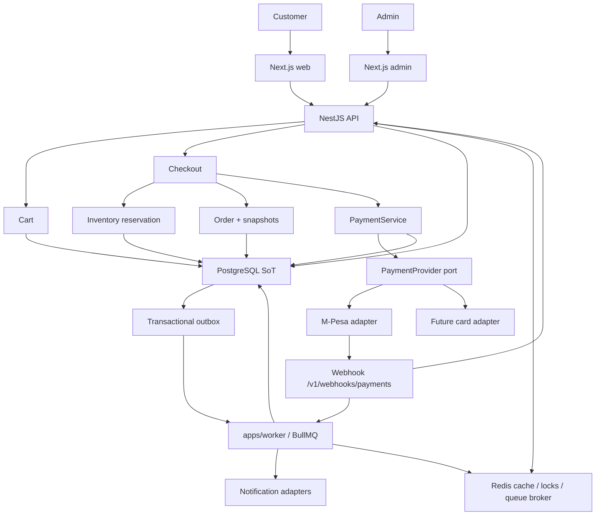
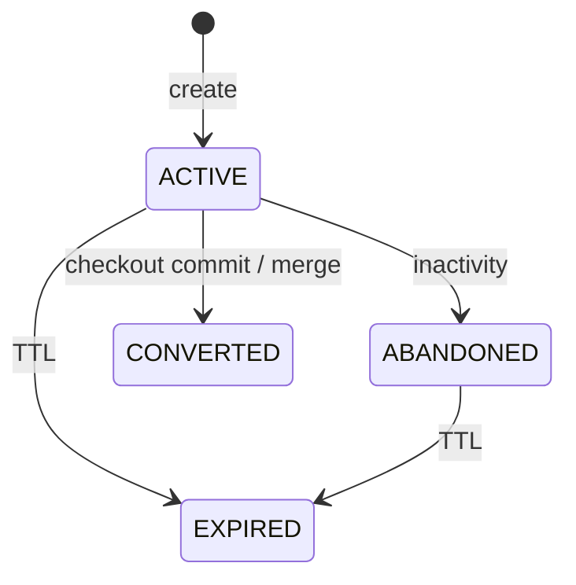
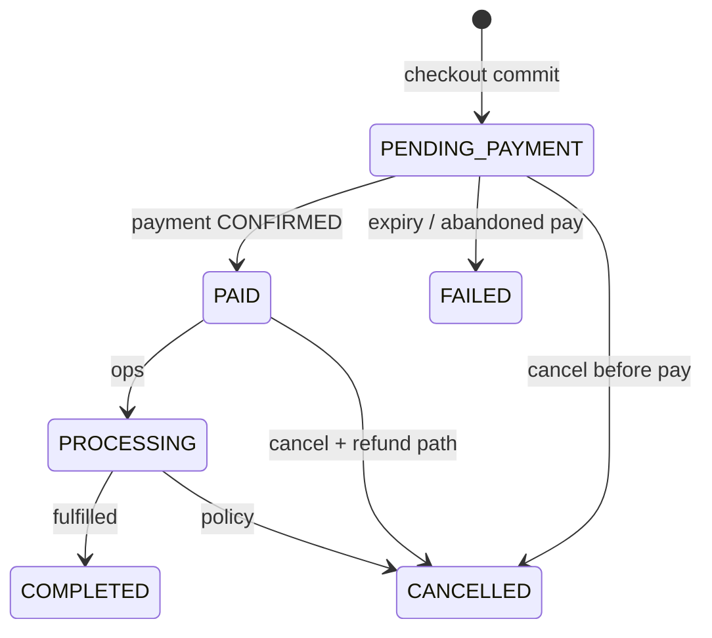
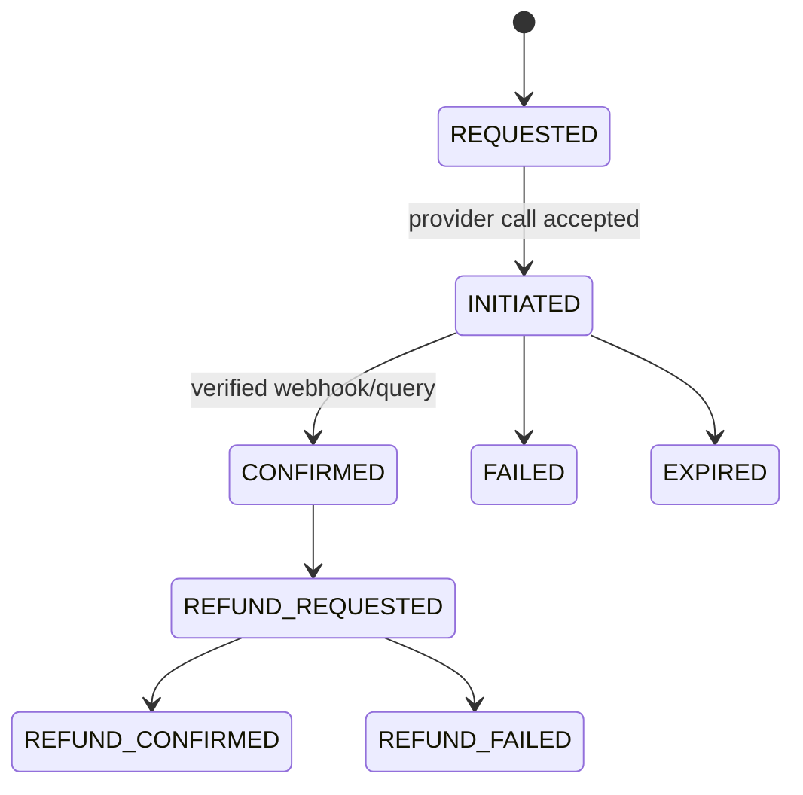
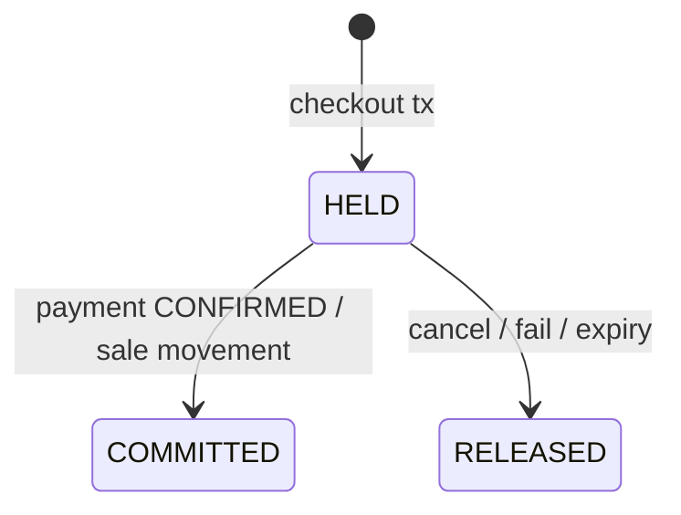

# ADR-0011: Cart, checkout, orders, and payments architecture

- Status: **Accepted**
- Date: 2026-08-13
- Deciders: Platform Architecture (recommendation); product owner / technical
  lead (acceptance)
- Aligns with: [docs/ARCHITECTURE.md](../ARCHITECTURE.md),
  [ADR-0005](./ADR-0005-backend-framework.md) (**Accepted**),
  [ADR-0006](./ADR-0006-database-and-data-architecture.md) (**Accepted**),
  [ADR-0007](./ADR-0007-frontend-architecture.md) (**Accepted**),
  [ADR-0008](./ADR-0008-authentication-and-identity-architecture.md)
  (**Accepted**),
  [ADR-0009](./ADR-0009-api-contract-and-communication-architecture.md)
  (**Accepted**),
  [ADR-0010](./ADR-0010-catalog-product-inventory-search-architecture.md)
  (**Accepted**)
- Scope: Shopping cart, checkout, order lifecycle, payments, refunds,
  cancellations, inventory reservation at checkout, idempotency, webhooks,
  reconciliation, and financial audit
- Out of scope: Installing packages; Prisma models or migrations; payment
  provider SDKs; M-Pesa/Stripe/card integrations; implementing endpoints,
  workers, or frontend checkout

## 1. Context

Buying Bot Platform is a Kenya-first commerce system. Established decisions
this ADR must not override:

| ADR | Constraint used here |
| --- | --- |
| ADR-0005 | Nest modules; guards; provider SDKs stay in adapters |
| ADR-0006 | PostgreSQL SoT for carts, orders, payments, reservations; Redis never ledger; integer money; short DB txs; no provider HTTP inside long txs; optional **transactional outbox** recommended for payments |
| ADR-0007 | Browser never owns price/stock/payment status; SDK to Nest |
| ADR-0008 | AuthZ for orders/refunds; webhook HMAC; no PAN in identity store |
| ADR-0009 | REST + `Idempotency-Key`; webhooks ack fast then async; at-least-once jobs |
| ADR-0010 | Cart lines reference **Offer/SKU**; order items are **snapshots**; reservations + movements; KES-first integer minor units; tax separate from catalog price |

No cart, order, or payment implementation exists. This ADR defines the
commerce transaction architecture **before** code.

## 2. Problem

Without this ADR, the first checkout handler would:

- trust client prices;
- collapse cart/order/payment into one status field;
- mark orders paid on frontend redirect;
- hold Postgres transactions open across M-Pesa;
- store carts only in `localStorage` or Redis;
- decrement stock at “add to cart”;
- create duplicate orders on retry.

Those mistakes are expensive once real money moves.

## 3. Core principle

**Cart, checkout, order, payment, inventory reservation, and fulfillment are
separate concerns with separate state machines.**

```text
Customer
   │
   ▼
Cart                    (intent to buy; not a financial record)
   │
   ▼
Checkout                (server workflow; not a durable SoT by itself)
   ├── resolve Offer/SKU (ADR-0010)
   ├── validate price / inventory / shipping
   ├── calculate totals (server)
   ├── reserve inventory
   ├── create Order (PENDING_PAYMENT) + PaymentAttempt
   └── initiate payment (outside DB transaction)
           │
           ▼
         Order          (commercial contract + snapshots)
           │
           ▼
        Payment         (money movement; provider-confirmed)
           │
           ▼
      Fulfillment       (physical/digital delivery; future ADR)
```

Do **not** represent these as one enum on one row.

## 4. Cart architecture

### 4.1 Entities (conceptual)

| Entity | Role |
| --- | --- |
| **Cart** | Customer or guest basket; `cartId` UUID |
| **CartItem** | Line referencing **Offer** + **SKU** (ADR-0010); quantity |

Cart items may store **display** name/image for UX but **must not** be the
source of payable price or stock. On every cart read and at checkout, the
server **re-resolves** Offer, price, currency, availability, and seller.

The client must never be trusted for: price, stock, discount, seller,
product ownership, or tax.

### 4.2 Quantity rules (server-enforced)

| Situation | Behavior |
| --- | --- |
| Below minimum (usually 1) | Reject |
| Above max per line / policy | Reject or clamp with error — prefer **reject** |
| SKU/Offer inactive or product not `ACTIVE` | Remove or block with error |
| Insufficient **available-to-sell** | Reject add/update; do not oversell in cart |
| Price change vs last display | Cart remains; UI shows updated server price |
| `ARCHIVED` / `INACTIVE` product | Line invalid until removed |

Cart **does not** reserve inventory. Two customers may hold the same last
unit in carts; only checkout reservation commits stock (ADR-0010 / ADR-0006).

## 5. Cart pricing

**Hybrid:**

- **Display:** dynamically resolved from current Offer (+ estimated
  promotions) on each cart GET.
- **Payable:** calculated **only** at checkout / order creation and
  **snapshotted** on the order.

Do not freeze cart line prices for days (stale). Do not let the client send
`unitPrice` that the API accepts as truth.

Optional: cart response includes `pricedAt` and a warning when offer price
changed since last view.

## 6. Guest cart

**Support guest shopping** (Kenya conversion).

| Mechanism | Decision |
| --- | --- |
| Identifier | Server-issued opaque `cartId` |
| Transport | **HttpOnly Secure** cookie (customer web realm, ADR-0008) — not a
  client-generated UUID in localStorage as authorization |
| Binding | Cookie proves possession of that cart; API ignores body `cartId`
  that does not match cookie/session |
| Takeover | Guest cookie must not attach to another customer’s cart; rotate
  cart cookie on login merge |
| Conversion | On login/register, **merge** then bind cart to `customerId` |

Do not treat query-string `?cartId=` as authorization.

Authenticated customers use the same Cart entity keyed by `customerId`
(one active cart per customer per tenant at v1).

## 7. Cart merging

When guest + authenticated customer:

1. Re-resolve all lines against current Offers.
2. Same SKU/Offer: **sum quantities**, then apply max-qty / stock checks;
   excess dropped or reduced with a merge report.
3. Unavailable / inactive lines: **dropped**; listed in merge result.
4. Prices: **not merged** — always current Offer.
5. Prefer authenticated cart as survivor; guest cart marked `CONVERTED`.

Never copy guest `cartId` into the session as a way to steal an
authenticated cart.

## 8. Cart lifecycle

| State | Meaning |
| --- | --- |
| `ACTIVE` | Editable |
| `ABANDONED` | Inactive past marketing threshold (derived or marked by job) |
| `EXPIRED` | Past TTL; not checkoutable |
| `CONVERTED` | Successfully became an order (or merged away) |

Abandoned carts may be retained **briefly** for analytics with minimized
PII. Do not keep guest contact data in carts indefinitely (align ADR-0006
retention; legal review later).

Suggested TTL (policy, not hardcoded forever): guest carts days; logged-in
carts longer. Exact durations are product policy.

## 9. Cart storage

| Store | Role |
| --- | --- |
| **PostgreSQL** | **Authoritative** cart and lines (ADR-0006 `cart` schema) |
| **Redis** | Optional cache of cart read model; TTL; never sole SoT |
| **Browser** | Cookie (cart id) + UI state; **not** authoritative lines |

Restarting Redis must not empty paid-intent carts. Checkout always reads
Postgres.

## 10. Checkout architecture

Checkout is a **server-side workflow**, not a client-calculated form post.

### 10.1 Steps

| Step | Sync vs async |
| --- | --- |
| Identify customer (session or attach guest after auth) | Sync |
| Load cart from Postgres | Sync |
| Re-resolve Offer/SKU/product (ADR-0010) | Sync |
| Validate price, qty, availability, product lifecycle | Sync |
| Calculate promotions, tax, shipping, payable | Sync |
| Validate shipping address / method (server quote) | Sync |
| **DB transaction:** create Order + items snapshots + reservation + PaymentAttempt + idempotency row + **outbox** | Sync, short |
| Commit | Sync |
| Initiate payment with provider | **After** commit (HTTP or outbox → worker) |
| Await provider / webhook | Async |
| Confirm payment → convert reservation → `PAID` | Async (webhook/job) |

The HTTP checkout response returns the **order id**, **payment attempt**
client actions (e.g. STK prompt pending), and **never** `PAID` solely
because initiation succeeded.

## 11. Checkout snapshot (order items)

At order creation, persist immutable line snapshots:

- productId, product name, variant options, SKU codes, offerId, seller/
  organizationId
- quantity, unit price (minor units), currency
- line discount, line tax, line total
- tax class used (if any)

Catalog/Offer changes **must not** rewrite these rows. Display names on
PDP may change; order history does not.

## 12. Price authority

**The server is the only authority** for:

- unit price, discounts, tax, shipping, payable total

Pipeline (align ADR-0010):

```text
Offer price (list or sale window)
    → promotions / discounts (future promotions ADR may extend)
    → tax (see §15)
    → shipping (see §16)
    → payable total (single currency)
```

Reject checkout if client-sent totals do not match (or ignore client totals
entirely — **prefer ignore**).

## 13. Money representation

Per ADR-0010:

- **Integer minor units** (e.g. cents) + **ISO 4217** currency code on every
  money field
- **No** IEEE floating point for financial math
- KES 1,250.50 → `{ amount: 125050, currency: "KES" }` conceptually
- Do **not** hardcode KES in schemas; default launch currency is KES

## 14. Currency

- Launch: **KES**
- **One settlement currency per order.** Mixed-currency lines are rejected
  at checkout.
- Reasoning: tax, payment providers (M-Pesa), refunds, and accounting
  become ambiguous with multi-currency orders; marketplace FX is a future
  ADR.

Cart may theoretically hold mixed offers only if all resolve to the same
checkout currency; otherwise block checkout.

## 15. Tax

Tax is **not** catalog price and **not** the payment provider’s job.

- Catalog/Offer may carry tax class / tax-inclusive flag (ADR-0010).
- Checkout applies a **tax calculation port** (`TaxCalculator`).
- v1 Kenya: start with a **simple configurable rule** (e.g. VAT rate /
  inclusive vs exclusive) behind that port — **not** hardcoded in Order
  entity.
- Complex multi-jurisdiction / eTIMS / invoice tax law → **future tax ADR**.
  Do not pretend this ADR is a tax engine.

Payable = goods + shipping ± tax per that port’s output, snapshotted on the
order.

## 16. Shipping / fulfillment cost

Server-calculated via `ShippingQuote` port.

v1: **simple methods** (flat / location band / free-above-threshold) as
data, not frontend numbers.

Weight/provider-based rates and 3PL APIs → **future fulfillment ADR**.
Client-supplied `shippingFee` is ignored.

No shipping integration is implemented in this ADR.

## 17. Order creation

A cart becomes an order **when checkout’s DB transaction commits**, not when
payment succeeds.

| Entity | Role |
| --- | --- |
| **Order** | Header: customer, currency, totals, statuses, addresses |
| **OrderItem** | Snapshot lines |
| **OrderStatus** | Commercial lifecycle (see §20) |

**Idempotent:** `Idempotency-Key` + actor (ADR-0009 / ADR-0006 unique
`(actor, idempotency_key)`). Retry returns the **same order**.

Do not create an order on “add to cart”.

## 18. Order numbers

| Id | Use |
| --- | --- |
| `orderId` UUID | Internal, API path |
| `orderNumber` | Customer-facing; unique; **not** raw serial `1,2,3…` |

Use a non-trivial format (e.g. time + random or encrypted sequence) to
reduce **enumeration** of other customers’ orders. Authorization still
required (ADR-0008); obscurity is not AuthZ.

## 19. Order, payment, and fulfillment status

**Accepted: keep separate state machines. Do not collapse them into one
status field.**

| Machine | Owns |
| --- | --- |
| **Order status** | Commercial contract |
| **Payment status** | Money |
| **Fulfillment status** | Delivery (future; `UNFULFILLED` at v1) |
| **Inventory reservation status** | Stock hold for an order (HELD / COMMITTED / RELEASED) |

### 19.1 Minimal order status

| Status | Meaning |
| --- | --- |
| `PENDING_PAYMENT` | Created; awaiting confirmed payment |
| `PAID` | Payable collected (provider-confirmed) |
| `PROCESSING` | Accepted for operations / pick |
| `COMPLETED` | Fulfilled (or digital complete) |
| `CANCELLED` | Voided; not fulfilled |
| `FAILED` | Terminal unsuccessful (e.g. payment never confirmed, expired) |

Refunds: keep order `PAID`/`COMPLETED`/`CANCELLED` as appropriate and use
**payment/refund records** plus optional `refundStatus`:
`NONE` | `PARTIAL` | `FULL`. Do **not** require `REFUNDED` as the only
order status if it hides that goods were delivered.

Rejected as required v1 order states: long warehouse ladders
(`READY_FOR_FULFILLMENT`, `FULFILLING`) until fulfillment ADR — may map
into `PROCESSING` + fulfillment substatus later.

### 19.2 Payment status (on Payment / PaymentAttempt)

`REQUESTED` → `INITIATED` → `AUTHORIZED` (if distinct) → `CONFIRMED` |
`FAILED` | `EXPIRED`  
Refunds: `REFUND_REQUESTED` → `REFUND_CONFIRMED` | `REFUND_FAILED`

**Initiated ≠ confirmed.**

## 20. State transitions

Every transition records: previous, next, actor (`customer` | `admin` |
`system` | `provider-webhook`), reason, timestamp, `correlationId`, audit
event.

Allowed examples (illustrative, enforced in domain):

| From | To | Typical actor |
| --- | --- | --- |
| `PENDING_PAYMENT` | `PAID` | system (confirmed payment) |
| `PENDING_PAYMENT` | `FAILED` / `CANCELLED` | system (expiry) or customer/admin |
| `PAID` | `PROCESSING` | system/ops |
| `PAID` / `PROCESSING` | `CANCELLED` | admin/customer per policy + refund path |
| `PROCESSING` | `COMPLETED` | fulfillment |

Forbidden: client PATCH `status=PAID`; skip `CONFIRMED` payment; revival of
`FAILED` without a new checkout.

## 21. Payment architecture

| Entity | Role |
| --- | --- |
| **Payment** | Money obligation for an order (amount, currency) |
| **PaymentAttempt** | One try with a provider (STK, card session, etc.) |
| **PaymentTransaction** | Provider-confirmed movement (charge, refund) with provider ids |

An order may have multiple **attempts** (retry STK) but one logical
**payable**. Partial payments: v1 **reject** unless a future ADR allows;
payable must be covered by confirmed transactions before `PAID`.

States: requested / initiated / authorized / confirmed / failed / refunded
as in §19.2.

## 22. Payment provider abstraction

```text
PaymentService (application)
    → PaymentProvider (port)
         ├── MpesaProvider (adapter)
         ├── CardProvider (adapter)
         └── OtherProvider
```

Domain/order code depends on the **port**, not Daraja/Stripe types.
Provider SDKs live in infrastructure adapters (ADR-0005 / ADR-0009).

## 23. Kenya-first payments

- **v1 primary:** M-Pesa (STK Push / C2B as product chooses) behind
  `PaymentProvider`
- **Designed for later:** cards, other mobile money, bank rails
- **Do not** put `mpesaReceipt` fields on `Order` as the only payment model
- Phone for STK is customer profile / checkout input, validated server-side

No provider is implemented in this ADR.

## 24. Payment initiation vs confirmation

```text
Order (PENDING_PAYMENT)
  → PaymentAttempt INITIATED
  → Provider (customer completes STK/card)
  → Provider webhook and/or poll
  → PaymentTransaction CONFIRMED
  → Order PAID
```

**Authoritative confirmation:** verified provider webhook **and/or**
verified provider query API — **not** the Next.js success page, query
params, or “STK sent”.

Frontend may show “waiting for payment”; it must poll/order-get for status.

## 25. Payment webhooks (ADR-0009)

```text
Provider → POST /v1/webhooks/payments/{provider}
  → raw body + HMAC + timestamp (ADR-0008)
  → idempotency on provider event id (Postgres)
  → persist webhook receipt
  → 2xx quickly
  → worker: interpret → update PaymentAttempt/Transaction → order/inventory
```

Retries must not double-capture or double-release stock.

## 26. Idempotency

PostgreSQL is the SoT for financial idempotency (ADR-0006). Redis may cache.

| Operation | Key |
| --- | --- |
| Checkout / order create | Client `Idempotency-Key` + actor |
| Payment initiation | Order + attempt policy (don’t spawn duplicate in-flight attempts) |
| Webhook | Provider event id |
| Refund | `Idempotency-Key` + payment id |
| Cancel | Order id + command id |

At-least-once delivery + **idempotent handlers**. Not exactly-once.

## 27. Reconciliation

Periodic job (`payments.reconcile` per ADR-0006):

| Drift | Action |
| --- | --- |
| Platform unpaid, provider paid | Confirm payment path (same as webhook); never ignore |
| Platform paid, provider failed/unknown | Flag `RECONCILIATION_HOLD`; do not silently unpay without policy |
| Duplicate callbacks | Idempotent no-op |
| Missing callback | Poll provider by attempt reference |
| Partial / unknown txn | Ops queue; do not auto-fulfill |

Reconciliation **must not** invent stock; it uses the same domain
transitions as live webhooks.

## 28. Refunds

- Full and **partial** refunds as PaymentTransactions
- `REFUND_REQUESTED` (admin, `payments:refund`) ≠ `REFUND_CONFIRMED`
- Confirm via provider webhook/API
- Restock: explicit inventory movement per policy (ADR-0010) — restock vs
  write-off is not automatic for all refunds (e.g. damaged goods)

Never assume success because the HTTP refund call returned 200 without
provider confirmation (or documented sync confirm).

## 29. Cancellations

| Timing | Inventory | Payment |
| --- | --- | --- |
| Before confirmed payment | Release reservation; order `CANCELLED`/`FAILED` | No capture |
| After paid, before fulfillment | Release/restock per policy; refund requested | Refund flow |
| During/after fulfillment | Generally no auto-restock; admin exception | Refund policy |

Customers cannot cancel another customer’s order. Admin requires
permissions. Late webhook after cancel: reconciliation hold — **do not**
re-reserve expired stock blindly.

## 30. Inventory reservation (ADR-0010 / ADR-0006)

- **Not** at add-to-cart
- **At checkout transaction:** reservation row (SKU, qty, order id, expiry);
  `reserved` increases; available-to-sell decreases
- Ownership: the **order** (or checkout id) owns the reservation
- Payment confirmed: reservation → **sale movement**; reserved decreases,
  on_hand decreases (policy as ADR-0010)
- Failure/cancel/expiry: **release** movement in Postgres

Redis lock may serialize hot SKUs; **Redis is not stock**.

## 31. Reservation expiry vs late payment

**Accepted financial rule:** prefer reconciliation and temporary holds over
automatically creating an inconsistent financial or inventory state.

```text
Reservation expires
        ↓
Stock released
        ↓
Late payment arrives
        ↓
DO NOT blindly fulfill / DO NOT oversell
        ↓
Reconciliation / controlled resolution
```

Operational path:

```text
Reservation expires
  → job releases stock
  → order still PENDING_PAYMENT → FAILED (or CANCELLED)
  → late CONFIRMED webhook
       → do NOT blindly allocate released stock
       → mark payment confirmed + RECONCILIATION_HOLD
       → ops: refund or manual allocate if stock exists
```

Payment processing that outlives reservation: extend reservation **only**
while attempt is `INITIATED` and within a bounded window; document the
window as policy.

## 32. Concurrency

Protect:

- last-unit race → DB constraint + reservation tx (+ optional `FOR UPDATE`)
- duplicate checkout → idempotency unique key
- duplicate payment init → one in-flight attempt per order
- duplicate webhooks → provider event unique
- cancel vs refund vs webhook → version/state guards on order/payment

PostgreSQL is the correctness boundary.

## 33. Database transactions

**Inside short Postgres transactions:**

- inventory reservation + order + items + payment attempt row + idempotency
  + outbox

**Outside transactions:**

- M-Pesa/Stripe HTTP
- SMS/email
- waiting for customer PIN

Pattern (ADR-0006): persist intent → commit → call provider → persist
result (idempotent).

## 34. Transactional outbox

**Mandatory for payment-critical side effects** once payments go live
(strengthens ADR-0006 “recommended when payment reliability is
implemented”):

Same transaction as Order + PaymentAttempt writes an **outbox** row
(`InitiatePayment`, `SendOrderEmail`, …). Worker publishes to BullMQ /
provider. If Redis is down at enqueue, outbox still holds the intent.

Cart-only updates do not require outbox.

## 35. Async processing (BullMQ / worker)

Jobs (idempotent): webhook apply, reservation expiry, payment reconcile,
notifications, refund follow-up, invoice generation (later).

Retries: exponential backoff + jitter; **never** blind extra captures.
DLQ + alert for financial jobs.

## 36. Failure scenarios

| Scenario | Recovery |
| --- | --- |
| 1. Provider unavailable | Order `PENDING_PAYMENT`; attempt `FAILED`; retry initiate with new attempt / backoff; stock remains reserved until expiry |
| 2. Customer payment timeout | Expiry job; release reservation; order `FAILED`; notify |
| 3. Webhook delayed | Poll/reconcile; same confirm path |
| 4. Webhook duplicated | Idempotent |
| 5. Webhook missing | Reconcile poll |
| 6. Database unavailable | API not ready; no checkout |
| 7. Redis unavailable | Cart/checkout via Postgres; enqueue via **outbox**; rate-limit degrade per ADR-0006 |
| 8. Worker unavailable | Outbox/queue backlog; orders remain correct in PG |
| 9. Payment succeeds, response lost | Webhook or reconcile confirms; idempotent |
| 10. Order created, client timeout | GET checkout/order by idempotency key / order id; **no second order** |
| 11. Reservation expires while paying | §31 hold; no oversell |
| 12. Refund requested, callback delayed | Stay `REFUND_REQUESTED`; reconcile |

## 37. At-least-once vs exactly-once

Webhooks, workers, and provider callbacks are **at-least-once**.
Financial safety = **idempotent processing** + unique provider/event keys
in PostgreSQL. Do not design as if the bus is exactly-once.

## 38. Security

| Threat | Mitigation |
| --- | --- |
| Cart takeover | HttpOnly cart cookie; merge rules; no body-id auth |
| IDOR | Orders scoped by principal; uniform 404 |
| Price/qty tampering | Server reprice; ignore client money |
| Unauthorized order access | ADR-0008; customers see own; admin `orders:read` |
| Payment/webhook replay | HMAC + timestamp + event id |
| Refund/coupon abuse | Permissions; server promotions; rate limits |
| Enumeration | Non-sequential order numbers + AuthZ |
| Brute-force pay | Rate-limit payment initiate (ADR-0009) |

`customerId` / `orderId` in the body never override the session principal.

## 39. Customer vs admin order access

- Customer: `/v1/me/orders` — own orders only
- Admin: `orders:read` / `orders:update` / `payments:refund` (ADR-0008)
- Guest orders after checkout: bind to customer on login or access via
  authenticated session created at checkout — **not** secret URL as sole
  AuthZ for long-lived access

## 40. Payment data security

- **No PAN, CVV, PIN, or track data** in platform DB or logs
- Tokenized / provider-hosted fields only
- Store provider charge ids, mpesa conversation/receipt **references**,
  masked MSISDN if needed
- PCI: avoid SAQ-D by not touching raw cards; card UI via provider widgets
  when cards launch
- Never log secrets, tokens, or webhook signing keys

**Compliance is not claimed** until reviewed.

## 41. Financial audit trail

Append-only (ADR-0006 `audit` + payment/order event tables):

- order created (totals)
- payment attempts and confirmations/failures
- refunds, cancellations
- reservation, conversion, release
- admin overrides

Durable in PostgreSQL; not only logs. No silent in-place rewrite of
amounts; corrections are new events.

## 42. Order history

Order items and original totals are **immutable facts**. Status changes are
**transitions**. Admin “notes” do not edit snapshots.

## 43. Notifications

Triggers (async, not in order domain): order created, payment confirmed /
failed, cancelled, refund initiated/completed, fulfillment updates.

`NotificationPort` / worker. WhatsApp/SMS/email adapters must not be
imported by order aggregates.

## 44. Invoicing / receipts

| Document | When |
| --- | --- |
| Order confirmation | After order create (unpaid ok) |
| Receipt | After **payment confirmed** |
| Tax invoice | After confirmed payment + tax ADR/legal rules |

Document generation is **async**. **Future invoicing/tax ADR** for Kenya
invoice regulations. This ADR does not implement PDFs.

## 45. Checkout retries

Client timeout after commit: retry with **same Idempotency-Key** → same
order. Status endpoint: `GET /v1/orders/{id}` or checkout session by key.

Never “create order if not found” without idempotency.

## 46. Observability

Metrics (correlation ids on all): checkout success/fail, cart abandonment,
payment init vs confirm latency, payment fail rate, webhook latency,
duplicate webhook count, reservation fail/expiry, refund success/fail,
order create latency.

No PAN, PIN, tokens, or raw provider secrets in logs.

## 47. Performance targets (**ASPIRATIONAL**)

| Operation | p95 goal |
| --- | --- |
| Cart GET/PATCH | < 200 ms |
| Checkout validation + commit | < 800 ms (ADR-0009) |
| Payment initiation (until provider accepted) | < 3 s excluding customer PIN |
| Webhook acknowledgement | < 1 s |

Unmeasured.

## 48. Disaster recovery (ADR-0006)

Restore priority:

1. Orders + order items
2. Payments, attempts, transactions, webhook receipts
3. Inventory balances + movements + reservations
4. Financial audit
5. Carts
6. Outbox
7. Redis/BullMQ (rebuild from outbox)

RPO/RTO for **production payments** must be tightened per ADR-0006 before
go-live; current 24h RPO is **not** a payment SLO.

## 49. Data retention

| Data | Direction |
| --- | --- |
| Orders, payments, attempts, webhooks, refunds, audit | **Retain** for accounting/ops; not deleted because account is deleted (anonymize PII where law allows) |
| Carts | Shorter TTL; purge expired/abandoned |
| Guest identifiers | Minimize |

Exact periods → legal/compliance review. No compliance claim here.

## 50. Architecture diagram



Caption: Postgres holds carts, orders, payments, reservations, outbox.
Providers sit behind a port. Webhooks ack fast; workers apply money and
stock. Redis is not the ledger.

## 51. State machines (conceptual)



**Cart** — not a payment machine.



**Order** — independent of attempt-level payment retries.



**Payment attempt / transaction** — initiated ≠ confirmed.



**Reservation** — owned by order; late pay cannot COMMITTED after RELEASED
without reconciliation hold.

## 52. Decision matrix

| Area | Decision | Alternatives | Reason |
| --- | --- | --- | --- |
| Cart persistence | PostgreSQL SoT; Redis optional | Redis-only; localStorage | ADR-0006; restart safety |
| Guest cart | Server cartId + HttpOnly cookie | Client UUID | Takeover resistance |
| Cart merging | Sum qty; reprice; drop invalid | Last-write-wins | Predictable; no stale price |
| Cart expiry | ACTIVE/ABANDONED/EXPIRED/CONVERTED | Keep forever | PII + hygiene |
| Checkout | Server workflow; order before confirm | Pay then order | STK needs reference; idempotency |
| Price authority | Server pipeline only | Client totals | Tamper-proof |
| Order creation | On checkout commit; idempotent | On payment confirm only | Retry-safe; reservation owner |
| Order lifecycle | Separate order/payment/fulfillment | One mega-status | Clarity |
| Payment model | Payment + Attempt + Transaction | Single payment row | Retries + audit |
| Payment provider | Port/adapters; M-Pesa first | Hardcode Daraja in Order | Kenya + future cards |
| Payment confirmation | Webhook/query; never frontend | Thank-you page | Fraud/safety |
| Webhooks | Verify, persist, ack, async | Sync business in HTTP | ADR-0009 |
| Idempotency | Postgres keys | Redis-only | Financial SoT |
| Inventory reservation | At checkout, not cart | Reserve on add | Oversell vs UX |
| Concurrency | PG constraints + versions | Redis lock only | Correctness |
| Transactions | Short; no provider I/O inside | One long tx | ADR-0006 |
| Outbox | **Mandatory** for payment side effects | Best-effort enqueue | Lost-intent risk |
| Async processing | BullMQ workers | Sync emails/pay wait | Resilience |
| Refunds | Request vs confirm; partial OK | Assume HTTP 200 | Provider truth |
| Cancellation | Policy by payment/fulfillment stage | Always instant | Stock + money |
| Reconciliation | Scheduled poll + holds | Webhook-only | Missing callbacks |
| Financial audit | Append-only PG events | Logs only | Durability |
| Notifications | Async ports | In-domain SMS | Coupling |

## 53. Major trade-offs

| Trade-off | Choice | Cost |
| --- | --- | --- |
| Guest vs auth cart | Guest + secure cookie + merge | Merge edge cases |
| Cart persistence | Postgres | Extra writes vs Redis-only speed |
| Snapshot vs live price | Live in cart; snapshot at order | Price can change before pay |
| Reservation timing | Checkout, not cart | Possible stock disappointment |
| Provider abstraction | Port | Adapter work |
| Sync vs async confirm | Async webhook | UX “pending payment” |
| Tx boundary | No HTTP in DB tx | More states to reconcile |
| Outbox | Mandatory for pay | Operational table/worker |
| Exactly-once | Rejected | Must build idempotency |
| Simplicity vs safety | Safety | More entities/statuses |

## 54. Future ADRs

- Promotions / coupons engine
- Tax / e-invoicing (Kenya)
- Shipping / fulfillment / 3PL
- Invoicing documents
- Marketplace settlements (multi-offer checkout)
- Subscriptions / installments
- Additional payment providers & routing
- Advanced reconciliation UI
- Fraud / risk scoring

## 55. Dependencies

| ADR | Effect on ADR-0011 |
| --- | --- |
| ADR-0005 | Nest checkout/payment modules; adapters not domain |
| ADR-0006 | PG SoT, reservations, idempotency tables, outbox, `cart`/`orders`/`payments` schemas, no Redis ledger |
| ADR-0007 | Checkout UI; never trusts payment query params |
| ADR-0008 | Order AuthZ; admin refunds; webhook HMAC; no card data |
| ADR-0009 | Idempotency-Key, webhook ack, correlation ids, REST resources |
| ADR-0010 | Offer/SKU lines; snapshots; movements; money; tax split |

## 56. Implementation boundary

Acceptance does **not** authorize: Prisma schemas, M-Pesa/Stripe packages,
webhook controllers, cart APIs, or frontend checkout.

## 57. Accepted clarifications (this acceptance)

The following decisions are **accepted** with this ADR:

### Cart

- PostgreSQL is authoritative for persistent cart state.
- Browser stores only the secure **HttpOnly** cart/session identifier.
- Redis is optional acceleration/cache and is **never** the financial source
  of truth.
- Guest carts are supported.
- Cart ownership must be protected against takeover / IDOR.

### Checkout

- Checkout is **server-authoritative**.
- Client-supplied prices, discounts, stock, and totals are **never** trusted.
- Server re-resolves Offer/SKU information (ADR-0010).
- Inventory is reserved during checkout, **not** when an item is added to cart.
- Checkout uses PostgreSQL-backed **idempotency**.

### Order

- Order is created during the checkout **commit** before payment confirmation
  (`PENDING_PAYMENT`).
- Order items are **immutable historical snapshots**.
- Internal `orderId` and customer-facing `orderNumber` are separate.
- Order status, payment status, fulfillment status, and reservation status
  remain **separate** (not one field).

Accepted order statuses:

`PENDING_PAYMENT` | `PAID` | `PROCESSING` | `COMPLETED` | `CANCELLED` |
`FAILED`

### Payment

- Payment **initiation is not** payment confirmation.
- Frontend success / thank-you pages are **never** authoritative.
- Verified provider **webhook** and/or **provider query** is authoritative.
- Provider implementations are isolated behind **`PaymentProvider` ports**.
- **M-Pesa** is the first provider adapter and must **not** leak into domain
  logic.
- **Partial payment/capture is rejected for v1** payable amounts unless a
  future ADR explicitly changes this.

### Webhooks

- Verify HMAC / signature.
- Validate timestamp / replay protection.
- Persist provider event.
- Acknowledge quickly.
- Process asynchronously.
- Provider event identifiers are used for idempotency.

### Inventory

- Reservations occur at checkout.
- Reservation expiration releases inventory.
- Late payment after reservation expiry must enter **reconciliation** handling.
- The system must **never** blindly allocate released stock because of a late
  payment notification.

### Idempotency

- PostgreSQL-backed idempotency is authoritative for financial operations.
- Redis may provide a fast path but must **never** be the only protection.

### Transactions

- Database transactions must remain **short**.
- Do **not** perform external payment-provider HTTP calls inside database
  transactions.
- A transaction may atomically include: inventory reservation, order creation,
  payment attempt creation, and outbox event creation.

### Payment outbox

- A **transactional outbox is mandatory** for payment-critical side effects
  once payment processing goes live.

### Reconciliation

- Support reconciliation for: missing, duplicate, and delayed provider
  callbacks; divergent provider/platform states; late payment after
  reservation expiry.
- Prefer reconciliation / temporary holds over inconsistent financial or
  inventory state.

### Refunds

- Support full and partial refunds.
- Distinguish `REFUND_REQUESTED` from `REFUND_CONFIRMED`.
- Inventory restocking must be an **explicit inventory movement**.

### Security

- Never store or log: PAN/card numbers, CVV, PIN, payment secrets,
  authentication tokens, or provider credentials.
- Orders must be protected through ADR-0008 authorization rules.

Tax port detail and exact reservation-extension windows remain product /
policy parameters within this architecture; a full tax/e-invoicing engine is
a future ADR if needed.

## 58. Decision status

**Accepted.**

Indexed in [DECISIONS.md](../DECISIONS.md). Acceptance does **not** authorize
Prisma schemas, payment provider SDKs, webhook controllers, cart/checkout
APIs, or frontend implementation; see §56 Implementation boundary.
