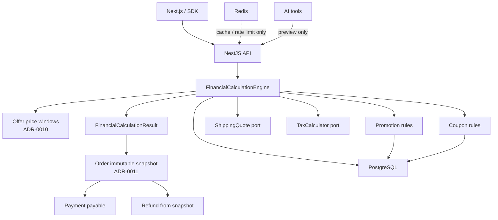

# ADR-0012: Pricing, promotions, tax, and financial calculation architecture

- Status: **Accepted**
- Date: 2026-08-13
- Deciders: Platform Architecture (recommendation); product owner / technical
  lead (acceptance)
- Aligns with: [docs/ARCHITECTURE.md](../ARCHITECTURE.md),
  [ADR-0005](./ADR-0005-backend-framework.md) (**Accepted**),
  [ADR-0006](./ADR-0006-database-and-data-architecture.md) (**Accepted**),
  [ADR-0007](./ADR-0007-frontend-architecture.md) (**Accepted**),
  [ADR-0008](./ADR-0008-authentication-and-identity-architecture.md)
  (**Accepted**),
  [ADR-0009](./ADR-0009-api-contract-and-communication-architecture.md)
  (**Accepted**),
  [ADR-0010](./ADR-0010-catalog-product-inventory-search-architecture.md)
  (**Accepted**),
  [ADR-0011](./ADR-0011-cart-checkout-orders-payments-architecture.md)
  (**Accepted**)
- Scope: Authoritative pricing, sale windows, promotions, coupons, discounts,
  tax calculation ports, rounding, currency rules, checkout totals, order
  financial snapshots, refund calculation from snapshots, and financial
  auditability
- Out of scope: Installing packages; implementing pricing/promotion/tax
  services; creating schemas or migrations; checkout/payment code; Kenya
  eTIMS / e-invoicing integration; marketplace settlements; FX engines

## 1. Context

ADR-0010 established **Offer** as the commercial price boundary and integer
minor-unit money. ADR-0011 established server-authoritative checkout, one
currency per order, immutable order snapshots, `TaxCalculator` as a port,
and refunds against historical totals.

What remains undefined is the **financial calculation engine**: how list/
sale prices become effective prices, how promotions and coupons stack, how
tax and shipping enter the total, how rounding works, and how refunds
allocate against discounted lines without replaying today's catalog.

Without this ADR, checkout implementers will invent divergent discount
math, float arithmetic, and mutable “recalculated” order totals.

## 2. Problem

Commerce fails financially when:

- the browser or AI invents payable amounts;
- JavaScript floats accumulate rounding drift;
- sale windows overlap ambiguously;
- promotions stack non-deterministically;
- coupons are brute-forced or double-applied;
- tax is hardcoded into Order entities;
- refunds reprice lines using current Offer prices;
- historical orders cannot explain “why KES X?”.

This ADR defines the calculation architecture **before** implementation.

## 3. Decision (summary)

Adopt a **server-side, deterministic financial calculation engine** that:

1. Resolves authoritative money from **Offer** (ADR-0010), not Product.
2. Uses **integer minor units** + **ISO 4217** currencies (KES launch default;
   never hardcoded in schemas).
3. Applies a fixed **calculation pipeline** with explicit precedence.
4. Supports a **controlled v1 promotion/coupon set**; advanced rules later.
5. Calculates tax via a **`TaxCalculator` port** with configurable rules
   (Kenya-first; no invented statutory rates in this ADR).
6. Snapshots the full calculation result onto the **order at checkout commit**
   (ADR-0011); never mutates that snapshot when catalog/rules change.
7. Computes refunds **from the snapshot**, not from live pricing.
8. Stores financial configuration and usage counters in **PostgreSQL**;
   Redis is cache/rate-limit only.
9. **Fails checkout safely** when price, currency, tax, or promotion
   configuration is uncertain — never charges a guessed amount.

## 4. Authoritative price

### 4.1 Chain of authority

```text
Product → Variant → SKU → Offer → Price (list / sale window)
                              ↓
                    FinancialCalculationEngine
                              ↓
                    payable total (checkout) → order snapshot
```

| Stage | Price behavior |
| --- | --- |
| **Browsing / PDP** | Display effective Offer price (server-computed; cacheable as read model) |
| **Cart** | **Live** re-resolve on each GET (ADR-0011); display may change |
| **Checkout** | **Re-resolve** Offer + run full calculation; client totals ignored |
| **Payment** | Charges the **snapshotted payable** on the order — not a new catalog price |

The client is **never** authoritative for unit price, discount, promotion,
tax, subtotal, total, or payable amount.

If Offer price changes between cart view and checkout commit, checkout uses
the **current** Offer price at commit time. **v1 does not soft-lock cart
prices.** The cart may display a previously observed price for UX, but
checkout must re-resolve the authoritative Offer price. If the price
changed, the customer must be informed **before payment**. The payment
amount always comes from the **final checkout financial snapshot**.

A future “price lock / soft-lock” capability would require a separate ADR.

## 5. Money representation

### 5.1 Canonical type (conceptual)

```text
Money = {
  amount: integer,          // minor units (e.g. cents)
  currency: ISO 4217 code   // e.g. "KES"
}
```

Example: KES 1,250.50 → `{ amount: 125050, currency: "KES" }`.

### 5.2 Rules

| Concern | Rule |
| --- | --- |
| Precision | Currency exponent from ISO 4217 (KES = 2). No float intermediates. |
| Arithmetic | Integer add/subtract; multiply by rational then **round per §12** |
| Comparison | Same currency only; reject cross-currency compare |
| Serialization | JSON integers + string currency; never number floats for money |
| Zero / negative | Zero allowed; negative money forbidden for prices, quantities, and
  payable totals (refunds are separate signed movements) |
| Unsupported currency | Reject at API/domain boundary with stable error code |

**Launch currency:** KES as platform default. Schemas store `currency` on
every money field — **do not** hardcode KES into column names or domain
types.

**No IEEE-754 financial arithmetic** in calculation paths.

## 6. Price structure

| Component | Meaning |
| --- | --- |
| **List price** | Merchant list on Offer |
| **Sale price** | Optional scheduled Offer sale |
| **Effective unit price** | Deterministic result of list vs active sale window |
| **Line subtotal** | effective unit × quantity (pre-discount) |
| **Item promotion discount** | Catalog/auto promotion on line |
| **Coupon discount** | Code-applied discount (item or cart allocation) |
| **Cart promotion discount** | Order-level promotion allocation |
| **Shipping** | From `ShippingQuote` port (ADR-0011) |
| **Fees** | Extensible fee lines (payment/service — v1 usually empty) |
| **Tax** | From `TaxCalculator` |
| **Payable total** | Final amount to charge |

Every adjustment carries: `type`, `referenceId` (promotion/coupon/fee id),
`amount`, `currency`, and optional human `label` for audit.

Silent mutation of historical financial values is **forbidden**.

## 7. Price windows

Offer may define:

- regular list price (always)
- zero or more **sale windows** with `startsAt` / `endsAt` (UTC stored;
  display in Africa/Nairobi or customer locale)

**Precedence (deterministic):**

1. Among sale windows active at `asOf` (checkout/cart timestamp), pick the
   window with the highest admin **`priority`**.
2. If priority is equal, pick the window with the **lowest sale price**.
3. If still tied, pick the lowest stable `priceWindowId`.
4. If no active sale window → list price.

The same inputs must always produce the same effective unit price.

Future-dated windows are ignored until active. Expired windows never apply.
Ambiguous “stack list + sale” is rejected: sale **replaces** list for
effective unit price; promotions apply **after** effective price.

Admin must not create overlapping windows that violate uniqueness
constraints without the precedence above — validation may warn on overlap.

## 8. Promotion engine

### 8.1 Principles

- **Declarative rules** stored in PostgreSQL (`promotions` schema per
  ADR-0006) — not arbitrary scripts/eval.
- Engine is a pure function of: cart lines + customer context + channel +
  `asOf` + loaded rules.
- No Turing-complete rule language in v1.

### 8.2 V1 supported promotions

| Type | v1 |
| --- | --- |
| Percentage off item / category / brand | **Yes** |
| Fixed amount off item | **Yes** |
| Cart-level percentage or fixed off (min spend) | **Yes** |
| Max discount cap | **Yes** |
| Date windows, channel (web), org/tenant | **Yes** |
| Usage limit (global) / per-customer limit | **Yes** |
| Buy-X-get-Y | **Future** |
| Complex multi-tier / personalized / A-B | **Future** |

### 8.3 Future capabilities (not v1)

Buy-X-get-Y, free shipping as promotion type (beyond simple shipping
quotes), loyalty, gift cards, dynamic pricing, seller-funded marketplace
promotions.

### 8.4 Priority and conflict

Default deterministic order when selecting auto-promotions:

1. Higher numeric `priority` wins (admin-defined).
2. If equal priority: prefer **larger discount amount** (customer-favorable,
   still deterministic).
3. If still tied: lower `promotionId`.

Engine emits which rules were **selected**, **skipped**, and **why**
(conflict, ineligible, exhausted).

## 9. Discount stacking

**Accepted v1 policy: deterministic and limited stacking. Arbitrary unlimited
stacking is not supported.**

Default application sequence:

1. **Item-level promotion** (one winning auto-promotion per line)
2. **Eligible coupon** (at most one coupon per checkout)
3. **Cart-level promotion** (on the remaining eligible base)

| Question | Answer |
| --- | --- |
| Multiple auto-promotions on one SKU? | **No** — one winning item promotion per line |
| Item promotion + cart promotion? | **Yes**, in the sequence above when both eligible |
| Coupon + promotions? | **Only when** the applicable promotion/coupon configuration
  **explicitly permits** stacking |
| Coupon + another coupon? | **No** — one coupon per checkout |
| Duplicate same promotion? | Prevented by unique application set |
| Unlimited stacking? | **Rejected** for v1 |

Competing promotions resolve deterministically via §8.4 (priority → larger
discount → lower `promotionId`). Same inputs → same outputs. Policy id is
part of `calculationVersion`. Changing stacking semantics requires a
versioned policy change or future ADR.

## 10. Coupons

Coupons are **customer-entered instruments**, distinct from automatic
promotions.

**Accepted:**

- **One coupon per checkout** in v1.
- Coupon stacking with promotions is allowed **only when explicitly
  permitted** by the applicable promotion/coupon rules.
- Coupon **validation is server-side**.
- Coupon **usage limits are protected transactionally** in PostgreSQL
  (constraints / unique redemption rows). **Redis is never** the
  authoritative coupon usage store (rate-limit only).

| Concern | Rule |
| --- | --- |
| Code normalization | Trim, uppercase, collapse internal spaces **before** comparison |
| Uniqueness | Unique active code (normalized form or hash of normalized form) |
| Lifecycle | `DRAFT` / `ACTIVE` / `DISABLED` / `EXPIRED` |
| Limits | Global redemptions, per-customer redemptions, min order value |
| Scope | All / product / category / brand allow-lists |
| Types | Percentage or fixed; optional max discount |
| Invalid/expired | Reject at validate and at checkout; never silent ignore if code present |
| Abuse | Rate-limit validate attempts (Redis ok); AuthZ for admin create |
| Storage | **Chosen approach:** always normalize. Ordinary marketing coupons may
  store the **normalized code** for admin management and support. Coupons
  that require secrecy (high-value / single-use / unguessable) store a
  **cryptographic hash** (or equivalent) of the normalized code for
  validation; plaintext is shown only at creation. Hashing is **not**
  mandatory for every low-sensitivity marketing code, but sensitive codes
  **must** use a secure representation. Do not expose unnecessary sensitive
  coupon material in logs or public APIs. |
| Audit | Coupon id, normalized code **or** hash reference, discount amount,
  customer, order — enough for validation, uniqueness, usage tracking,
  auditing, and admin management |

Coupon application is re-checked inside the checkout transaction against
PostgreSQL usage counters.

## 11. Tax architecture

Tax is an **independent calculation capability**, not scattered `if Kenya`
branches in Order.

### 11.1 Port

```text
TaxCalculator.calculate(input) → TaxResult
```

Input includes: lines (after discounts), shipping, fees, currency,
jurisdiction, customer tax attributes, tax-inclusive flags from Offer/
catalog class.

### 11.2 Capabilities

- Tax-inclusive and tax-exclusive Offer flags
- Taxable vs non-taxable lines
- Tax categories / classes on Offer or product
- Configurable rates by jurisdiction (data, not code constants)
- Exemptions as data-driven rules

**Kenya** is the initial launch jurisdiction context. This ADR **does not
claim, invent, or hardcode current statutory tax rates** into application
logic. Rates and rules are **controlled configuration/data** reviewed by
finance/legal before production, consumed through the `TaxCalculator`
abstraction.

Future Kenya tax / e-invoicing integrations (e.g. eTIMS) must be possible
through an **adapter/port** on the same TaxCalculator boundary + a future
invoice ADR — **without rewriting** checkout or the calculation pipeline
order.

## 12. Tax rounding

**Accepted rounding rule: half-away-from-zero on integer minor units.**

| Rule | Decision |
| --- | --- |
| Mode | **Half-away-from-zero** (commercial half-up) on minor units. This is
  the v1 deterministic rule. Changing it requires a versioned policy /
  future ADR. |
| Arithmetic | **Integer minor-unit only** — no floating-point financial arithmetic |
| When | After each multiplicative step that produces a money amount; never leave float residue |
| Line vs order | Compute tax **per taxable line** (and shipping if taxable); sum integers for order tax. Apply a single **order-level residual adjustment** only if inclusive-price recomposition requires it — record as `ROUNDING_ADJUSTMENT` line |
| Currency | Round to currency exponent |
| Determinism | Same inputs + same `taxPolicyVersion` → same outputs |

No cumulative float error: all math in integers or rational → integer round.

## 13. Calculation pipeline (authoritative order)

**Selected sequence:**

```text
1. Resolve catalog identities (Offer / SKU / qty / lifecycle)
2. Resolve authoritative effective unit price (list/sale windows)
3. Validate currency consistency (one currency)
4. Calculate line subtotals (unit × qty)
5. Apply item-level promotions (one winner per line)
6. Apply coupon (allocate to eligible lines or cart)
7. Apply cart-level promotions (on remaining eligible base)
8. Calculate shipping (ShippingQuote on post-discount goods if policy needs)
9. Apply permitted fees
10. Calculate tax (TaxCalculator on discounted goods + taxable shipping/fees)
11. Sum payable total
12. Emit FinancialCalculationResult + calculationVersion
```

### 13.1 Why this order

- **Price before discount:** promotions discount the sellable effective price,
  not a phantom list+sale stack.
- **Item before cart before coupon allocation:** coupon may target cart or
  items; applying auto item promos first avoids coupon on already
  conflicted bases. Coupon is applied **before cart promo** when the coupon
  is item-scoped; for cart-scoped coupons, apply **after item promos and
  before cart promos** so cart promos see remaining eligible amount.
  **Clarified v1 rule:**
  1) item promotions → 2) coupon → 3) cart promotions.
- **Shipping after merchandise discounts:** shipping quotes often depend on
  discounted merchandise total.
- **Tax after discounts and shipping:** taxable base must reflect what the
  customer actually pays for goods/shipping under jurisdiction rules.
- **Fees before tax** when fees are taxable; non-taxable fees still before
  payable sum. Fee taxability is TaxCalculator input.

This supersedes the informal pipeline sketch in ADR-0011 §12 with a
**normative** order for implementers.

## 14. FinancialCalculationResult

Conceptual structure:

```text
FinancialCalculationResult {
  currency
  lines[]: {
    offerId, skuId, qty,
    listUnit, saleUnit, effectiveUnit,
    lineSubtotal,
    adjustments[]  // promotions, coupon allocation
    lineTaxableBase, lineTax, lineTotal
  }
  merchandiseSubtotal
  discountTotal
  shipping
  fees[]
  taxTotal
  roundingAdjustments[]
  grandTotal / payableAmount
  appliedRules[]   // promotionIds, couponId, taxPolicyVersion, shippingQuoteId
  calculationVersion
  pricedAt (instant)
}
```

Every adjustment has a reason/reference. Result is what gets **snapshotted**.

## 15. Order financial snapshot (ADR-0011)

At checkout commit, persist:

- Full `FinancialCalculationResult` (or equivalent normalized tables)
- Per-line unit prices, discounts, tax, totals
- Header shipping, fees, tax, payable
- `calculationVersion`, `pricedAt`, applied promotion/coupon ids and amounts

**Immutability:** later changes to products, Offers, promotions, tax rates,
or coupons **must not** rewrite these rows. Corrections = new refund/
adjustment events, never in-place total edits.

## 16. Price / calculation versioning

Use a composite **`calculationVersion`** string or structured object:

```text
pricingEngine@version
+ promotionPolicy@version
+ taxPolicy@version
+ stackingPolicy@version
+ shippingPolicy@version (if relevant)
```

Purpose: explain historical totals. Do **not** require a separate version
row per Offer price if the snapshot already stores amounts and rule ids —
the snapshot is primary; version aids replay/explanation in audits.

Replay for audit is **optional** and must reproduce the snapshot; if it
cannot, trust the snapshot and flag drift — never overwrite.

## 17. Refunds (ADR-0011)

Refunds **reference the order snapshot**.

| Case | Approach |
| --- | --- |
| Full refund | Refund payable (or remaining refundable); reverse tax/shipping per policy recorded on order |
| Partial line qty | Proportional share of that line’s **snapshotted** discount and tax |
| Fixed cart discount | Allocate refund using **original allocation ratios** stored on snapshot |
| Coupon | Do not re-validate live coupon eligibility for amount; use snapshotted coupon discount allocation |
| Cap | Refundable ≤ paid − already refunded (minor units) |

**Forbidden:** recalculating the order with **current** Offer prices or
**current** promotion engine to decide refund amount.

Restock remains an explicit inventory movement (ADR-0010 / ADR-0011).

## 18. Currency

- **One currency per order** (ADR-0011) — reinforced.
- All Offers in the checkout must share that currency; else reject.
- Unsupported currency codes rejected.
- **No FX conversion in v1.** Multi-currency / FX → future ADR.

## 19. Shipping and fees

| Component | Port / home |
| --- | --- |
| Shipping | `ShippingQuote` (ADR-0011); amount enters pipeline §13 step 8 |
| Fees | Extensible `FeeLine` (payment fee, service fee) — v1 empty or minimal |
| Marketplace commission | **Out of scope** — future settlement ADR |

Shipping/fees are server-quoted; client-supplied amounts ignored.

## 20. Financial security

| Threat | Mitigation |
| --- | --- |
| Client price/total manipulation | Ignore client money; server recalculates |
| Coupon brute force / enumeration | Rate limits; generic errors; AuthZ on admin |
| Promotion abuse | Usage counters in PG; eligibility checks |
| Negative qty/price | Zod + domain invariants |
| Integer overflow | Bounded qty and money ceilings |
| Invalid currency | Allow-list / ISO validation |
| Double coupon / replay | One coupon; checkout idempotency (ADR-0011) |
| Rounding games | Fixed rounding mode + snapshot |
| Race on limited promo | PG transaction + unique redemption constraints |

All payable math runs **server-side** in Nest application services
(ADR-0005), not in Next.js as authority (ADR-0007).

## 21. Concurrency

Protect in **PostgreSQL transactions** (with checkout tx where applicable):

- coupon redemption counters / unique `(couponId, customerId, orderId)`
- global promotion usage limits
- inventory reservation (ADR-0011) — separate but same checkout tx
- idempotent checkout key

Do not rely only on in-memory checks. Redis rate limits are abuse controls,
not financial SoT.

## 22. Auditability

The platform must answer **“Why did this order cost KES X?”** from:

- order financial snapshot
- applied rule ids and amounts
- `calculationVersion` and `pricedAt`
- payment/refund events (ADR-0011)

**without** reading today's catalog or promotion tables as truth.

Never log PAN, PIN, CVV, payment secrets, or provider credentials.

## 23. AI integration

AI **must not invent** prices, discounts, taxes, promotions, stock, or
totals (ADR-0008 / ADR-0010 / ADR-0011).

AI may call tools such as `getOfferPrice`, `previewCartTotals` that hit the
same calculation engine. AI output never mutates payable values.

## 24. API boundary

Informational (non-authoritative for payment):

- current product/offer price
- eligible promotions (preview)
- cart totals preview
- checkout totals (same engine as commit)
- coupon validate result

Client may **display** breakdown. Payable charge uses only server commit
snapshot. Mismatch between client display and commit is resolved by
**commit** (show confirmation of final totals).

Never accept `clientPayable` as charge amount.

## 25. Observability

Metrics / structured logs (correlation ids, ADR-0009):

- calculation latency and failures
- invalid coupon attempts
- promotion conflicts / skips
- tax calculator failures
- currency mismatches
- checkout total validation rejects
- refund calculation failures

No unnecessary PII; no payment secrets.

## 26. Performance

**Aspirational:** cart/checkout calculation p95 &lt; 100 ms for typical carts
(&lt; 50 lines) excluding network to external tax SaaS (v1 should be local
config).

Core engine should be **deterministic and pure** given loaded rules + cart
input. Cache **read models** (Offer display price) only — **never** cache
as sole source of payable at commit.

## 27. Testability

Required before production checkout:

- unit tests for money arithmetic and rounding
- promotion conflict / stacking fixtures
- coupon eligibility and limits
- tax inclusive/exclusive fixtures
- currency rejection
- refund proportional allocation from snapshots
- concurrency tests on coupon/promotion limits
- regression golden fixtures (“order costs X”)
- property tests where useful (non-negative totals, refund ≤ paid)

## 28. Failure behavior

| Failure | Behavior |
| --- | --- |
| Invalid pricing config / negative Offer | Fail checkout |
| Tax calculator error / required tax cannot be determined reliably | **Fail closed — do not complete checkout.** Do not guess tax. Do not silently use stale tax information when that could produce an incorrect payable amount. |
| Coupon invalid | Fail if code supplied; else continue without |
| Promotion engine error | Fail checkout |
| Unsupported currency | Fail checkout |
| Calculation version / policy missing | Fail checkout |

**Prefer failing safely over charging an incorrect amount.** Tax calculation
must fail closed.

## 29. Architecture diagram



## 30. Decision matrix

| Area | Decision | Alternatives | Reason |
| --- | --- | --- | --- |
| Money | Integer minor units + ISO 4217 | Floats; BigDecimal-only without policy | Determinism; ADR-0010/0011 |
| Launch currency | KES default, field always present | Hardcoded KES columns | Expansion |
| Order currency | One per order | Multi-currency / FX v1 | ADR-0011; M-Pesa |
| Price authority | Offer → engine → snapshot | Client totals; Product price | Tamper-proof |
| Cart vs checkout | Live cart; snapshot at commit | Freeze cart for days | UX + correctness |
| Sale windows | Priority → lowest price → stable id | Undefined overlap | Deterministic |
| Promotions v1 | % / fixed item + cart; limits | Full rules DSL | Complexity |
| Stacking | Item → coupon → cart; explicit stack flags; no unlimited stack | Free stack | Determinism |
| Coupons | One per checkout; PG usage SoT; hash when secrecy required | Redis usage; multi-coupon | Abuse control |
| Tax | TaxCalculator + config; fail closed; Kenya context no hardcoded rates | Hardcoded VAT | Correctness |
| Rounding | Integer **half-away-from-zero** | Float; banker's v1 | Determinism |
| Cart price | No soft-lock; re-resolve at checkout; inform on change | Soft-lock v1 | Snapshot truth |
| Pipeline | Price → item promo → coupon → cart → ship → fee → tax → payable | Tax before discount | Correct taxable base |
| Snapshot | Immutable at order create | Live recalculation | History |
| Version | calculationVersion composite | None | Explainability |
| Refunds | From snapshot allocations | Reprice with current Offer | Fairness / audit |
| Storage | PostgreSQL SoT | Redis promo counters only | ADR-0006 |
| Failure | Fail checkout if uncertain | Charge with guess | Financial safety |

## 31. Alternatives considered

| Alternative | Why rejected |
| --- | --- |
| Floating-point money | Rounding drift and exploit risk |
| Client-authoritative totals | Fraud |
| Price only on Product | Conflicts with Offer (ADR-0010) |
| Arbitrary scripted promotions | Non-determinism, security |
| Unlimited discount stacking | Unpredictable margins and tests |
| Tax hardcoded in checkout service | Blocks e-invoicing / multi-jurisdiction |
| Recalculate refunds from live catalog | Breaks history and fairness |
| FX in v1 | Complexity; ADR-0011 one-currency rule |
| Redis as promotion usage SoT | Lost counters under flush |

## 32. Consequences

### Positive

- One deterministic path from Offer to payable.
- Auditable “why KES X?” from snapshots.
- Clean extension point for Kenya tax/e-invoicing.
- Aligns cart/checkout/payment ADRs.

### Negative

- Implementers must build money helpers and golden fixtures early.
- Fixed v1 stacking may feel strict for marketing — change via versioned
  policy / future ADR.
- Failing closed on tax errors can block checkout until config is fixed
  (desired for correctness).

### Security

- Removes client/AI price authority; coupon abuse rate-limited.

### Performance

- Pure engine is fast; avoid remote tax SaaS in the hot path for v1.

### Reliability

- Checkout fails safe; snapshots isolate history from rule churn.

### Testing

- Financial golden tests become a release gate for checkout.

### Observability

- Calculation failures and coupon attacks become first-class metrics.

### Implementation

- No code in this ADR. Implementation follows Nest modules + PG schemas
  (`promotions`, tax config) after acceptance and a separate milestone.

## 33. Dependencies on previous ADRs

| ADR | Dependency |
| --- | --- |
| ADR-0005 | Calculation and ports live in Nest application layer; adapters for tax/shipping |
| ADR-0006 | PostgreSQL for prices, promotions, coupons, usage; Redis cache/rate-limit only; `promotions` schema |
| ADR-0007 | UI displays breakdown; never authoritative |
| ADR-0008 | Admin promotion/coupon AuthZ; AI tools cannot bypass money engine |
| ADR-0009 | Idempotent checkout; correlation ids; REST exposes previews not client authority |
| ADR-0010 | Offer list/sale; tax class flags; integer money; inventory separate |
| ADR-0011 | Checkout pipeline home; order snapshots; refunds; ShippingQuote; one currency; fail-safe payment amounts |

## 34. Future ADRs

- Advanced promotions (BOGO, loyalty, personalized)
- Kenya tax / e-invoicing (eTIMS) integration
- Marketplace commissions and seller settlements
- Subscriptions / installments pricing
- Gift cards / store credit
- Multi-currency and FX
- Dynamic pricing / yield
- Fraud and coupon-risk scoring
- Invoicing document generation (with ADR-0011)

## 35. Accepted clarifications (this acceptance)

The following open questions are **resolved and accepted**:

### Promotion stacking

- Deterministic and **limited** stacking only — **no** arbitrary unlimited
  stacking in v1.
- Default sequence: **item-level promotion → eligible coupon → cart-level
  promotion**.
- A promotion/coupon may stack with others **only when configuration
  explicitly permits** stacking.
- Competing promotions resolve deterministically (§8.4).

### Coupons

- **One coupon per checkout** in v1.
- Stacking with promotions only when explicitly permitted by rules.
- Validation is **server-side**.
- Usage limits are **PostgreSQL-transactional**; Redis is not the usage SoT.
- Codes are **normalized** before comparison.
- Storage: normalized code for ordinary marketing coupons; **cryptographic
  hash** (or equivalent) when secrecy/security requires it. Hashing is not
  mandatory for every low-sensitivity code. Support validation, uniqueness,
  usage tracking, auditing, and admin management without exposing unnecessary
  sensitive coupon material.

### Rounding

- Integer minor-unit arithmetic only.
- Accepted mode: **half-away-from-zero**.
- No floating-point financial arithmetic.

### Tax failure

- Tax calculation **fails closed**.
- If required tax cannot be determined reliably: **do not complete checkout**.
- Do not guess tax; do not silently use stale tax that could produce an
  incorrect payable amount.

### Sale price tie-breaking

- Deterministic: highest **priority** → lowest sale price → lowest stable
  `priceWindowId`.
- Same input → same effective price.

### Price soft-lock

- **No cart price soft-lock in v1.**
- Checkout re-resolves current authoritative Offer price.
- Cart may show a previously observed price; customer must be informed before
  payment if price changed.
- Payment amount always comes from the final checkout snapshot.

### Kenya tax configuration

- Launch context is Kenya.
- Do **not** hardcode statutory rates into application logic.
- Tax rules via controlled configuration/data + `TaxCalculator`.
- Future e-invoicing via adapter/port — no invented statutory rates in this ADR.

### Preserved core principles

- Server-authoritative pricing
- Integer minor-unit money; ISO 4217; no float financial arithmetic
- One currency per order
- PostgreSQL financial SoT; Redis cache/rate-limit only
- Deterministic calculations; immutable order financial snapshots
- Refunds from historical snapshots
- Client totals never authoritative; calculation uncertainty fails safely
- AI cannot invent or modify payable financial values

## 36. Implementation boundary

Acceptance of this ADR does **not** authorize:

- implementing `FinancialCalculationEngine`
- creating promotion/coupon/tax tables
- installing money libraries
- modifying apps or packages
- integrating e-invoicing providers

## 37. Decision status

**Accepted.**

Indexed in [DECISIONS.md](../DECISIONS.md). Acceptance does **not** authorize
implementation of pricing, promotions, coupons, tax, checkout, or payment
code; see §36 Implementation boundary.
