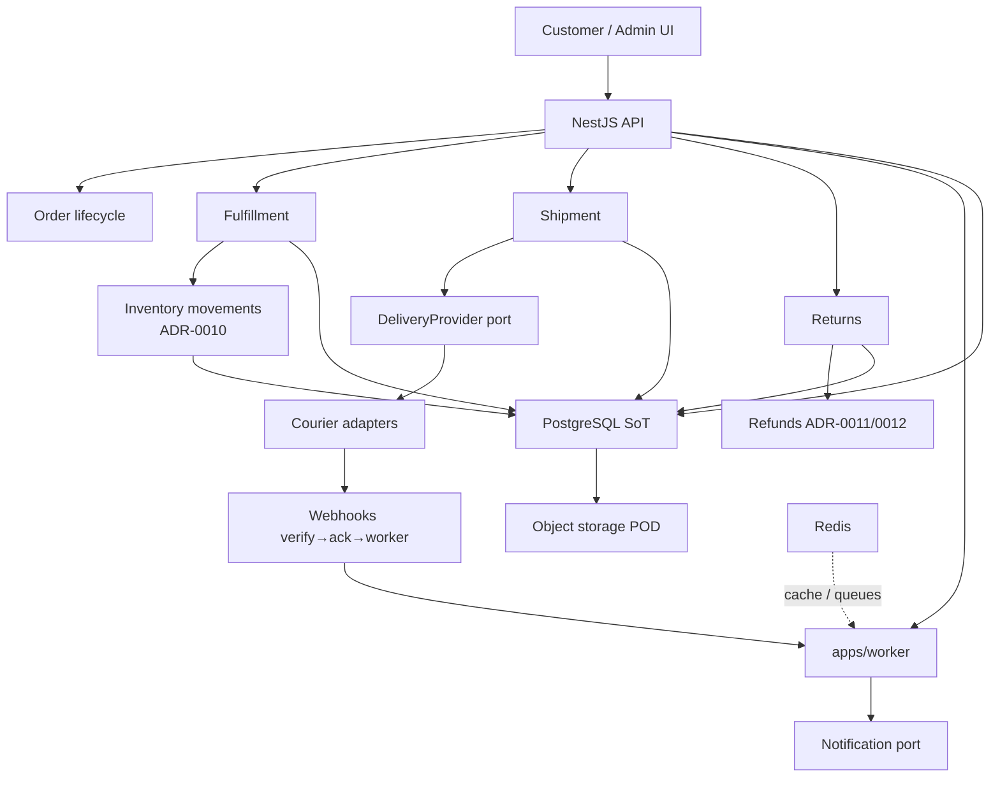
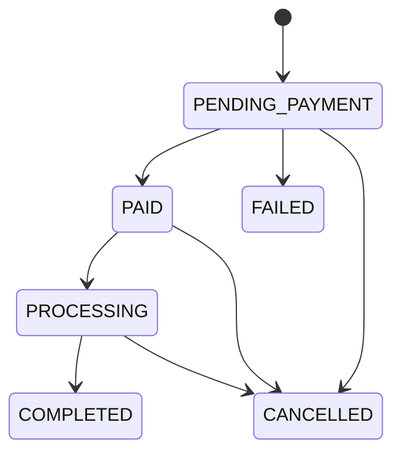
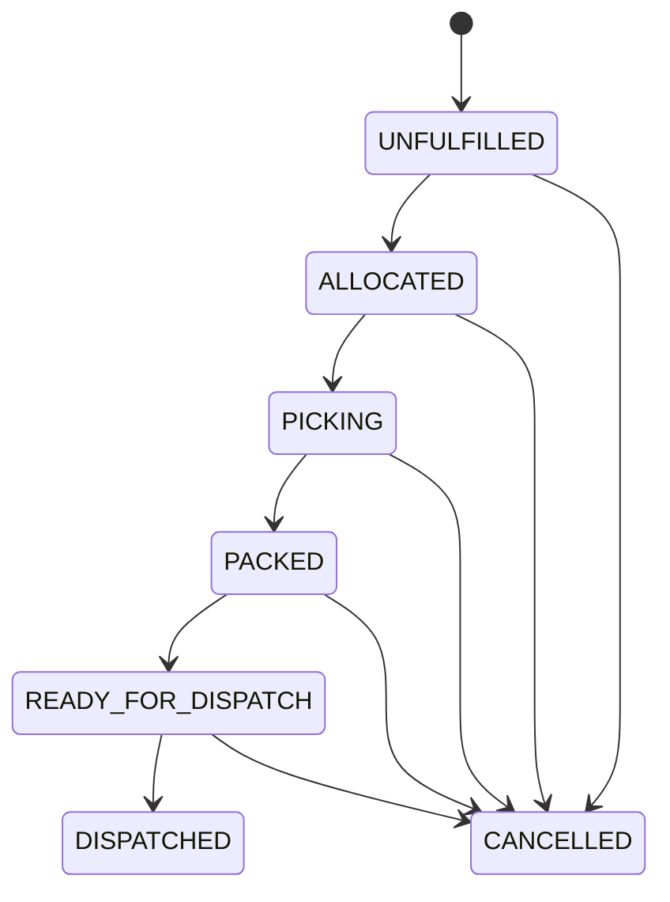
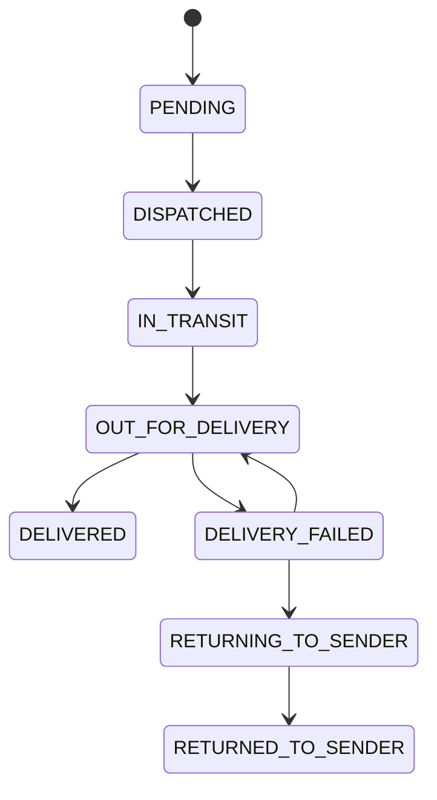
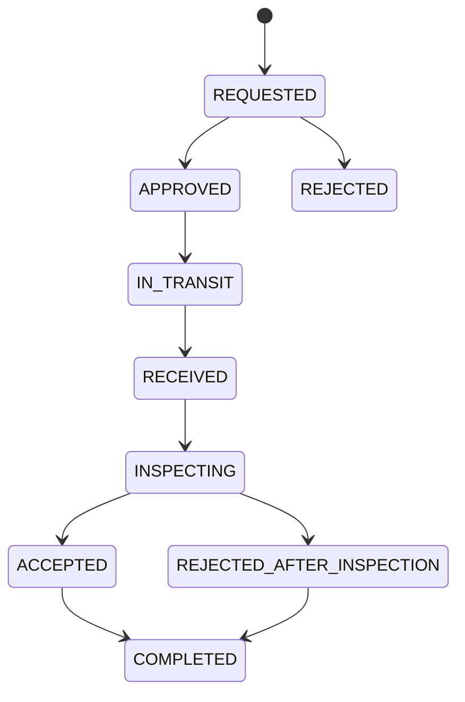

# ADR-0013: Fulfillment, shipping, delivery, returns, and order lifecycle architecture

- Status: **Accepted**
- Date: 2026-08-13
- Deciders: Platform Architecture; accepted by architecture program review on
  2026-08-13
- Aligns with: [docs/ARCHITECTURE.md](../ARCHITECTURE.md),
  [ADR-0005](./ADR-0005-backend-framework.md) (**Accepted**),
  [ADR-0006](./ADR-0006-database-and-data-architecture.md) (**Accepted**),
  [ADR-0007](./ADR-0007-frontend-architecture.md) (**Accepted**),
  [ADR-0008](./ADR-0008-authentication-and-identity-architecture.md)
  (**Accepted**),
  [ADR-0009](./ADR-0009-api-contract-and-communication-architecture.md)
  (**Accepted**),
  [ADR-0010](./ADR-0010-catalog-product-inventory-search-architecture.md)
  (**Accepted**),
  [ADR-0011](./ADR-0011-cart-checkout-orders-payments-architecture.md)
  (**Accepted**),
  [ADR-0012](./ADR-0012-pricing-promotions-tax-financial-calculation-architecture.md)
  (**Accepted**)
- Scope: Post-payment order lifecycle, fulfillment, shipping quotes,
  shipments, delivery tracking, delivery failures, cancellations after pay,
  returns, restocking, refund linkage, notifications, and operations AuthZ
- Out of scope: Implementing fulfillment code; courier SDKs; warehouse WMS;
  creating schemas/migrations; modifying apps/packages; configuring couriers
  or secrets; changing ADR-0005–0012

## 1. Context

After checkout and payment (ADR-0011), Buying Bot must prepare, ship, and
deliver goods in a Kenya-first market, then handle failures, cancellations,
returns, and refunds without corrupting inventory (ADR-0010) or financial
snapshots (ADR-0012).

ADR-0011 deferred warehouse ladder states to a fulfillment ADR and reserved
`Fulfillment status` as a separate machine. This ADR fills that gap.

No fulfillment, shipment, or return implementation exists yet.

## 2. Problem

Without an explicit post-payment architecture, teams will:

- collapse packing, shipping, and delivery into one order status enum;
- call courier SDKs from domain code;
- restock before inspection;
- auto-refund every failed delivery;
- mutate historical delivery addresses when a customer edits a saved address;
- treat Redis or BullMQ as the ledger;
- let AI invent tracking numbers or approve refunds.

Those mistakes break ops, finance, and customer trust.

## 3. Goals

1. Define separate state machines for order, payment, fulfillment, shipment,
   return, refund, and inventory reservation.
2. Support single-merchant, single-location fulfillment at launch with a path
   to multi-warehouse and multi-shipment.
3. Keep PostgreSQL authoritative; inventory via ADR-0010 movements only.
4. Isolate couriers behind ports/adapters; verify webhooks (ADR-0009).
5. Kenya-first flexible addresses and delivery methods without hardcoding one
   courier.
6. Connect cancellations/returns to refunds via historical financial
   snapshots (ADR-0011 / ADR-0012).
7. Keep UI and AI non-authoritative.

## 4. Non-goals

- Implementing WMS, route optimization, or courier marketplace
- Selecting a permanent courier vendor
- Building fraud/risk scoring (future ADR)
- International shipping / duties
- Marketplace seller fulfillment
- Implementing code, schemas, or infrastructure in this ADR

## 5. Decision (summary)

Adopt a **lightweight fulfillment domain** on Nest (ADR-0005) with:

1. **Lean order statuses** (commercial contract) plus **rich fulfillment and
   shipment statuses** (ops/delivery).
2. **One default fulfillment location** at v1; `locationId` everywhere for
   future warehouses (ADR-0010).
3. **Fulfillment ≠ Shipment ≠ Delivery event stream.**
4. **`ShippingQuote` / `ShippingCalculator` port** for server-side shipping
   amounts (ADR-0011 / ADR-0012); client fees ignored.
5. **`DeliveryProvider` port** for couriers; normalized tracking events.
6. **Configurable return policy** + inspection before restock when required.
7. **Explicit inventory movements** for sale commit, release, return,
   damage, write-off — never a second inventory system.
8. **Async workers** for notifications, provider sync, and webhook apply;
   Postgres remains SoT.
9. **No unpaid fulfillment** unless a future ADR allows it.

## 6. Separate status concepts (authoritative)

**Do not collapse these into one field** (preserves ADR-0011).

| Machine                   | Owns                                                       | Lives on                                                         |
| ------------------------- | ---------------------------------------------------------- | ---------------------------------------------------------------- |
| **Order status**          | Commercial contract with the customer                      | Order                                                            |
| **Payment status**        | Money movements                                            | Payment / PaymentAttempt                                         |
| **Fulfillment status**    | Warehouse/ops progress for the order (or fulfillment unit) | Fulfillment                                                      |
| **Shipment status**       | Physical parcel progress                                   | Shipment                                                         |
| **Return status**         | Reverse logistics request                                  | ReturnRequest                                                    |
| **Refund status**         | Money return                                               | Payment refund records (`REFUND_REQUESTED` / `REFUND_CONFIRMED`) |
| **Inventory reservation** | Stock hold                                                 | Reservation (`HELD` / `COMMITTED` / `RELEASED`)                  |

Rejected as **order** statuses: `PACKED`, `READY_FOR_DISPATCH`, `SHIPPED`,
`OUT_FOR_DELIVERY`, `DELIVERED`, `DELIVERY_FAILED`, `RETURN_*` — those belong
on fulfillment/shipment/return machines. Order may remain `PROCESSING` while
shipment is `OUT_FOR_DELIVERY`.

## 7. Order lifecycle (commercial)

### 7.1 Accepted order statuses

| Status            | Meaning                                                          |
| ----------------- | ---------------------------------------------------------------- |
| `PENDING_PAYMENT` | Created; awaiting confirmed payment (ADR-0011)                   |
| `PAID`            | Provider-confirmed payment; eligible for fulfillment             |
| `PROCESSING`      | Accepted into ops / fulfillment started                          |
| `COMPLETED`       | Successfully delivered (or otherwise fulfilled per policy)       |
| `CANCELLED`       | Voided; not to be fulfilled (may have refunds)                   |
| `FAILED`          | Terminal unsuccessful before/without successful commerce outcome |

Optional aggregate `refundStatus` on order: `NONE` | `PARTIAL` | `FULL`
(ADR-0011) — not a replacement for payment refund states.

### 7.2 Order transitions

| From                  | To                     | Actor                     | Conditions                                                        |
| --------------------- | ---------------------- | ------------------------- | ----------------------------------------------------------------- |
| `PENDING_PAYMENT`     | `PAID`                 | system                    | Payment `CONFIRMED`                                               |
| `PENDING_PAYMENT`     | `FAILED` / `CANCELLED` | system / customer / admin | Expiry, cancel policy                                             |
| `PAID`                | `PROCESSING`           | system / ops              | Fulfillment opened; payment still confirmed                       |
| `PAID` / `PROCESSING` | `CANCELLED`            | customer / admin / system | Policy allows; refund path if paid                                |
| `PROCESSING`          | `COMPLETED`            | system                    | All required shipments `DELIVERED` (v1: single shipment) + policy |
| `PROCESSING`          | `CANCELLED`            | admin / policy            | Before dispatch or with void shipment per policy                  |

**Prohibited:** client sets `PAID`/`COMPLETED`; fulfill when payment not
confirmed; jump to `COMPLETED` without shipment delivery evidence (unless
digital/pickup policy explicitly defines completion criteria).

Every transition: previous → next, actor, reason, timestamp, correlation id,
audit event.

## 8. Fulfillment status machine

One **Fulfillment** per order at v1 (1:1). Future: multiple fulfillment units
per order without changing Order itself.

| Status               | Meaning                                               |
| -------------------- | ----------------------------------------------------- |
| `UNFULFILLED`        | Paid (or eligible) but not started                    |
| `ALLOCATED`          | Lines assigned to location / stock committed for pick |
| `PICKING`            | Pick in progress                                      |
| `PACKED`             | Packed / labeled                                      |
| `READY_FOR_DISPATCH` | Ready for carrier handover                            |
| `DISPATCHED`         | Handed to carrier (shipment created/dispatched)       |
| `CANCELLED`          | Fulfillment aborted                                   |

Transitions (happy path):

```text
UNFULFILLED → ALLOCATED → PICKING → PACKED → READY_FOR_DISPATCH → DISPATCHED
```

Exceptional: any pre-dispatch state → `CANCELLED` when order cancel allowed.
Post-dispatch cancel is **not** a fulfillment cancel — use shipment failure /
return flows.

Actors: ops (`fulfillment:manage`), system (automation), never anonymous
client.

## 9. Shipment / delivery status machine

| Status                | Meaning                                       |
| --------------------- | --------------------------------------------- |
| `PENDING`             | Shipment record created, not yet with carrier |
| `DISPATCHED`          | Carrier accepted / in network                 |
| `IN_TRANSIT`          | Moving                                        |
| `OUT_FOR_DELIVERY`    | Final mile                                    |
| `DELIVERED`           | Confirmed delivery                            |
| `DELIVERY_FAILED`     | Failed attempt / failed delivery              |
| `RETURNING_TO_SENDER` | Reverse to origin                             |
| `RETURNED_TO_SENDER`  | Back at origin                                |
| `CANCELLED`           | Voided before/without successful delivery     |

Happy path:

```text
PENDING → DISPATCHED → IN_TRANSIT → OUT_FOR_DELIVERY → DELIVERED
```

Exceptional:

```text
OUT_FOR_DELIVERY → DELIVERY_FAILED → OUT_FOR_DELIVERY (reschedule)
OUT_FOR_DELIVERY → DELIVERY_FAILED → RETURNING_TO_SENDER → RETURNED_TO_SENDER
```

Provider raw codes map into these **normalized** states. Provider state is
never the domain enum.

When all required shipments are `DELIVERED`, order may move
`PROCESSING` → `COMPLETED`. Delivery failure does **not** auto-complete or
auto-refund.

## 10. Return status machine

| Status                      | Meaning                                              |
| --------------------------- | ---------------------------------------------------- |
| `REQUESTED`                 | Customer/admin opened return                         |
| `APPROVED`                  | Eligible; return authorized                          |
| `REJECTED`                  | Denied by policy/ops                                 |
| `IN_TRANSIT`                | Customer shipping back (or pickup arranged)          |
| `RECEIVED`                  | Warehouse received                                   |
| `INSPECTING`                | Inspection in progress                               |
| `ACCEPTED`                  | Inspection accepted (qty may be partial)             |
| `REJECTED_AFTER_INSPECTION` | Received but not accepted for restock/refund         |
| `COMPLETED`                 | Return closed (refunds/movements done as applicable) |

Do **not** auto-approve every request. Do **not** restock before inspection
when policy requires inspection.

## 11. Fulfillment model

### 11.1 Relationships

```text
Order
  └── OrderItem (snapshot: SKU, Offer, qty, money — ADR-0011/0012)
        └── FulfillmentLine (qty to fulfill from location)
Fulfillment (order-scoped ops unit)
Shipment (physical parcel; 1 per order in v1)
  └── ShipmentLine (qty shipped)
InventoryLocation (ADR-0010 locationId)
```

Inventory **authority** remains ADR-0010 (balances + movements). Fulfillment
references `skuId` + `locationId`; it does not invent a parallel stock table.

### 11.2 Launch vs future

| Concern   | v1                      | Future                       |
| --------- | ----------------------- | ---------------------------- |
| Merchant  | Single                  | Multi-seller fulfillment ADR |
| Locations | One default             | Multiple warehouses / stores |
| Shipments | One shipment per order  | Split shipments              |
| Routing   | Assign default location | Optimization ADR             |

## 12. Order allocation (become fulfillable)

An order is fulfillable only when:

1. Order status is `PAID` (payment confirmed) — **never fulfill unpaid**
   unless a future ADR allows pay-later models.
2. Inventory reservation is `COMMITTED` (sale movement) or still validly
   held per ADR-0011 policy after payment confirm.
3. Order not `CANCELLED` / `FAILED`.
4. No blocking ops hold (manual hold flag — lightweight; **not** a fraud
   engine). Fraud/risk scoring is **future scope**.

Then: create/open Fulfillment (`UNFULFILLED` → `ALLOCATED`), assign
`locationId`.

## 13. Inventory interaction

All stock effects use **append-only movements** (ADR-0010):

| Event                       | Movement (conceptual)                                                        |
| --------------------------- | ---------------------------------------------------------------------------- |
| Checkout                    | Reservation hold                                                             |
| Payment confirmed           | Reservation → sale / commit                                                  |
| Cancel before commit        | Release                                                                      |
| Cancel/restock after commit | Restock or write-off per policy                                              |
| Return accepted             | `RETURN_RECEIVED` then `RESTOCKED` and/or `DAMAGED_RETURN` / `WRITEOFF`      |
| Pick/pack                   | Optional internal allocation markers; **on_hand** changes only via movements |

Never mutate `on_hand` without a movement. Fulfillment must not create a
second inventory ledger.

## 14. Fulfillment locations

- Abstraction: `FulfillmentLocation` / inventory `locationId`.
- v1: single `DEFAULT` location.
- Stock availability and assignment always carry `locationId`.
- No warehouse optimization, wave picking, or cross-dock in v1.

## 15. Shipping vs fulfillment vs delivery

| Concept         | Role                                                          |
| --------------- | ------------------------------------------------------------- |
| **Fulfillment** | Prepare order (allocate, pick, pack)                          |
| **Shipment**    | Parcel + carrier handover + tracking identity                 |
| **Delivery**    | Progress of that shipment toward the customer (events/status) |

Do not collapse into one “shipped” order flag.

## 16. Shipping quotes

Server-side only via:

```text
ShippingQuote / ShippingCalculator port
```

Inputs may include: destination, method, weight/dims (when known), location,
zone, provider, service level, discounted merchandise total (ADR-0012).

- Client-supplied shipping fee is **ignored**.
- Quote id / amount snapshotted on order at checkout (ADR-0011/0012).
- Real courier rate APIs are adapters behind the port — not required for v1
  (flat/zone tables acceptable).

## 17. Delivery methods

| Method                         | v1                                      | Future             |
| ------------------------------ | --------------------------------------- | ------------------ |
| Standard delivery              | **Yes**                                 | —                  |
| Express delivery               | **Optional** if quote rules exist       | —                  |
| Customer pickup / pickup point | **Deferred** unless product requires it | Pickup network ADR |

Do not force pickup into v1 if it adds address/handover complexity without
business need.

## 18. Kenya-first delivery & addresses

### 18.1 Flexible address model

Do not assume conventional street addresses. Support fields such as:

- county, town/city, area/estate
- landmark, delivery instructions
- phone (E.164), recipient name
- optional building/street/postal when available
- geocode optional later

### 18.2 Address ownership

- Saved addresses owned by customer (ADR-0008 AuthZ).
- Billing vs shipping may differ.
- **Order stores an immutable delivery-address snapshot** at checkout (or
  last allowed pre-dispatch update).
- Editing a saved address **never** rewrites historical orders.
- After dispatch, address change is **prohibited** (or requires cancel/
  re-ship policy — not silent mutation).

### 18.3 Address security

- IDOR-safe address APIs; ownership checks.
- No modifying another user’s address.
- Sanitize delivery instructions (abuse/injection).
- Tracking links must not leak other customers’ PII.

## 19. Shipment model

Conceptual fields: `shipmentId`, `orderId`, tracking number, carrier/
provider code, normalized status, dispatchedAt, ETA, deliveredAt, metadata.

**v1:** one shipment per order.  
**Future:** `Order 1—N Shipment` without redesigning Order — use shipment
table from day one even if cardinality is 1.

Split-shipment complexity (partial dispatch UX, partial complete) is **not**
required in v1.

## 20. Courier adapters

```text
Fulfillment/Shipping application service
    → DeliveryProvider (port)
         ├── LocalCourierAdapter
         ├── ThreePLAdapter
         └── PickupNetworkAdapter (future)
```

Domain must **not** import provider SDK types (ADR-0005 / ADR-0009). No
permanent architectural dependency on a single courier brand.

## 21. Tracking

- Store provider tracking id + **normalized** status + append-only
  **tracking events** (timestamp, code, message, optional locality).
- Map provider statuses → internal shipment states (§9).
- Proof of delivery metadata references object storage keys when present.

## 22. Delivery webhooks

Reuse ADR-0008 / ADR-0009:

```text
VERIFY signature → timestamp/replay checks → persist provider event
→ idempotency (provider event id) → ACK fast → worker applies domain update
```

Unauthenticated callbacks are rejected. Retries must not duplicate inventory
or refunds.

## 23. Proof of delivery

Provider-neutral evidence record: timestamp, recipient confirmation, agent
id, OTP result, signature/photo object keys (ADR-0006 object storage + PG
metadata).

v1 may accept subset (timestamp + provider confirmation). Do not require
photo/OTP for every delivery.

## 24. Delivery failures

| Situation                 | Shipment                         | Order                   | Inventory                       | Refund                  |
| ------------------------- | -------------------------------- | ----------------------- | ------------------------------- | ----------------------- |
| Customer unavailable      | `DELIVERY_FAILED` → retry or RTS | stay `PROCESSING`       | unchanged until RTS/policy      | **Not automatic**       |
| Incorrect address         | failed / RTS                     | stay `PROCESSING`       | per RTS receive                 | policy                  |
| Courier failure           | failed / retry                   | stay `PROCESSING`       | unchanged                       | policy                  |
| Damaged / refused         | failed / RTS                     | stay `PROCESSING`       | inspect on return               | policy                  |
| Return to sender received | `RETURNED_TO_SENDER`             | may cancel or await ops | restock/write-off via movements | if policy + refund path |

**Delivery failure does not automatically imply refund.** Business policy
decides retry, RTS, cancel, or refund.

## 25. Cancellations (with ADR-0011)

| Stage                             | Allowed?                                           | Effects                                                    |
| --------------------------------- | -------------------------------------------------- | ---------------------------------------------------------- |
| Before payment                    | Yes                                                | Release reservation; order `CANCELLED`/`FAILED`            |
| After payment, before fulfillment | Yes (policy)                                       | Cancel fulfillment; refund path; inventory release/restock |
| During processing / packing       | Restricted                                         | Admin; void fulfillment if not dispatched                  |
| After packing, before dispatch    | Restricted                                         | Admin; may scrap label                                     |
| After dispatch / in delivery      | Generally **no** cancel → return/RTS/refund policy |
| After delivery                    | No cancel → **return** flow                        |

After payment, cancellation uses the **refund path** when money was
captured (`REFUND_REQUESTED` → `REFUND_CONFIRMED`).

## 26. Returns

### 26.1 ReturnRequest

Links to order + line quantities + reason. Lifecycle §10.

### 26.2 Eligibility (configurable policy)

Factors: order/shipment state, deliveredAt, product returnable flag, return
window days, condition, reason codes, qty, prior returns.

**Do not hardcode** a universal return window in architecture; store policy
configuration.

### 26.3 Inspection

When required: `RECEIVED` → `INSPECTING` → `ACCEPTED` /
`REJECTED_AFTER_INSPECTION` (partial qty supported).

**Do not silently restock before inspection** when inspection is required.

## 27. Restocking movements

Examples: `RETURN_RECEIVED`, `RESTOCKED`, `DAMAGED_RETURN`, `WRITEOFF`.

Partial accept: restock accepted qty only; write off/reject remainder with
audit.

## 28. Refunds (ADR-0011 / ADR-0012)

- Reference original order, financial snapshot, payment transaction, and
  return/cancel reason.
- **Never** reprice with current Offer/promotions.
- Distinguish `REFUND_REQUESTED` vs `REFUND_CONFIRMED`.
- Idempotent initiation and webhook confirmation.
- Partial returns → item-level refund allocation per ADR-0012 snapshot math.
- Shipping refund policy is configurable (often non-refundable) — recorded
  on snapshot/policy, not guessed.

Return **approval** ≠ automatic refund confirmation; refund still goes
through payment provider confirmation.

## 29. Notifications

Events (async via Notification port): order/payment confirmed, processing,
packed, shipped, out for delivery, delivered, delivery failed, return
requested/approved/received, refund initiated/confirmed.

- Do **not** block fulfillment/checkout DB transactions on email/SMS/WhatsApp.
- Channels (email, SMS, WhatsApp, push) are adapters — not imported by
  fulfillment domain.
- Omnichannel providers are future-ready; v1 may start with one channel.

## 30. Customer experience

Customers see order, shipment, tracking, ETA, address snapshot, return, and
refund **status via API**. Frontend (ADR-0007) is display-only.

## 31. Admin / operations AuthZ (ADR-0008)

Illustrative permissions: `fulfillment:view|manage`, `shipment:view|manage`,
`delivery:view|manage`, `returns:view|approve|reject`,
`refunds:view|manage` (align with `payments:refund`).

UI hiding is not authorization. All transitions server-enforced.

## 32. Audit trail

Append-only events for: fulfillment created, allocated, picked, packed,
shipment created/dispatched, delivery attempted/completed/failed, return
requested/approved/received/inspected, refund requested/confirmed,
inventory movements.

Durable in PostgreSQL; not only logs.

## 33. Async processing

```text
API: validate → persist → enqueue (outbox/BullMQ)
Worker: process → retry → record result
```

Workers apply domain commands; they are **not** the SoT. Postgres is.

Queues: fulfillment, delivery webhooks, notifications, refund follow-up
(ADR-0006 naming).

## 34. Idempotency

Required for: shipment create, provider webhooks, delivery updates, return
create, refund initiate/confirm, inventory movements.

Provider event ids + command ids in PostgreSQL (ADR-0009 / ADR-0011).

## 35. Failure and recovery

| Failure                  | Behavior                                                        |
| ------------------------ | --------------------------------------------------------------- |
| Worker outage            | Events/outbox remain in PG; catch up later                      |
| Courier API outage       | Shipment stays last known good state; retry; no corrupt invent  |
| Webhook outage           | Persist when received; reconcile/poll later                     |
| Notification outage      | Commerce continues; retry notify                                |
| Database outage          | API not ready; no transitions                                   |
| Redis outage             | Cache/queue degrade; **fulfillment state intact in PG**; outbox |
| Object storage outage    | POD upload fails; delivery status can still update              |
| Duplicate provider event | Idempotent no-op                                                |
| Provider timeout         | Retry with backoff; no double dispatch if idempotent create     |

Redis outage must **not** destroy fulfillment state.

## 36. Observability

Metrics: fulfillment/pack/dispatch latency, delivery success/fail rates,
return rate, refund latency, webhook/courier/queue/notification failures.

Use `requestId` / `correlationId` (ADR-0009). Never log payment secrets or
unnecessary POD biometrics.

## 37. Security

Order IDOR, address/tracking privacy, unauthorized transitions, fake courier
webhooks, malicious tracking numbers, return fraud, refund abuse, POD
privacy, admin privilege abuse — mitigated by ADR-0008 RBAC, ownership,
HMAC webhooks, rate limits, and policy gates.

## 38. Performance (aspirational)

| Operation                      | Target                 |
| ------------------------------ | ---------------------- |
| Order/shipment status read p95 | &lt; 300 ms            |
| Fulfillment command ack        | Fast persist + enqueue |
| Provider webhook ack           | &lt; 1 s               |
| Heavy provider I/O             | Async worker           |

Unmeasured.

## 39. Data ownership

| Store                         | Role                                                                               |
| ----------------------------- | ---------------------------------------------------------------------------------- |
| **PostgreSQL**                | Authoritative orders, fulfillments, shipments, returns, tracking events, inventory |
| **Redis**                     | Cache, locks, BullMQ broker — never ledger                                         |
| **Object storage**            | POD photos/signatures, labels                                                      |
| **BullMQ**                    | Work transport                                                                     |
| **External courier**          | External shipment signals                                                          |
| **Normalized shipment state** | Internal truth after verified events                                               |

## 40. AI boundary

AI **may:** explain status, fetch tracking via tools, answer return policy,
help start supported workflows through APIs.

AI **must not:** fabricate status/tracking numbers; approve refunds outside
AuthZ; change order/shipment state directly; bypass RBAC; access DB
directly; override fulfillment rules.

Mutations only via authorized API/domain operations.

## 41. Architecture diagram



## 42. State diagrams



**Order** (commercial).



**Fulfillment**.



**Shipment**.



**Return**.

## 43. Decision matrix

| Area         | Decision                  | Alternatives               | Reason               |
| ------------ | ------------------------- | -------------------------- | -------------------- |
| Status model | Separate machines         | One mega order status      | ADR-0011 clarity     |
| Order states | Lean commercial set       | PACKED/SHIPPED on Order    | Ops detail elsewhere |
| Fulfillment  | Lightweight + locationId  | Full WMS v1                | Launch simplicity    |
| Inventory    | ADR-0010 movements only   | Second stock system        | One ledger           |
| Locations    | One default + abstraction | Multi-warehouse routing v1 | Path without rewrite |
| Shipping fee | ShippingQuote port        | Client fee                 | ADR-0012             |
| Shipments    | Entity now; 1:1 v1        | Force split v1 / no entity | Future multi-ship    |
| Couriers     | DeliveryProvider adapters | Hardcoded SDK in domain    | Portability          |
| Tracking     | Normalized + events       | Raw provider as SoT        | Control              |
| Webhooks     | Verify→persist→ack→async  | Sync trust                 | ADR-0009             |
| Failures     | Policy; no auto-refund    | Auto-refund all fails      | Finance control      |
| Returns      | Policy + inspection       | Always restock             | Quality              |
| Refunds      | Snapshot + idempotent     | Live reprice               | ADR-0012             |
| Notify       | Async ports               | Sync SMS in tx             | Reliability          |
| SoT          | PostgreSQL                | Redis fulfillment          | ADR-0006             |

## 44. Alternatives considered

| Alternative                                          | Why rejected / deferred                     |
| ---------------------------------------------------- | ------------------------------------------- |
| Single order status for pack/ship/deliver            | Mixes commercial and ops; violates ADR-0011 |
| Direct courier SDK in domain                         | Lock-in; untestable                         |
| Synchronous fulfillment HTTP to courier inside DB tx | Long txs; ADR-0006/0011 forbid              |
| Redis as fulfillment authority                       | Lost on flush; not ledger                   |
| Immediate restock without inspection                 | Damaged goods pollution                     |
| Only “shipped” boolean, no Shipment entity           | Blocks multi-shipment later                 |
| Full custom WMS at v1                                | Premature ops cost                          |
| Sync notifications in fulfillment command            | Brittle latency                             |

## 45. Consequences

### Positive

- Clear post-payment path; Kenya-ready addresses; safe inventory/finance
  integration; courier-agnostic.

### Negative

- More status fields for UI to compose; ops must learn machines.
- Inspection before restock adds latency to refunds when required.

### Security / reliability / observability / testing

- Webhook HMAC, RBAC transitions, PG SoT, metrics on delivery/returns,
  transition and idempotency tests required before production.

## 46. Testing strategy (future)

Unit: transition guards, provider status mapping, eligibility policy.  
Integration: pay → fulfill → ship → deliver; cancel paths; return → inspect
→ restock → refund; webhook idempotency.  
E2E: customer tracking and return request.  
Security: IDOR on orders/addresses; forged webhooks.

## 47. Dependencies

| ADR      | How ADR-0013 depends                                            |
| -------- | --------------------------------------------------------------- |
| ADR-0005 | Nest modules for fulfillment/shipping/returns; adapters at edge |
| ADR-0006 | PG SoT; Redis cache/queues; BullMQ; object storage for POD      |
| ADR-0007 | Non-authoritative status UI                                     |
| ADR-0008 | RBAC, ownership, webhook HMAC, address privacy                  |
| ADR-0009 | REST resources, webhooks, idempotency, async jobs, ports        |
| ADR-0010 | SKU, locationId, reservations, movements, restock/damage        |
| ADR-0011 | Order/payment states, cancel/refund path, reservation commit    |
| ADR-0012 | ShippingQuote amounts, snapshot refunds, tax on shipping policy |

## 48. Future ADRs

- Advanced WMS / multi-warehouse optimization
- Route optimization / delivery scheduling
- Courier marketplace / pickup-point networks
- International shipping & duties
- Marketplace seller fulfillment
- Exchanges & advanced reverse logistics
- Fraud/risk holds
- Subscriptions fulfillment
- Carbon / delivery optimization

## 49. Accepted clarifications

1. **Order statuses remain lean** — `SHIPPED`/`DELIVERED` live on shipment/
   fulfillment machines, not Order.
2. **v1: one shipment per order**; Shipment entity exists for future 1:N.
3. **Pickup deferred** from v1 unless product later requires it.
4. **Physical returns require inspection by default** before restock.
5. **Shipping fees default non-refundable** unless order/policy snapshot
   says otherwise (configurable).
6. **Customers may cancel after `PAID` before fulfillment allocation/
   dispatch** without admin; after dispatch → return/RTS policy.
7. **Max delivery attempts before RTS:** configurable policy (suggested
   default **3**); not hardcoded forever in domain.
8. **Courier vendor is procurement**, not an ADR technology lock-in.

## 50. Implementation boundary

Acceptance does **not** authorize: schemas, courier SDKs, fulfillment APIs,
worker jobs, frontend tracking pages, or infra.

## 51. Decision status

**Accepted.**

Indexed in [DECISIONS.md](../DECISIONS.md).
