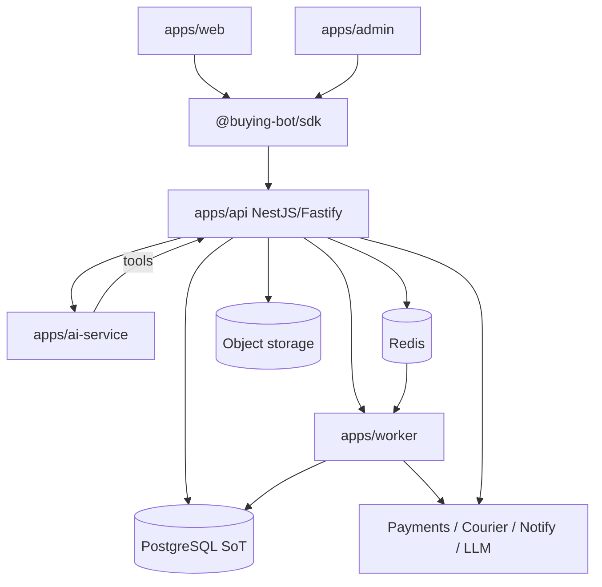

# High-level system architecture

```mermaid
flowchart TB
  web["apps/web"]
  admin["apps/admin"]
  sdk["@buying-bot/sdk"]
  api["apps/api NestJS/Fastify"]
  ai["apps/ai-service"]
  worker["apps/worker"]
  pg[(PostgreSQL SoT)]
  redis[(Redis)]
  s3[(Object storage)]
  providers["Payments / Courier / Notify / LLM"]

  web --> sdk
  admin --> sdk
  sdk --> api
  api --> pg
  api --> redis
  api --> s3
  api --> ai
  ai -->|"tools"| api
  api --> worker
  redis --> worker
  worker --> pg
  worker --> providers
  api --> providers
```
