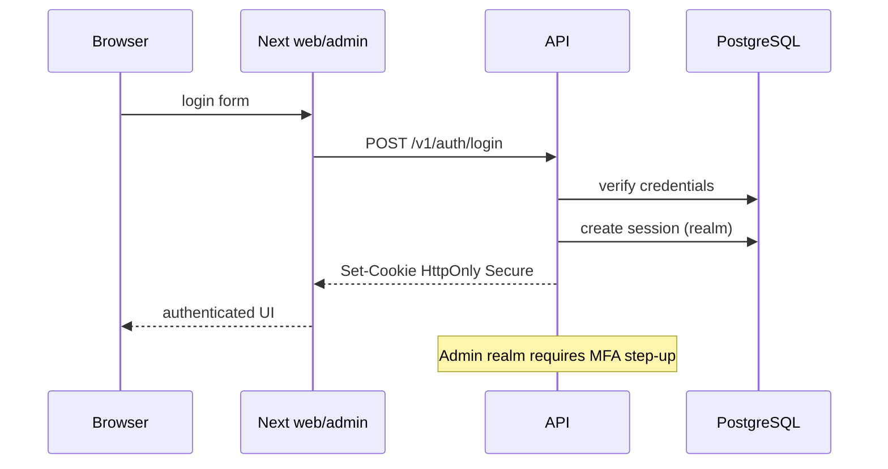

# Authentication flow

```mermaid
sequenceDiagram
  participant B as Browser
  participant W as Next web/admin
  participant A as API
  participant PG as PostgreSQL

  B->>W: login form
  W->>A: POST /v1/auth/login
  A->>PG: verify credentials
  A->>PG: create session (realm)
  A-->>W: Set-Cookie HttpOnly Secure
  W-->>B: authenticated UI
  Note over A: Admin realm requires MFA step-up
```
