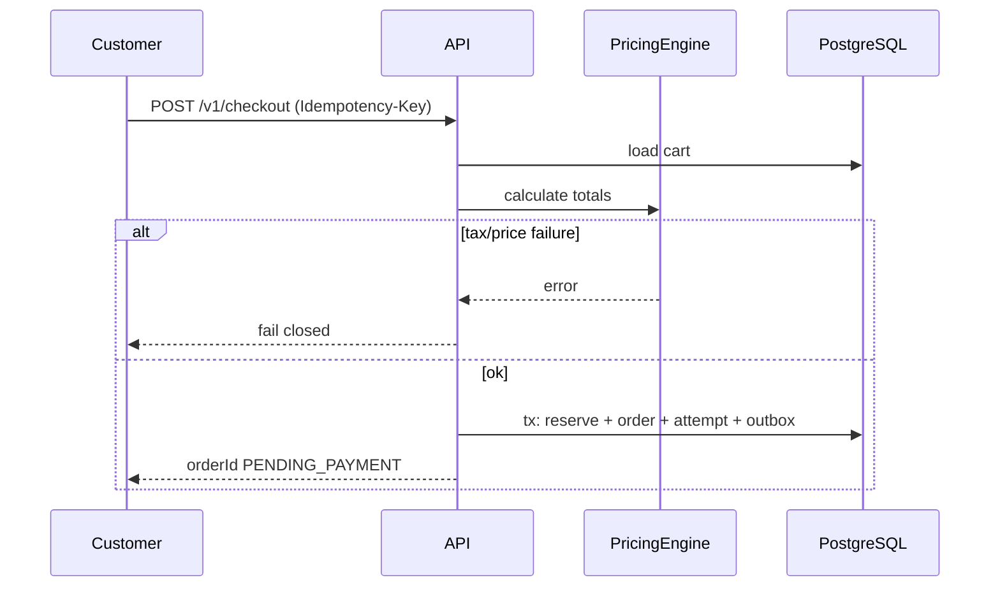

# Checkout flow

```mermaid
sequenceDiagram
  participant C as Customer
  participant A as API
  participant Calc as PricingEngine
  participant PG as PostgreSQL

  C->>A: POST /v1/checkout (Idempotency-Key)
  A->>PG: load cart
  A->>Calc: calculate totals
  alt tax/price failure
    Calc-->>A: error
    A-->>C: fail closed
  else ok
    A->>PG: tx: reserve + order + attempt + outbox
    A-->>C: orderId PENDING_PAYMENT
  end
```
