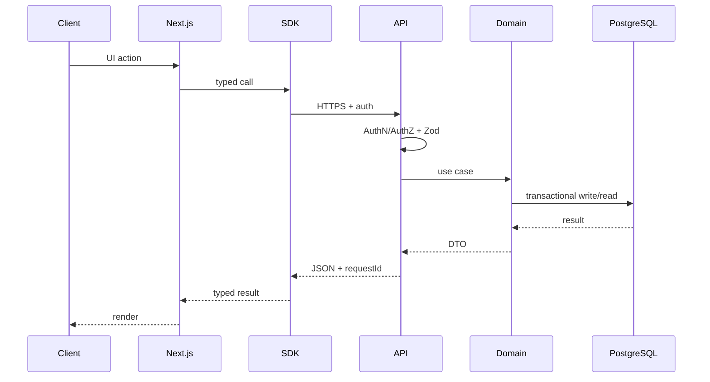

# Data / request flow

```mermaid
sequenceDiagram
  participant C as Client
  participant N as Next.js
  participant S as SDK
  participant A as API
  participant D as Domain
  participant P as PostgreSQL

  C->>N: UI action
  N->>S: typed call
  S->>A: HTTPS + auth
  A->>A: AuthN/AuthZ + Zod
  A->>D: use case
  D->>P: transactional write/read
  P-->>D: result
  D-->>A: DTO
  A-->>S: JSON + requestId
  S-->>N: typed result
  N-->>C: render
```
