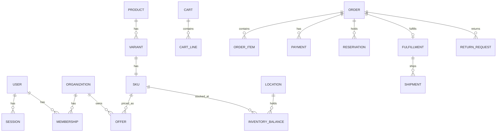

# Conceptual ERD (selected)

```mermaid
erDiagram
  USER ||--o{ SESSION : has
  USER ||--o{ MEMBERSHIP : has
  ORGANIZATION ||--o{ MEMBERSHIP : has
  ORGANIZATION ||--o{ OFFER : owns
  PRODUCT ||--o{ VARIANT : has
  VARIANT ||--|| SKU : has
  SKU ||--o{ OFFER : priced_as
  SKU ||--o{ INVENTORY_BALANCE : stocked_at
  LOCATION ||--o{ INVENTORY_BALANCE : holds
  CART ||--o{ CART_LINE : contains
  ORDER ||--o{ ORDER_ITEM : contains
  ORDER ||--o{ PAYMENT : has
  ORDER ||--o{ RESERVATION : holds
  ORDER ||--o| FULFILLMENT : fulfills
  FULFILLMENT ||--o{ SHIPMENT : ships
  ORDER ||--o{ RETURN_REQUEST : returns
```

Full field lists: [../design/database-design.md](../design/database-design.md).
