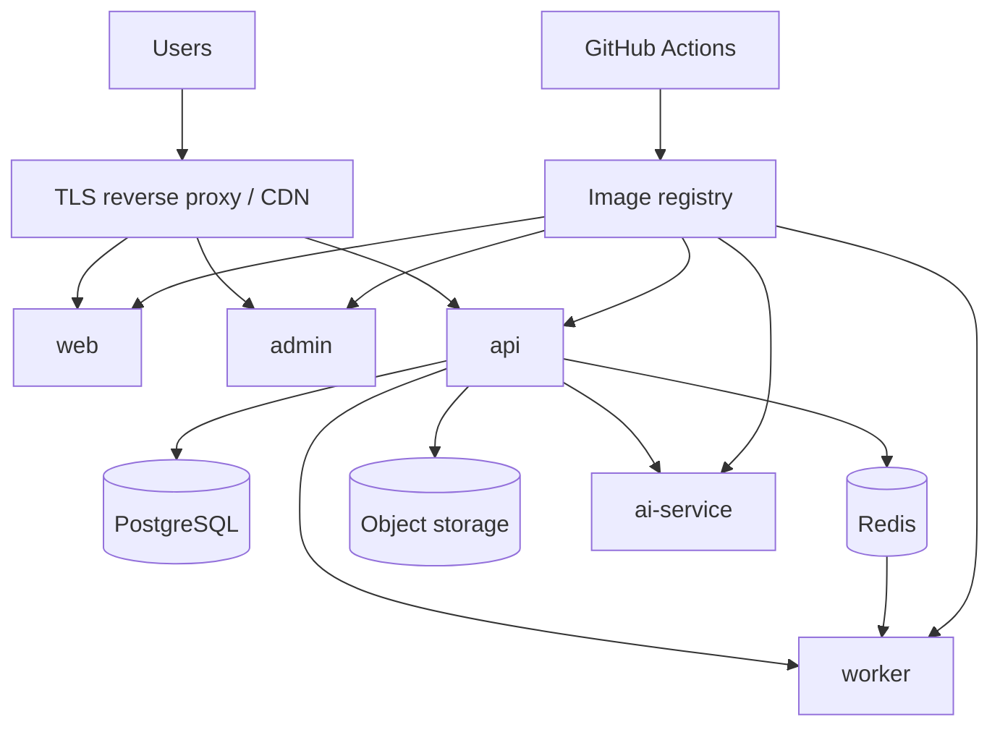

# Deployment architecture

```mermaid
flowchart TB
  users[Users] --> edge[TLS reverse proxy / CDN]
  edge --> web[web]
  edge --> admin[admin]
  edge --> api[api]
  api --> pg[(PostgreSQL)]
  api --> redis[(Redis)]
  api --> s3[(Object storage)]
  api --> worker[worker]
  redis --> worker
  api --> ai[ai-service]
  ci[GitHub Actions] --> registry[Image registry]
  registry --> web
  registry --> admin
  registry --> api
  registry --> worker
  registry --> ai
```
