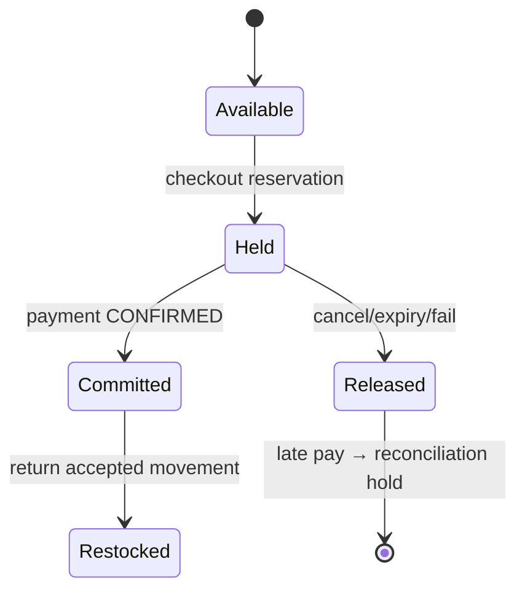

# Inventory reservation flow

```mermaid
stateDiagram-v2
  [*] --> Available
  Available --> Held: checkout reservation
  Held --> Committed: payment CONFIRMED
  Held --> Released: cancel/expiry/fail
  Committed --> Restocked: return accepted movement
  Released --> [*]: late pay → reconciliation hold
```
