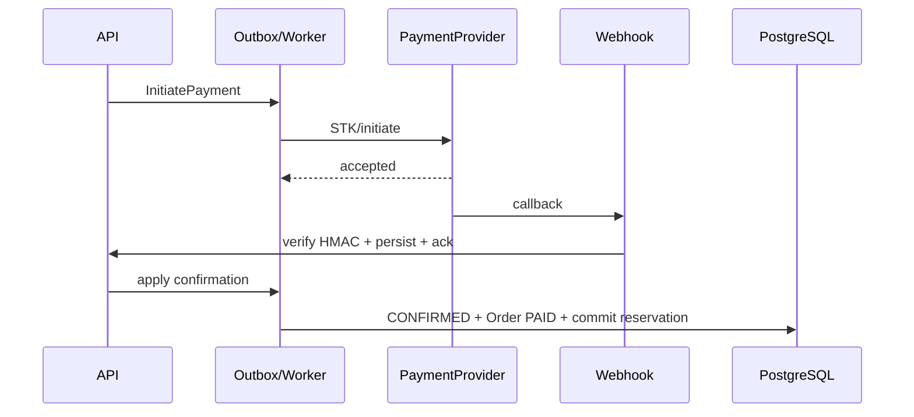

# Payment flow

```mermaid
sequenceDiagram
  participant A as API
  participant O as Outbox/Worker
  participant P as PaymentProvider
  participant W as Webhook
  participant PG as PostgreSQL

  A->>O: InitiatePayment
  O->>P: STK/initiate
  P-->>O: accepted
  P->>W: callback
  W->>A: verify HMAC + persist + ack
  A->>O: apply confirmation
  O->>PG: CONFIRMED + Order PAID + commit reservation
```
