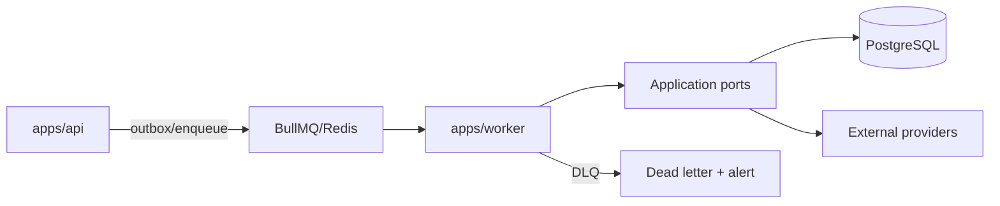

# Queue / worker flow

```mermaid
flowchart LR
  API[apps/api] -->|outbox/enqueue| Q[BullMQ/Redis]
  Q --> W[apps/worker]
  W --> Dom[Application ports]
  Dom --> PG[(PostgreSQL)]
  Dom --> Prov[External providers]
  W -->|DLQ| DLQ[Dead letter + alert]
```
