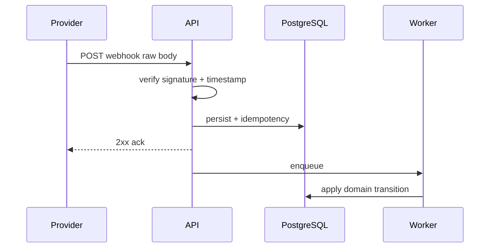

# Webhook processing flow

```mermaid
sequenceDiagram
  participant Prov as Provider
  participant API as API
  participant PG as PostgreSQL
  participant W as Worker

  Prov->>API: POST webhook raw body
  API->>API: verify signature + timestamp
  API->>PG: persist + idempotency
  API-->>Prov: 2xx ack
  API->>W: enqueue
  W->>PG: apply domain transition
```
